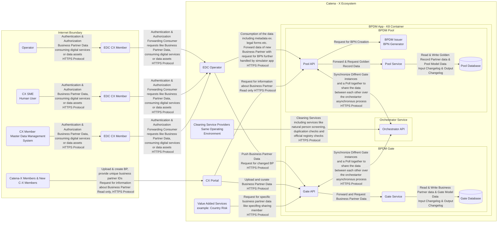

## Data Flow Diagram BPDM Golden Record

Below diagram was designed with purpose to pull it with the security assessment documentation crated by Kristian - https://github.com/eclipse-tractusx/bpdm/pull/737/commits/ac5ee908bb0cc447833dc14143e2acd512b99eb3

