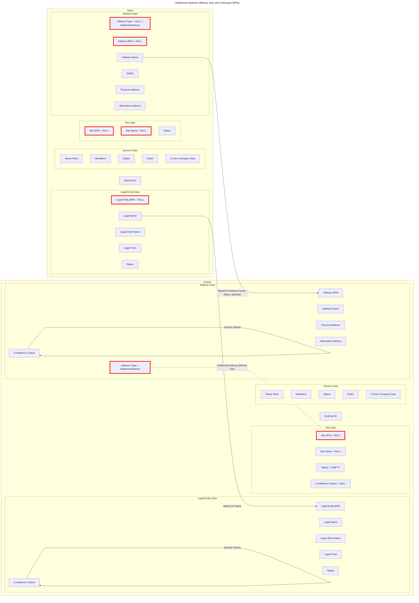
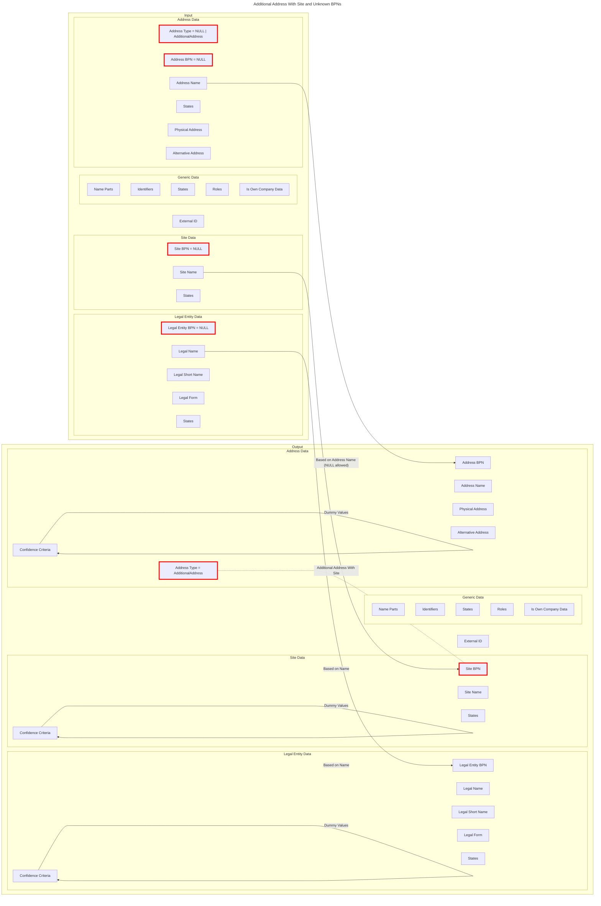
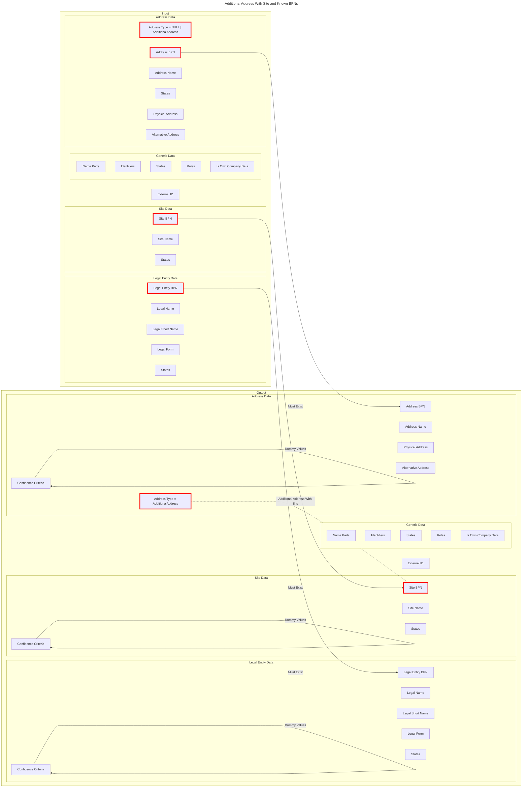

# End to End Business Partner Mappings

```mermaid
---
title: Additional Address Without Site and Unknown BPNs
---
flowchart LR
    subgraph Input
        InputExternalId[External ID]
        subgraph InputGeneric[Generic Data]
            InputNameParts[Name Parts]
            InputIdentifiers[Identifiers]
            InputStates[States]
            InputRoles[Roles]
            InputOwnCompany[Is Own Company Data]
        end
        subgraph InputL[Legal Entity Data]
            InputLegalEntityBpn[Legal Entity BPN = NULL]:::highlight
            InputLegalName[Legal Name]
            InputShortName[Legal Short Name]
            InputLegalForm[Legal Form]
            InputLegalStates[States]
        end
        subgraph InputS[Site Data]
            InputSiteBpn[Site BPN = NULL]:::highlight
            InputSiteName[Site Name = NULL]:::highlight
            InputSiteStates[States]
        end
        subgraph InputA[Address Data]
            InputAddressType["Address Type = NULL | AdditionalAddress"]:::highlight
            InputAddressBpn[Address BPN = NULL]:::highlight
            InputAddressName[Address Name]
            InputAddressStates[States]
            InputPhysicalAddress[Physical Address]
            InputAlternativeAddress[Alternative Address]
        end
    end
    subgraph Output
        OutputExternalId[External ID]
        subgraph  OutputGeneric[Generic Data]
            OutputNameParts[Name Parts]
            OutputIdentifiers[Identifiers]
            OutputStates[States]
            OutputRoles[Roles]
            OutputOwnCompany[Is Own Company Data]
        end
        subgraph OutputL[Legal Entity Data]
            OutputLegalEntityBpn[Legal Entity BPN]
            OutputLegalName[Legal Name]
            OutputShortName[Legal Short Name]
            OutputLegalForm[Legal Form]
            OutputLegalStates[States]
            CCL[Confidence Criteria]
        end
        subgraph OutputS[Site Data]
            OutputSiteBpn[Site BPN = NULL]:::highlight
            OutputSiteName[Site Name = NULL]
            OutputSiteStates[States = EMPTY]
            CCS[Confidence Criteria = NULL]
        end
        subgraph  OutputA[Address Data]
            OutputAddressType["Address Type = AdditionalAddress"]:::highlight
            OutputAddressBpn[Address BPN]
            OutputAddressName[Address Name]
            OutputPhysicalAddress[Physical Address]
            OutputAlternativeAddress[Alternative Address]
            CCA[Confidence Criteria]
        end
    end

    InputLegalName -- Based on Name --> OutputLegalEntityBpn
    InputAddressName -- "Based on Address Name (NULL allowed)" --> OutputAddressBpn
    CCL -- "Dummy Values" --> CCL
    CCA -- "Dummy Values" --> CCA
    OutputAddressType -. "Additional Address Without Site" .- OutputSiteBpn

    classDef highlight stroke:#f00,stroke-width:4px;
```

```mermaid
---
title: Additional Address With Site and Unknown BPNs
---
flowchart LR
    subgraph Input
        InputExternalId[External ID]
        subgraph InputGeneric[Generic Data]
            InputNameParts[Name Parts]
            InputIdentifiers[Identifiers]
            InputStates[States]
            InputRoles[Roles]
            InputOwnCompany[Is Own Company Data]
        end
        subgraph InputL[Legal Entity Data]
            InputLegalEntityBpn[Legal Entity BPN = NULL]:::highlight
            InputLegalName[Legal Name]
            InputShortName[Legal Short Name]
            InputLegalForm[Legal Form]
            InputLegalStates[States]
        end
        subgraph InputS[Site Data]
            InputSiteBpn[Site BPN = NULL]:::highlight
            InputSiteName[Site Name]
            InputSiteStates[States]
        end
        subgraph InputA[Address Data]
            InputAddressType["Address Type = NULL | AdditionalAddress"]:::highlight
            InputAddressBpn[Address BPN = NULL]:::highlight
            InputAddressName[Address Name]
            InputAddressStates[States]
            InputPhysicalAddress[Physical Address]
            InputAlternativeAddress[Alternative Address]
        end
    end
    subgraph Output
        OutputExternalId[External ID]
        subgraph  OutputGeneric[Generic Data]
            OutputNameParts[Name Parts]
            OutputIdentifiers[Identifiers]
            OutputStates[States]
            OutputRoles[Roles]
            OutputOwnCompany[Is Own Company Data]
        end
        subgraph OutputL[Legal Entity Data]
            OutputLegalEntityBpn[Legal Entity BPN]
            OutputLegalName[Legal Name]
            OutputShortName[Legal Short Name]
            OutputLegalForm[Legal Form]
            OutputLegalStates[States]
            CCL[Confidence Criteria]
        end
        subgraph OutputS[Site Data]
            OutputSiteBpn[Site BPN]:::highlight
            OutputSiteName[Site Name]
            OutputSiteStates[States]
            CCS[Confidence Criteria]
        end
        subgraph  OutputA[Address Data]
            OutputAddressType["Address Type = AdditionalAddress"]:::highlight
            OutputAddressBpn[Address BPN]
            OutputAddressName[Address Name]
            OutputPhysicalAddress[Physical Address]
            OutputAlternativeAddress[Alternative Address]
            CCA[Confidence Criteria]
        end
    end

    InputLegalName -- Based on Name --> OutputLegalEntityBpn
    InputSiteName -- Based on Name --> OutputSiteBpn
    InputAddressName -- "Based on Address Name (NULL allowed)" --> OutputAddressBpn
    CCL -- "Dummy Values" --> CCL
    CCS -- "Dummy Values" --> CCS
    CCA -- "Dummy Values" --> CCA
    OutputAddressType -. "Additional Address With Site" .- OutputSiteBpn

    classDef highlight stroke:#f00,stroke-width:4px;
```

```mermaid
---
title: Additional Address With Site and Known BPNs
---
flowchart LR
    subgraph Input
        InputExternalId[External ID]
        subgraph InputGeneric[Generic Data]
            InputNameParts[Name Parts]
            InputIdentifiers[Identifiers]
            InputStates[States]
            InputRoles[Roles]
            InputOwnCompany[Is Own Company Data]
        end
        subgraph InputL[Legal Entity Data]
            InputLegalEntityBpn[Legal Entity BPN]:::highlight
            InputLegalName[Legal Name]
            InputShortName[Legal Short Name]
            InputLegalForm[Legal Form]
            InputLegalStates[States]
        end
        subgraph InputS[Site Data]
            InputSiteBpn[Site BPN]:::highlight
            InputSiteName[Site Name]
            InputSiteStates[States]
        end
        subgraph InputA[Address Data]
            InputAddressType["Address Type = NULL | AdditionalAddress"]:::highlight
            InputAddressBpn[Address BPN]:::highlight
            InputAddressName[Address Name]
            InputAddressStates[States]
            InputPhysicalAddress[Physical Address]
            InputAlternativeAddress[Alternative Address]
        end
    end
    subgraph Output
        OutputExternalId[External ID]
        subgraph  OutputGeneric[Generic Data]
            OutputNameParts[Name Parts]
            OutputIdentifiers[Identifiers]
            OutputStates[States]
            OutputRoles[Roles]
            OutputOwnCompany[Is Own Company Data]
        end
        subgraph OutputL[Legal Entity Data]
            OutputLegalEntityBpn[Legal Entity BPN]
            OutputLegalName[Legal Name]
            OutputShortName[Legal Short Name]
            OutputLegalForm[Legal Form]
            OutputLegalStates[States]
            CCL[Confidence Criteria]
        end
        subgraph OutputS[Site Data]
            OutputSiteBpn[Site BPN]:::highlight
            OutputSiteName[Site Name]
            OutputSiteStates[States]
            CCS[Confidence Criteria]
        end
        subgraph  OutputA[Address Data]
            OutputAddressType["Address Type = AdditionalAddress"]:::highlight
            OutputAddressBpn[Address BPN]
            OutputAddressName[Address Name]
            OutputPhysicalAddress[Physical Address]
            OutputAlternativeAddress[Alternative Address]
            CCA[Confidence Criteria]
        end
    end

    InputLegalEntityBpn -- Must Exist --> OutputLegalEntityBpn
    InputSiteBpn -- Must Exist --> OutputSiteBpn
    InputAddressBpn -- "Must Exist" --> OutputAddressBpn
    CCL -- "Dummy Values" --> CCL
    CCS -- "Dummy Values" --> CCS
    CCA -- "Dummy Values" --> CCA
    OutputAddressType -. "Additional Address With Site" .- OutputSiteBpn

    classDef highlight stroke:#f00,stroke-width:4px;
```

```mermaid
---
title: Additional Address With Site and Known BPNs
---
flowchart LR
    subgraph Input
        InputExternalId[External ID]
        subgraph InputGeneric[Generic Data]
            InputNameParts[Name Parts]
            InputIdentifiers[Identifiers]
            InputStates[States]
            InputRoles[Roles]
            InputOwnCompany[Is Own Company Data]
        end
        subgraph InputL[Legal Entity Data]
            InputLegalEntityBpn[Legal Entity BPN]
            InputLegalName[Legal Name]
            InputShortName[Legal Short Name]
            InputLegalForm[Legal Form]
            InputLegalStates[States]
        end
        subgraph InputS[Site Data]
            InputSiteBpn[Site BPN]
            InputSiteName[Site Name]
            InputSiteStates[States]
        end
        subgraph InputA[Address Data]
            InputAddressType["Address Type = NULL | AdditionalAddress"]:::highlight
            InputAddressBpn[Address BPN]
            InputAddressName[Address Name]
            InputAddressStates[States]
            InputPhysicalAddress[Physical Address]
            InputAlternativeAddress[Alternative Address]
        end
    end
    subgraph Golden Records
        subgraph Legal Entity
            BPNL[BPNL]
            LegalName[Legal Name]
            ShortName[Legal Short Name]
            LegalForm[Legal Form]
            LegalStates[States]
            LegalIdentifiers[Identifiers]
            IsCatenaXMemberData[Is Catena-X Member Data]
            subgraph Legal Address
                LBPNA[BPNA]
                LAddressName[Address Name]
                LAddressIdentifiers[Identifiers]
                LAddressStates[States]
                LPhysicalAddress[Physical Address]
                LAlternativeAddress[Alternative Address]
            end
        end
        subgraph Site
            BPNS[BPNS]
            SiteName[Site Name]
            SiteStates[States]
            SiteIdentifiers[Identifiers]
            subgraph Site Main Address
                SBPNA[BPNA]
                SAddressName[Address Name]
                SAddressIdentifiers[Identifiers]
                SAddressStates[States]
                SPhysicalAddress[Physical Address]
                SAlternativeAddress[Alternative Address]
            end
        end
        subgraph Address
            ABPNA[BPNA]
            AAddressName[Address Name]
            AAddressIdentifiers[Identifiers]
            AAddressStates[States]
            APhysicalAddress[Physical Address]
            AAlternativeAddress[Alternative Address]
        end
    end
    
    InputIdentifiers --> LegalIdentifiers
    InputNameParts -- "If no Legal Name specified" --> LegalName
    InputStates -- "If no Legal Entity States specified" --> LegalStates
    InputOwnCompany --> IsCatenaXMemberData
    
    InputLegalEntityBpn --> BPNL
    InputLegalName --> LegalName
    InputShortName --> ShortName
    InputLegalForm --> LegalForm
    InputLegalStates --> LegalStates
    
    InputSiteBpn --> BPNS
    InputSiteName --> SiteName
    InputSiteStates --> SiteStates

    InputAddressBpn --> ABPNA
    InputAddressName --> AAddressName
    InputAddressStates --> AAddressStates
    InputPhysicalAddress --> APhysicalAddress
    InputAlternativeAddress --> AAlternativeAddress

    InputPhysicalAddress --> LPhysicalAddress
    InputAlternativeAddress --> LAlternativeAddress

    InputPhysicalAddress --> SPhysicalAddress
    InputAlternativeAddress --> SAlternativeAddress
    
    
    
    classDef highlight stroke:#f00,stroke-width:4px;
```