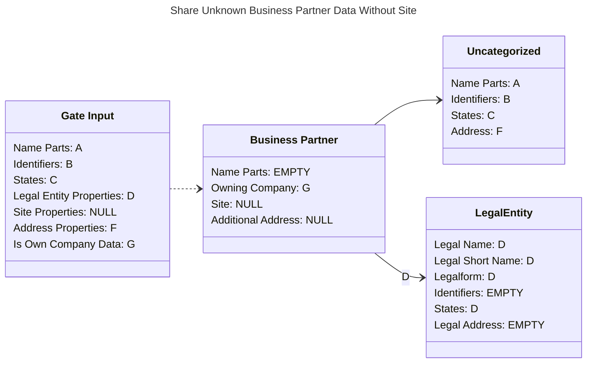
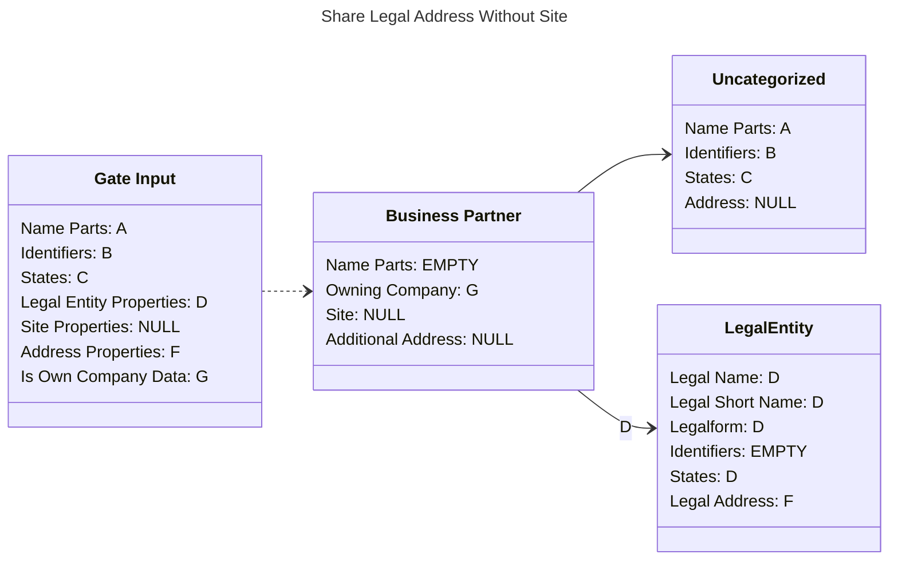
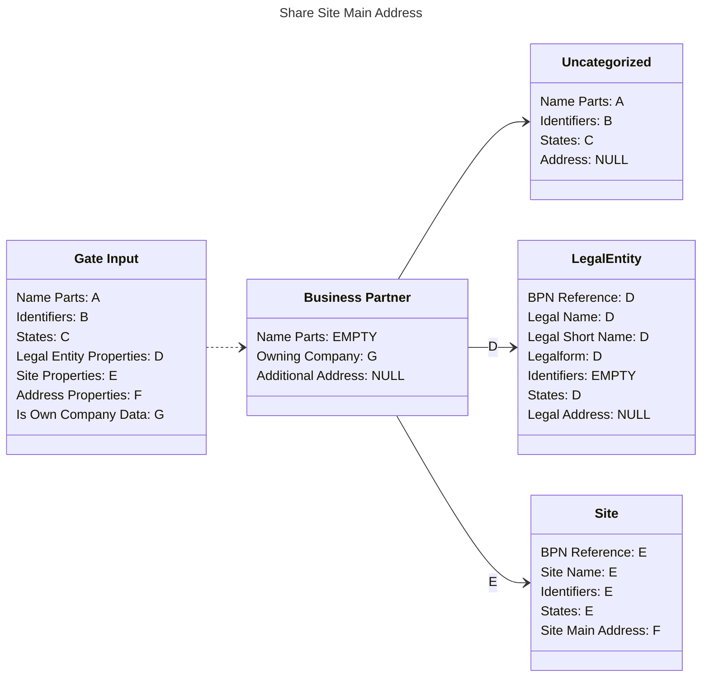
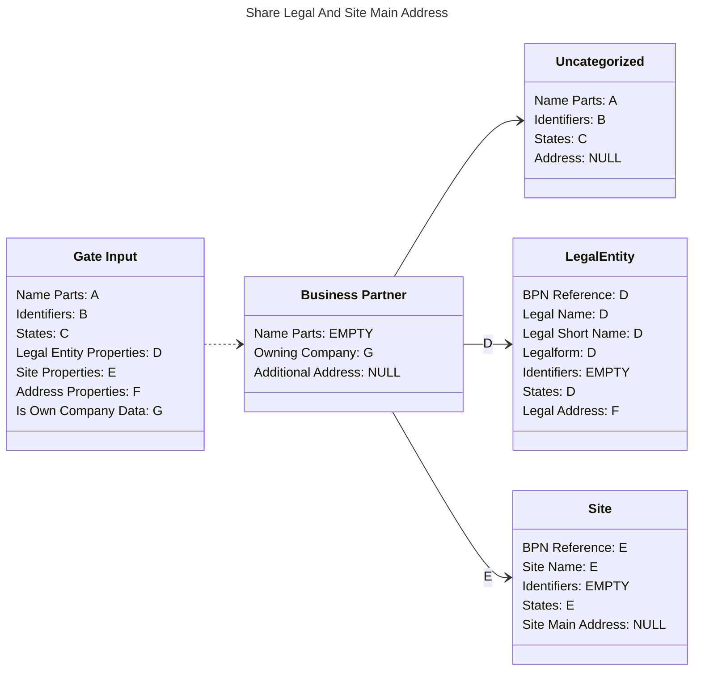
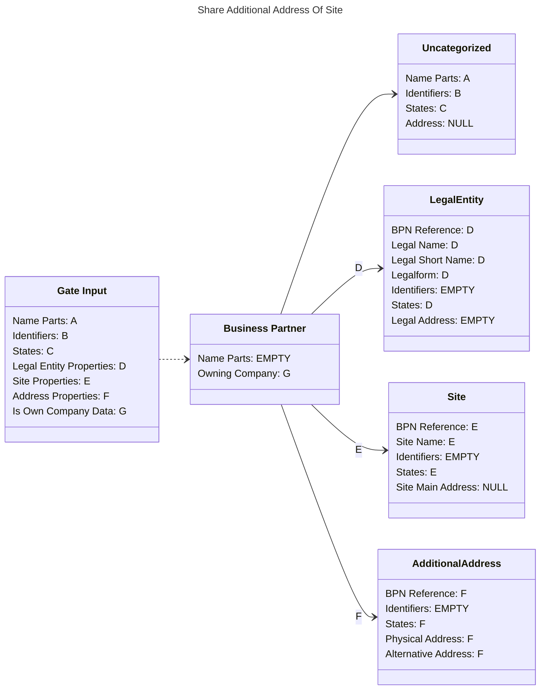
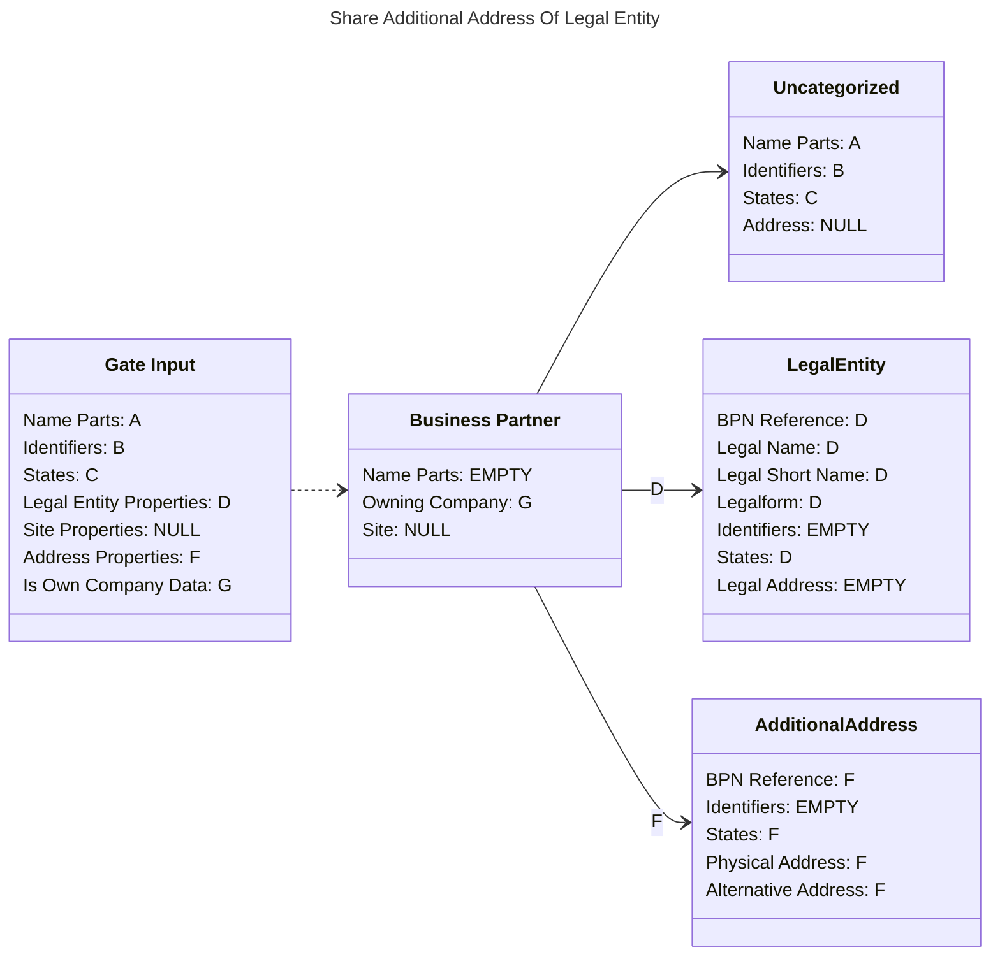

# API Documentation

<!-- TOC -->
* [API Documentation](#api-documentation)
  * [BPDM APIs](#bpdm-apis)
    * [Pool API](#pool-api)
      * [Authorization](#authorization)
    * [Gate API](#gate-api)
      * [Business Partner](#business-partner)
      * [Address Type](#address-type)
      * [Stages](#stages)
      * [Sharing State](#sharing-state)
      * [Changelog](#changelog)
      * [Additional information](#additional-information)
      * [Authorization](#authorization-1)
    * [Orchestrator API](#orchestrator-api)
      * [Tasks](#tasks)
      * [Processing Steps](#processing-steps)
      * [Clean And Sync Step](#clean-and-sync-step)
  * [Use Cases](#use-cases)
    * [Access BPDM over EDC](#access-bpdm-over-edc)
    * [Sharing Members](#sharing-members)
      * [Sharing Business Partner Data](#sharing-business-partner-data)
      * [Sharing Other Company's Data](#sharing-other-companys-data)
      * [Sharing Own Company Data](#sharing-own-company-data)
    * [VAS Providers](#vas-providers)
    * [Golden Record Processing Service Providers](#golden-record-processing-service-providers)
      * [Outdated Tasks](#outdated-tasks)
      * [Mapping of Gate Business Partner To Golden Record Tasks](#mapping-of-gate-business-partner-to-golden-record-tasks)
  * [NOTICE](#notice)
<!-- TOC -->

Here you can find documentation on how to access and integrate BPDM APIs.

## BPDM APIs

This section details concepts for the BPDM APIs.

### Pool API

With the [Pool API](pool.yaml) you can query golden record and available metadata information like legal forms and identifier types.
Value added services who operate on golden record data mainly use this API.
However, this API may also be interesting to sharing members who want to see which metadata information the golden record process provider supports.
Have a look at the corresponding [BPDM Pool API standard](https://catenax-ev.github.io/docs/standards/CX-0012-BusinessPartnerDataPoolAPI) for more information.

#### Authorization

The BPDM Pool API recognizes two user groups:

1. Catena-X Members who can read golden record member data and the metadata.
2. Admins who have full read and write access to the golden record and metadata.

Permissions:

| Resource              | Catena-X Member | Admin |
|-----------------------|-----------------|-------|
| Member Golden Records | R               | R & W |
| Member Changelog      | R               | R     |
| Metadata              | R               | R & W |
| Golden Records        | -               | R & W |

### Gate API

With the [Gate API](gate.yaml) you can share business partner data with the golden record process and query the results.
This API is important for sharing members and value added services who offer extended functionality for sharing members.
More general information can be obtained from the [BPDM Gate standard](https://catenax-ev.github.io/docs/standards/CX-0074-BusinessPartnerGateAPI).

#### Business Partner

A business partner is a logistic address augmented by additional meta information like names, identifiers and state of operation.
The business partner data may contain legal entity and/or site information.
For example, the business partner's name may include the name of the legal entity the logistic address belongs to.
Sharing member business partners are assigned up to three BPNs during the golden record process.
A BPNA refers to the actual logistic address contained in the business partner data.
A BPNL refers to the legal entity that logistic address belongs to.
An optional BPNS exists if the logistic address also belongs to a site of that legal entity.

#### Address Type

The data in the output stage does not directly say which business partner type has been determined.
Instead, you will find the determined address type which is slightly accurate than the business partner type.
If you want to categorize your business partner data into legal entity, site and address you can refer to this explanation:

| Address Type                | Golden Record Type |
|-----------------------------|--------------------|
| Legal Address               | Legal Entity       |
| Site Main Address           | Site               |
| Legal And Site Main Address | Site\*             |
| Additional Address          | Logistic Address   |

\* Note that the Legal and Site Main Address type is special in this regard since it indicates a site that has the legal address as its site main address.
For each legal entity there can only be up to one of such sites.

#### Stages

Business partners have two types of data: input and output data.
Input data is the version of the business partner how it is shared by the sharing member.
Output data is the version of the business partner after it has gone through in the golden record process.
Sharing members can only update the input data and the golden record process can only update the output data.

#### Sharing State

Each business partner has a sharing state in regard to the golden record process.
The sharing state indicates whether the business partner input data has not yet been shared, is currently in processing or finished.

> Initial Sharing State: The BPDM API can be configured to support an additional 'Initial' sharing state.
> Such a sharing state indicates that the business partner input data has been changed but is not yet marked for sharing.
> If that is the case the sharing state needs to be manually set to ready to be shared to the golden record process.
> If no initial sharing state has been configured uploaded input data is automatically shared to the golden record process as soon as it is received.

#### Changelog

Contains events for each stage on when business partner data has been added or changed.
The changelog only contains the information of when the business partner changed not what changed.

#### Additional information

The Gate API only works in context of one sharing member at a time.
This means, a sharing member or value added service may only see the business partner data information of one sharing member at a time.

The full implementation of the Golden Record Process - which includes duplication checks, categorizing and cleaning of data - is not yet provided in this repository.
Instead, BPDM offers a dummy golden record processing service that performs rudimentary checks and processing to offer a limited Golden Record Process without relying on an external provider.
Since the dummy service is very limited when using the BPDM API behind such a dummy golden record process comes with restrictions.
The next sections deal with how to use the BPDM API as a sharing member with a real golden record process and what to consider with the dummy service.

#### Authorization

The BPDM Gate API considers the following user groups:

1. Input Consumer: can read business partner input data
2. Output Consumer: can read business partner output data
3. Input Manager: can read and write business partner input data and may also start the sharing process
4. Admin: full access to all resources

Permissions:

| Resource                | Input Consumer | Output Consumer | Input Manager | Admin |
|-------------------------|----------------|-----------------|---------------|-------|
| Business Partner Input  | R              | -               | R & W         | R & W |
| Business Partner Output | -              | R               | -             | R & W |
| Sharing State           | R              | R               | R & W         | R & W |
| Input Changelog         | R              | -               | R             | R     |
| Output Changelog        | -              | R               | -             | R     |
| Statistics              | R              | R               | R             | R     |

### Orchestrator API

This API offers endpoints for retrieving and resolving business partner data being processed inside the golden record process.

#### Tasks

Business partner data to be processed come in processing tasks with their own task ID.
A processing service receives the business partner along with the task ID.
The service than can process the data and post the result of the task back to the API with the matching task ID.

#### Processing Steps

Business partner in the golden record process goes through different processing steps.
A golden record processing service can query and post results for the processing step it is responsible for.

#### Clean And Sync Step

Currently, there is only one step supported: CleanAndSync.
In this step the whole business partner process - including duplication check, natural person screening and cleaning of data - should be conducted.

The business partner that this step receives is the data the sharing member provided.
Depending on what the sharing member provided the data could be completely uncategorized or pre-categorized.
This data needs to be verified and corrected.
If that is not possible the data can be returned to the golden record process with an error message.

As a result for this step the golden record process expects the following:

1. If the business partner data refers to existing golden records the BPNs should be provided in the BPN reference fields.
2. The whole golden record hierarchy should be provided.
   That means if the business partner data contains an additional address, the result should also contain the possible site parent and the legal entity parent information

## Use Cases

The main user groups for BPDM are sharing members, golden record processing service providers and VAS providers.

This document contains explanations for different use cases for these user groups.
The explanations may refer to requests whose examples can be found in this [Postman collection](../postman/EDC%20BPDM%20Consumer.postman_collection.json).
Please mind that the requests in this Postman collection are not meant to be executed for automated tests but rather serve as documentation.

### Access BPDM over EDC

Some users can not directly access the BPDM API but may only do so over the EDC public API.
This section details how a sharing member EDC can access an EDC exposing the BPDM API as assets. Before you can access the assets make sure that the BPDM EDC
has been configured to [provide assets for your company's BPN](../../INSTALL.md).
In the provided consumer Postman collection you will see an example of how you can negotiate for a BPDM data offer.
Offers are separated into purposes (defined in the BPDM framework agreement) on why you want to access the BPDM API.
First, you need to select the offer based on your purpose.
Afterward you can negotiate for a contract agreement in order to get access to the data.
The final result of that negotiation will be a transfer token with which you can navigate the BPDM APIs over the BPDM EDC's public API (which acts as a proxy).

### Sharing Members

As a sharing member you want to share business partner data to the golden record process in order to obtain BPNs and refined data.
The process on how you use the BPDM APIs differs slightly on whether it is your own company data or that of other companies you do business with.

> Please notice that this repository offers a limited dummy golden record process which comes with a [list of restrictions](../architecture/11_Risks_And_Technical_Debts.md).
> If you are using such dummy golden record process for test purposes you may need to consider these restrictions when sharing business partner data.

#### Sharing Business Partner Data

The golden record process will determine the type and give you the information back together with the associated BPNs and refined data.

To share such business partners you perform the following actions:

1. Obtain access to the `ReadAccessPoolForCatenaXMember` asset
2. Query the Pool metadata information to obtain the list of supported legal forms, identifier types and administrative level 1 regions
3. Obtain access to the `FullAccessGateInputForSharingMember` asset
4. Within the constraints of the supported metadata upload a generic business partner entry to the Gate input stage
5. Optionally, if the Gate has been configured for [manual sharing](../../INSTALL.md) you should set the business partner entry to ready
6. Obtain access to the `ReadAccessGateOutputForSharingMember` asset
7. Monitor the output changelog for the business partner entry until you receive a CREATE event for that entry (UPDATE if you have shared it before)
8. Query the business partner data in the output stage

#### Sharing Other Company's Data

Business partners that do not belong to you or your managed subsidiaries should be shared as generic business partners - that is a business partner for which it is unknown whether it is a Legal Entity, Site or Address.
Additionally, the business partner **must not** be marked as `isOwnCompanyData`.

Also, it is important to note that sharing sites is reserved for the owning company of that site.
If you give site information to a business partner which does not belong to you, the entry might come back as invalid or the site information will be ignored.
The exact behaviour is determined by the golden record process implementation.

#### Sharing Own Company Data

When  sharing business partner data that belongs to your own company or managed subsidiary you are required to specify a fixed address type of the business partner.
That means, you can't share your own company data as of an unknown business partner type.

Additionally, you are required to mark the business partner as `isOwnCompanyData`.
This is the way to recognize that you want to share your own data.

In contrast to sharing other company's data you are allowed to specify site information including whether an address is a site main address.

### VAS Providers

Providers of value added services analyze the sharing member business partner data and provide useful insights before and after the golden record process.
Which APIs such services need to access depends highly on their use case.
The following shows an example interaction for a value added service that analyzes sharing member input data.

1. Obtain access to the `ReadAccessGateInputForSharingMember` asset
2. Monitor the input changelog events notifying you about new business partners (business partner updates)
3. Query the business partner input
4. Perform your analysis

There are similar interactions possible for analyzing the business partner output and even golden record pool data.

### Golden Record Processing Service Providers

As a golden record processing service provider you participate in realising the golden record process.
You provide a step towards transforming shared business partner data to a golden record.

As such your main point of interaction will be with the Orchestrator API.
The Pool API may also offer useful context information that benefits your service.

In general, as a golden record processing service provider you are expected to reserve and resolve golden record tasks.
Your service is responsible for a refinement step for which you will provide these resolutions.
The following list details the interaction:

1. Reserve a number of tasks for your refinement step to receive the business partner data to process (POST reserve endpoint)
2. Process and/or validate the business partner data according to your service logic
3. By specifying the task ID post the resulting business partner data (POST resolution endpoint)
4. Start from the beginning until no golden record tasks remain

Please note that you have to post the full resulting business partner data even for data points that you have not changed.
Failing to do so will be interpreted as specifying NULL values which may have unintended consequences for the business partner result.

#### Outdated Tasks

Between reserving a golden record task and providing a resolution a task may become outdated.
This can have several reasons:

1. The sharing member may have shared newer data for the business partner data in the task.
In this case, the task is aborted and resolutions to that task are accepted but ignored.
2. The golden record task may go into timeout as defined by the time was given to process to it.
Trying to provide a resolution for a timeout task results in an error.

#### Mapping of Gate Business Partner To Golden Record Tasks

This section shows how business partner data shared in a Gate is represented in golden record tasks in the Orchestrator.

## NOTICE

This work is licensed under the [Apache-2.0](https://www.apache.org/licenses/LICENSE-2.0).

- SPDX-License-Identifier: Apache-2.0
- SPDX-FileCopyrightText: 2023,2024 ZF Friedrichshafen AG
- SPDX-FileCopyrightText: 2023,2024 SAP SE
- SPDX-FileCopyrightText: 2023,2024 Bayerische Motoren Werke Aktiengesellschaft (BMW AG)
- SPDX-FileCopyrightText: 2023,2024 Mercedes Benz Group
- SPDX-FileCopyrightText: 2023,2024 Robert Bosch GmbH
- SPDX-FileCopyrightText: 2023,2024 Schaeffler AG
- SPDX-FileCopyrightText: 2023,2024 Contributors to the Eclipse Foundation
- Source URL: https://github.com/eclipse-tractusx/bpdm