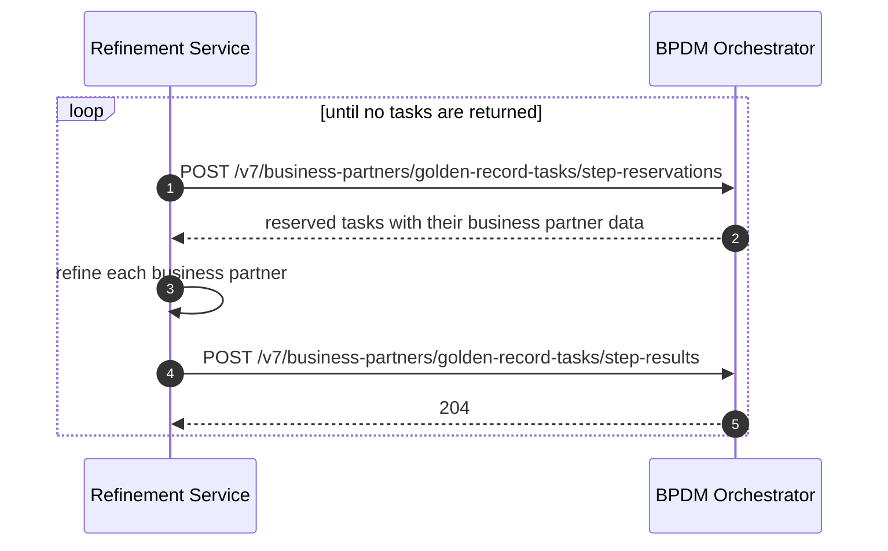

# Refinement Service Provider Guide

This guide is for a company that provides a refinement step of the golden record process - a
duplication check, a cleaning or validation service, a natural person screening - and integrates it
through the BPDM Orchestrator.
It explains what a golden record task is, what its business partner data can express, and what to
put into a result for the cases that come up.
The API documentation calls this role a
[golden record processing service provider](README.md#golden-record-processing-service-providers).

It does not cover how a sharing member gets data into the process
([see the Sharing Member Guide](sharing-member-guide.md)) or how to read finished golden records from
the Pool ([see the Dataspace Participant Guide](dataspace-participant-guide.md)).
The endpoints named here are described in full in [orchestrator.yaml](orchestrator.yaml); this guide
says which ones to call and what the data you send back has to say.

<!-- TOC -->
* [Refinement Service Provider Guide](#refinement-service-provider-guide)
  * [Getting Access](#getting-access)
  * [The Golden Record Task](#the-golden-record-task)
    * [Modes And Steps](#modes-and-steps)
    * [Reserve, Process, Resolve](#reserve-process-resolve)
    * [What A Task Carries](#what-a-task-carries)
  * [What A Task Expresses](#what-a-task-expresses)
    * [The Golden Record Type](#the-golden-record-type)
    * [The Parent Chain](#the-parent-chain)
    * [BPN References](#bpn-references)
    * [hasChanged](#haschanged)
  * [Use Cases](#use-cases)
    * [Expressing A Legal Entity](#expressing-a-legal-entity)
    * [Expressing A Site](#expressing-a-site)
    * [Expressing A Site At Its Legal Entity's Registered Address](#expressing-a-site-at-its-legal-entitys-registered-address)
    * [Expressing An Additional Address](#expressing-an-additional-address)
    * [Creating A Whole Parent Chain At Once](#creating-a-whole-parent-chain-at-once)
    * [Referencing Parents That Already Are Golden Records](#referencing-parents-that-already-are-golden-records)
    * [Matching A Record Onto An Existing Golden Record](#matching-a-record-onto-an-existing-golden-record)
    * [Consolidating The Sites Of An Address](#consolidating-the-sites-of-an-address)
    * [Failing A Task](#failing-a-task)
  * [Nice To Know](#nice-to-know)
    * [What The Pool Overwrites](#what-the-pool-overwrites)
    * [Script Variant Coverage](#script-variant-coverage)
    * [Relation Tasks Are A Separate Queue](#relation-tasks-are-a-separate-queue)
    * [Resolving Your Own Request Identifiers Later](#resolving-your-own-request-identifiers-later)
  * [NOTICE](#notice)
<!-- TOC -->

## Getting Access

The Orchestrator is reached differently from the other two APIs, and the difference is worth knowing
before you build against it.
A sharing member reaches its Gate and a dataspace participant reaches the Pool through an EDC, over a
data offer they negotiate.
The Orchestrator is exposed through no such offer.
You are integrated by the golden record process provider itself: it issues your service a technical
user at its identity provider, and you call the API directly with those client credentials.

What that technical user holds is one permission pair, per step:

| Permission                       | Lets you                                    |
|----------------------------------|---------------------------------------------|
| `create_reservation_<step>`      | reserve tasks from that step's queue        |
| `create_result_<step>`           | post step results into that step            |

So a service refining `CleanAndSync` needs `create_reservation_CleanAndSync` and
`create_result_CleanAndSync`, and nothing else.
The reference identity provider configuration bundles each pair as a single composite role named
`refiner_<step>`, which is what an operator normally grants.
Those are the default names - an operator may configure others - and they are matched
case-insensitively, so ask for the pair by step rather than by spelling.

Two consequences follow.

You are scoped to your step, not to a set of records.
Reserving from a step takes the tasks that are queued in it, whichever Gate created them and
whichever sharing member they came from - the Orchestrator publishes no per-caller view of the queue
the way the Pool and the Gate publish per-user-group ones.
Your service therefore sits inside the golden record process rather than in front of it, which is why
the data reaches you pseudonymised: see [The Golden Record Task](#the-golden-record-task) for what the
record id does and does not tell you.

And the task client endpoints are not yours.
Creating tasks (`create_task`) and reading task states and finished-task events (`read_task`) belong
to the Gate, which is the task creator; a refinement service is granted neither.
Everything a refinement service calls is the two endpoints in
[Reserve, Process, Resolve](#reserve-process-resolve).

## The Golden Record Task

A golden record task is one sharing member record on its way to becoming a golden record.
It is created by a Gate when a sharing member releases a business partner, it carries that business
partner's data, and it moves through a fixed queue of processing steps until it succeeds or fails.
A refinement service owns one of those steps: it takes tasks out of that step's queue, refines the
business partner data they carry, and hands the data back.

Two identifiers travel with a task, and the difference matters:

* the **task id**, which identifies this one run through the process and is what you post a result
  against.
* the **record id**, which identifies the sharing member's record the task was created for.
  It is stable across every task for that record, which is what lets you recognise the same business
  partner coming round again - and it is a public pseudonym: the Gate holds a separate private
  identifier, so the record id tells you nothing about which sharing member shared the data.
  Keeping data submitters anonymous from refinement services is the reason the Orchestrator sits
  between them.

### Modes And Steps

A task is created in a mode, and the mode fixes the steps it goes through, in order:

| Mode                      | Steps                     |
|---------------------------|---------------------------|
| `UpdateFromSharingMember` | `CleanAndSync`, `PoolSync` |
| `UpdateFromPool`          | `Clean`                   |

`UpdateFromSharingMember` is the mode a Gate creates tasks in, so it is the one you will see.
`CleanAndSync` is the refinement step: the whole golden record process - duplication check, natural
person screening, cleaning and categorizing - is expected to happen there, and that is the step a
refinement service reserves from.
`PoolSync` is the Pool's own step, in which it writes the golden records the refined data describes.
So the data you return in `CleanAndSync` is exactly what the Pool then persists.

A task advances one step at a time.
The business partner data you post as a step result becomes the task's business partner data for the
next step, which is why a result has to carry the complete business partner and not only what you
changed - a field you leave out is read as null and reaches the Pool as one.

### Reserve, Process, Resolve

From your side the integration is two calls in a loop.

1. **Reserve.** `POST .../step-reservations` takes the `step` to reserve from and an `amount`, and
   returns up to that many tasks that are queued in it, each with its `taskId`, its `recordId` and
   the `businessPartner` to process.
   Fewer tasks than you asked for means the queue holds no more; none means it is empty.
   The amount is capped by the operator, at 100 by default.
2. **Resolve.** `POST .../step-results` takes the `step` and a list of results, each naming its
   `taskId` and carrying either the refined `businessPartner` or a list of `errors`.
   Results are accepted all or nothing, they do not have to match one reservation, and the same cap
   applies.

Reserving is a one-way move: a reserved task leaves the queue and is not handed out again.
A task you reserve and never resolve therefore sits in your step until the Orchestrator's pending
timeout - two days from its creation by default - fails it with error type `Timeout`.
Reserve what you can process, and post a result for every task you took, an error result included.

A task can also become **outdated** between reserving and resolving, because the sharing member
shared newer data for that record and the Gate abandoned this run.
A result posted for such a task is accepted and silently ignored, and the task reports the result
state `Error`.
Nothing is expected of you here: post the result as usual.

### What A Task Carries

The business partner data in a task is the sharing member's record as far as the process has got
with it, and its shape is the same going in and coming out.
It has two halves.

**Uncategorized data** is what nobody has yet attributed to a level of the golden record:

* `uncategorized.nameParts` - the plain name as it appears in the sharing member's system
* `uncategorized.identifiers` and `uncategorized.states` - identifiers and business states for which
  it is unknown whether they belong to the legal entity, the site or an address
* `uncategorized.address` - address data for which it is unknown whether it is a legal, a site main
  or an additional address

**Categorized data** is the golden record the data is understood to describe: `legalEntity`, `site`
and `additionalAddress`, plus `nameParts` for the name parts you have attributed to a level
(`LegalName`, `ShortName`, `LegalForm`, `SiteName`, `AddressName`).

Refining a task is moving content from the first half into the second.
Alongside them the task carries `owningCompany`, the BPNL of the sharing member where the record is
its own company data, and `additionalSites`, the further sites the sharing member stated for its
address.

## What A Task Expresses

### The Golden Record Type

The task does not carry a field in which you declare "this is a site".
The type follows from which of the three categorized components are present, and the task reports it
back to you in the read-only `type`:

| `legalEntity` | `site` | `additionalAddress` | `type`         |
|---------------|--------|---------------------|----------------|
| filled        | null   | null                | `LegalEntity`  |
| filled        | filled | null                | `Site`         |
| filled        | any    | filled              | `Address`      |
| empty         | null   | null                | *undecided*    |

So expressing what a task depicts is a matter of which components you fill, and the innermost one you
fill decides it.
An undecided type produces no golden record; a result that stays undecided cannot be written by the
Pool and the task ends in `Error`.

### The Parent Chain

A golden record never stands alone, so the business partner data has to carry the **complete parent
chain** of the record it depicts, not only the record itself:

* a legal entity carries `legalEntity`, with its registered address in `legalEntity.legalAddress`.
* a site carries `site` **and** the `legalEntity` it belongs to.
* an additional address carries `additionalAddress`, the `legalEntity` it belongs to, and `site` where
  the address belongs to a site rather than directly to the legal entity.

`legalEntity` is therefore never null and never empty in a result that is meant to produce a golden
record: every business partner either is a legal entity or belongs to one.
Whether an additional address hangs off the legal entity directly or off one of its sites is stated
by nothing but the presence of `site`.

The Pool checks the chain it is given.
A site whose stated legal entity is not the legal entity that site actually belongs to, and an
additional address whose stated legal entity is not the one the address belongs to, fail the task.

### BPN References

Every component of the business partner data carries a `bpnReference` instead of a BPN, and that
reference is how you say which golden record the component is:

| Field                              | The reference identifies       |
|------------------------------------|--------------------------------|
| `legalEntity.bpnReference`         | the legal entity (BPNL)        |
| `legalEntity.legalAddress.bpnReference` | its registered address (BPNA) |
| `site.bpnReference`                | the site (BPNS)                |
| `site.siteMainAddress.bpnReference`| the site's main address (BPNA) |
| `additionalAddress.bpnReference`   | the additional address (BPNA)  |
| `additionalSites[].bpnReference`   | a further site of that address (BPNS) |

Each is a separate reference, so a site record carries four of them.

A reference is one of two things, stated in `referenceType`:

* **`Bpn`** - `referenceValue` is an existing BPN.
  The component is resolved to that golden record and updated.
  A BPN that does not exist fails the task, so state one only where you are sure of it.
* **`BpnRequestIdentifier`** - `referenceValue` is an identifier **you** choose.
  The process keeps a permanent mapping of request identifier to BPN: an identifier it has not seen
  before creates a new golden record and a new BPN and records the pair; an identifier it knows
  resolves to the BPN it was given and that golden record is updated.

That is what request identifiers are for.
A duplication check service decides that two records are the same business partner; it can express
that by deriving the same request identifier for both, without ever having to know or invent a BPN.
Derive them from what makes the business partner the same for you and keep them stable, because the
mapping is permanent: reusing an identifier for a different business partner points your data at a
golden record you did not mean, and deriving a new identifier for one you already have creates a
duplicate.

`desiredBpn` is not currently supported and is ignored.

### hasChanged

`legalEntity`, `site` and `additionalAddress` each carry a `hasChanged` flag that says whether the
component's data differs from the golden record behind it.

`false` means "use this only as a reference": the Pool resolves the component to its golden record,
leaves that golden record untouched, and returns its stored state to you in the reply.
Anything else - `true` or unset - means the component is written.
The flag only ever prevents an update, never a creation: a component whose reference resolves to no
BPN yet is created regardless of what the flag says.

The nested addresses have no say of their own.
`legalEntity.legalAddress` is written with its legal entity and `site.siteMainAddress` with its site,
so both follow their owner's flag and setting one on them changes nothing.
The address schema carries `hasChanged` all the same, marked deprecated, because all three addresses
share it - on `additionalAddress`, which is a component in its own right, the flag is read.

## Use Cases

### Expressing A Legal Entity

The task depicts a company itself, at its registered address.

Post a result whose business partner data

* fills `legalEntity` with the legal name, legal short name, legal form, identifiers and business
  states you attributed to it, and `confidenceCriteria`
* fills `legalEntity.legalAddress` with the registered address, at minimum its `country` and `city`
* leaves `site` and `additionalAddress` null
* carries a `bpnReference` on the legal entity and another on its legal address
* moves what you used out of `uncategorized` and into `nameParts` with type `LegalName`, `ShortName`
  or `LegalForm`

`type` then reads `LegalEntity` and the Pool writes a BPNL and the BPNA of its legal address.

### Expressing A Site

The task depicts a location or unit of a company, at that site's own main address.

Post a result whose business partner data

* fills `site` with the site name, its business states and `confidenceCriteria`
* fills `site.siteMainAddress` with the site's main address
* fills `legalEntity` as the parent the site belongs to - see
  [Referencing Parents That Already Are Golden Records](#referencing-parents-that-already-are-golden-records)
* leaves `additionalAddress` null
* carries a `bpnReference` on the site and another on its main address

`type` then reads `Site` and the Pool writes a BPNS, the BPNA of the main address, and the BPNL of the
parent.

### Expressing A Site At Its Legal Entity's Registered Address

Where the site's main address *is* the registered address of its legal entity, the two share one
address and it must be written once, not twice.

Post a result whose business partner data

* fills `site` as above but leaves `site.siteMainAddress` **null**
* carries that one address in `legalEntity.legalAddress`

A null `site.siteMainAddress` is the statement "this site's main address is the legal address", which
the task reports back in the read-only `siteMainIsLegalAddress`.
The Pool then writes one BPNA that is both, and the legal entity gets its one site of that kind.
Filling both address fields instead makes the task write two addresses and describes a different
business partner.

### Expressing An Additional Address

The task depicts a further address of a company or of one of its sites - a delivery gate, a rented
office - that is neither a registered nor a site main address.

Post a result whose business partner data

* fills `additionalAddress` with the address, its identifiers, its business states and
  `confidenceCriteria`
* fills `legalEntity` as the parent
* fills `site` as the parent **only** where the address belongs to a site; leaves it null where the
  address belongs to the legal entity directly
* carries a `bpnReference` on the additional address

`type` then reads `Address` and the Pool writes a BPNA, plus the BPNS where you stated a site.
Note that `site` here is the address's parent, not the subject of the task: with `additionalAddress`
filled, the type is `Address` whatever the site says.

### Creating A Whole Parent Chain At Once

A new additional address whose legal entity, or whose site, is not in the golden record process yet
does not need two earlier tasks to bring its parents in.
One task creates the whole chain.

Post a result whose business partner data

* fills `additionalAddress`, `site` and `legalEntity` with the full data you hold for each of the
  three, each with its own address where it has one
* gives every component a `bpnReference` of type `BpnRequestIdentifier`, with an identifier of your
  own for each
* leaves `hasChanged` unset, or sets it to `true`, on the components that are to be created

None of the request identifiers is known yet, so the Pool creates a legal entity with its legal
address, a site with its main address, and the additional address under them, and records the mapping
from each of your identifiers to the BPN it issued.
Every later task that uses the same identifiers resolves to those golden records.

Do this only with data you actually hold for the parents.
A parent invented to satisfy the chain becomes a golden record that everyone in the network sees.

### Referencing Parents That Already Are Golden Records

The common case is the other way round: the parents already exist and the task is only about the
component below them.

Post a result whose business partner data

* carries each parent with the `bpnReference` that resolves it - the BPN as `referenceType` `Bpn`, or
  the request identifier you already used for it
* sets `hasChanged` to `false` on each of those parents
* carries the parent's remaining fields as you received them

This is the practice to follow wherever a parent is unchanged.
The parent information then serves as a reference only: the Pool resolves it, does not update it, and
returns its stored state in the reply, so your task cannot degrade a golden record another service
refined - which is what would happen if you re-sent a parent you only know partially with
`hasChanged` left unset.

### Matching A Record Onto An Existing Golden Record

The task depicts a business partner you have decided is one you have seen before.

Post a result whose business partner data carries, on the component in question, the `bpnReference`
that identifies it:

* the **BPN** with `referenceType` `Bpn`, where you resolved the business partner to an existing
  golden record.
* the **request identifier** you used for it before, with `referenceType` `BpnRequestIdentifier`,
  where you recognised it as the same business partner as an earlier record without having its BPN.

Both resolve to the same golden record and update it with the data you post.
The difference is only where the knowledge comes from, and the second is what makes a duplication
check possible without BPN lookups.

### Consolidating The Sites Of An Address

One address can be a location of several sites - a warehouse two plants share, a gate that serves
both - and no single record says so.
Each sharing member states the one site the address means to it, and perhaps the further sites it
happens to know of; the network's answer to "which sites are at this address" exists only across all
of those records.
Producing that answer is a refinement service's responsibility, and one of its main ones: the Pool
applies what a single task states and merges nothing, so completeness has to come from you.

Post a result whose business partner data

* keeps the record's own site in `site`, as in any site or additional address record
* lists **every other** site at that address in `additionalSites`, each by its `bpnReference` where
  you resolved it to a site you already know, otherwise by `siteName`

The list is read as complete.
Together with `site` it is the address's whole site membership, and a site the address currently
belongs to that your list leaves out is **unlinked** from it.
An incomplete list is therefore not a partial statement but a destructive one: a task that repeats
only the sharing member's own view drops the sites other records contributed, and the address ends up
with the membership of whichever record was refined last.

Consolidating means keeping your own picture across records, because a task hands you one record and
no history.
Key it by the address, add what each record contributes, and restate the whole of it in every result
for that address.
The reference implementation does not do this - the
[cleaning service dummy](../../bpdm-cleaning-service-dummy) passes the sharing member's own statement
through, which is exactly the behaviour described above - so this is work a production service has to
add rather than inherit.

Three rules bind what you may state:

* **Resolving a name is yours to do.** An entry whose reference resolves to an existing site links
  that site to the address. An entry that resolves to no BPN yet **creates** a new site with this
  address as its main address, so a name you failed to match against a site you already know becomes
  a duplicate site rather than a link. An existing site is never updated through this field.
* **Every stated site belongs to the address's legal entity.** A site of another legal entity fails
  the task.
* **The site whose main address this is cannot be left out.** An address that is a site's main address
  stays a member of that site, so state it - in `site` or in the list.

Membership can only be stated by a record that has a site of its own.
A record with no `site` says nothing about it and the Pool leaves the address's membership as it
stands, and a result carrying `additionalSites` without a `site` is rejected outright.
So an address's membership is corrected through a record that has a site, never through one that has
none.

### Failing A Task

Where you cannot refine the data - a natural person, a blacklisted country, a record you cannot
resolve to a clear legal entity - the task fails rather than producing a golden record.

Post a result for the task that carries a non-empty `errors`, each with a `type` and a free-text
`description`:

| `type`                           | The record                                              |
|----------------------------------|---------------------------------------------------------|
| `NaturalPersonError`             | contains natural person information                     |
| `BpnErrorNotFound`               | cannot be matched to a legal entity or an address        |
| `BpnErrorTooManyOptions`         | cannot be linked to a clear legal entity                |
| `MandatoryFieldValidationFailed` | does not fulfil mandatory validation rules              |
| `BlacklistCountryPresent`        | is in a country the process may not process              |
| `UnknownSpecialCharacters`       | contains characters that are not allowed                |
| `Unspecified`                    | failed for a reason none of the above covers             |

The task then ends in result state `Error`, its errors reach the sharing member through its sharing
state, and no golden record is written.
An error result is a result: post it rather than leaving the task to time out, which reports
`Timeout` and tells the sharing member nothing.
Keep descriptions short: the stored description is limited to 255 characters, so put the detail that
identifies the cause first.

## Nice To Know

Behaviour that is worth knowing but that you do not act on.

### What The Pool Overwrites

`confidenceCriteria.numberOfSharingMembers` is not yours to set.
The Pool counts how many sharing member records stand behind a golden record and overwrites the value
you sent with its own, in the reply as well.
The other confidence criteria - `sharedByOwner`, `checkedByExternalDataSource`, `confidenceLevel` and
the two check timestamps - are written as you state them.

### Script Variant Coverage

Where a business partner's data is also written in another script, it travels in the `scriptVariants`
of the legal entity, the site or the address, each keyed by a `scriptCode` the Pool publishes.
Two rules bind a result: a variant has to carry the same mandatory content as the data it mirrors, and
a legal entity or site may only be named in a script its address is also written in.
The second one reaches beyond your task - an address can carry the names of two business partners - so
a result that stops writing an address in a script another partner is still named in fails the task
rather than silently stranding that partner.

### Relation Tasks Are A Separate Queue

Relations between business partners - `IsOwnedBy`, `IsManagedBy`, `IsReplacedBy`,
`IsAlternativeHeadquarterFor` - go through their own tasks under
`/v7/relations/golden-record-tasks`, with the same reserve-and-resolve shape and the same steps.
A relation task carries no business partner data: it names the two golden records by BPN, its
`relationType`, its `validityPeriods` and an optional `reasonCode`.
The two queues are independent, so a service that refines both reserves from both.

### Resolving Your Own Request Identifiers Later

The mapping from your request identifiers to the BPNs the process issued is not only internal.
`POST /v7/bpn/request-ids/search` on the Pool resolves request identifiers to BPNs, which is how a
service that kept its own identifiers can find out which golden records they became.
It needs golden record read access on the Pool, which is a permission separate from anything the
Orchestrator grants you.

## NOTICE

This work is licensed under the [Apache-2.0](https://www.apache.org/licenses/LICENSE-2.0).

- SPDX-License-Identifier: Apache-2.0
- SPDX-FileCopyrightText: 2023,2024 ZF Friedrichshafen AG
- SPDX-FileCopyrightText: 2023,2024 SAP SE
- SPDX-FileCopyrightText: 2023,2024 Bayerische Motoren Werke Aktiengesellschaft (BMW AG)
- SPDX-FileCopyrightText: 2023,2024 Mercedes Benz Group
- SPDX-FileCopyrightText: 2023,2024 Robert Bosch GmbH
- SPDX-FileCopyrightText: 2023,2024 Schaeffler AG
- SPDX-FileCopyrightText: 2023,2024 Contributors to the Eclipse Foundation
- Source URL: https://github.com/eclipse-tractusx/bpdm
