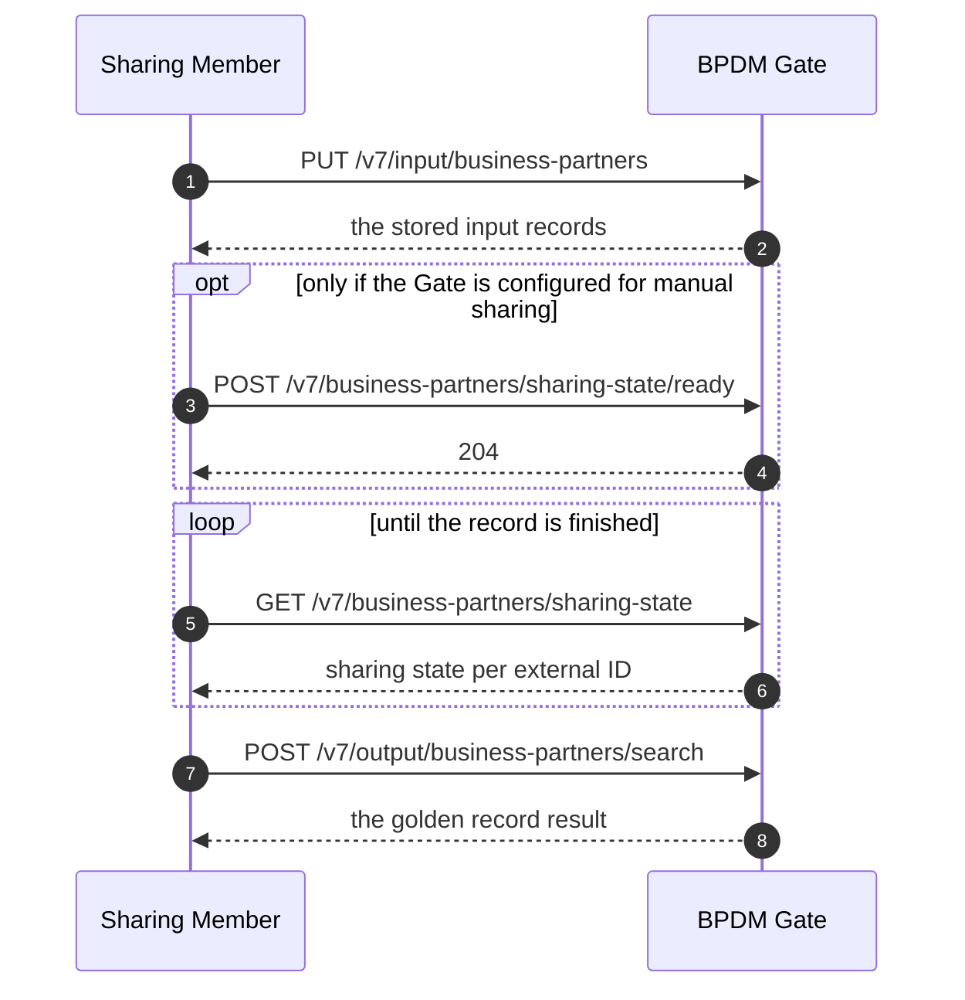

# Sharing Member Guide

This guide is for a company that shares business partner data with the golden record process
through its own BPDM Gate, in order to obtain BPNs and refined data in return.
It explains what the data format expects, what the process looks like from the outside, and what
to put into a request for the cases that come up most.

It does not cover how to reach the Gate through an EDC ([see the API documentation](README.md#access-bpdm-over-edc)),
how to query golden records from the Pool ([pool.yaml](pool.yaml)), or how to operate a golden
record processing service ([see the API documentation](README.md#golden-record-processing-service-providers)).
The endpoints named here are described in full in [gate.yaml](gate.yaml); this guide says which
ones to call, in which order, and with what content.

<!-- TOC -->
* [Sharing Member Guide](#sharing-member-guide)
  * [The Generic Business Partner](#the-generic-business-partner)
    * [What The Golden Record Process Determines](#what-the-golden-record-process-determines)
    * [Address Type](#address-type)
    * [Input And Output Data](#input-and-output-data)
  * [The Golden Record Process From The Gate](#the-golden-record-process-from-the-gate)
    * [Sharing State](#sharing-state)
    * [Changelog](#changelog)
    * [Sharing State Or Changelog](#sharing-state-or-changelog)
    * [Output Changes Without You Doing Anything](#output-changes-without-you-doing-anything)
  * [Business Partner Use Cases](#business-partner-use-cases)
    * [Before You Start](#before-you-start)
    * [Sharing Another Company's Business Partner](#sharing-another-companys-business-partner)
    * [Sharing Your Own Legal Entity](#sharing-your-own-legal-entity)
    * [Sharing Your Own Site](#sharing-your-own-site)
    * [Sharing Your Own Additional Address](#sharing-your-own-additional-address)
    * [Sharing An Address That Belongs To Several Sites](#sharing-an-address-that-belongs-to-several-sites)
    * [Sharing A Business Partner Whose BPN You Already Know](#sharing-a-business-partner-whose-bpn-you-already-know)
    * [Sharing An Address That Post Does Not Reach](#sharing-an-address-that-post-does-not-reach)
    * [Sharing Names In Several Scripts](#sharing-names-in-several-scripts)
    * [Correcting A Record You Already Shared](#correcting-a-record-you-already-shared)
    * [Retiring A Business Partner](#retiring-a-business-partner)
    * [Sharing Records From Several Systems Or Out Of Order](#sharing-records-from-several-systems-or-out-of-order)
  * [Relation Use Cases](#relation-use-cases)
    * [How Relations Are Shared](#how-relations-are-shared)
    * [A Legal Entity Is Replaced](#a-legal-entity-is-replaced)
    * [A Site Is Replaced](#a-site-is-replaced)
    * [An Address Is Replaced](#an-address-is-replaced)
    * [An Owner Or Data Manager Is Established](#an-owner-or-data-manager-is-established)
    * [One Of Your Legal Entities Is The Ultimate Owner](#one-of-your-legal-entities-is-the-ultimate-owner)
    * [The Owner Or Data Manager Changes](#the-owner-or-data-manager-changes)
    * [Ownership Or Data Management Pauses And Resumes](#ownership-or-data-management-pauses-and-resumes)
    * [An Owner Or Data Manager Goes Out Of Use](#an-owner-or-data-manager-goes-out-of-use)
    * [An Owned Or Managed Business Partner Goes Out Of Use](#an-owned-or-managed-business-partner-goes-out-of-use)
    * [An Alternative Headquarter Is Designated](#an-alternative-headquarter-is-designated)
    * [An Alternative Headquarter Pair Ends](#an-alternative-headquarter-pair-ends)
    * [Learning That A Business Partner You Share Was Replaced](#learning-that-a-business-partner-you-share-was-replaced)
  * [Nice To Know](#nice-to-know)
    * [Where Identifiers End Up](#where-identifiers-end-up)
    * [External IDs Are Permanent](#external-ids-are-permanent)
    * [What Does Not Pass Through The Process](#what-does-not-pass-through-the-process)
  * [NOTICE](#notice)
<!-- TOC -->

## The Generic Business Partner

Business partner data in a sharing member's own systems is typically flat.
One entry in an ERP or purchasing system holds a name, a postal address, a country, perhaps a tax
number and the role the partner plays for you - all in a single record, with no statement about
whether that record is a company, one of its plants, or just a delivery gate.
Several such entries may describe the same company without saying so.

The generic business partner is the data format the Gate accepts, and it is deliberately shaped
to take exactly that kind of record.
It is one flat entry identified by an `externalId` that you choose and keep stable.
That identifier is the only thing the format requires of you, and it stays the key under which the
record, its state in the process and its result are found from then on.

Everything else is optional.
The record holds the partner's names and identifiers, its business states and the roles it plays
for you, and it may in addition carry what you happen to know about the legal entity, the site and
the address behind it - each of the three separately, and only as far as your data goes.
That is the point of the format: you send what your system holds, not what a golden record needs.
[gate.yaml](gate.yaml) describes the individual fields.

### What The Golden Record Process Determines

Conceptually, a generic business partner is a single address plus everything you know about the
company behind it.
The golden record process decides what that address actually is, matches it against the golden
records that already exist, and hands the record back with up to three BPNs:

* a **BPNA** for the address itself - always present
* a **BPNL** for the legal entity the address belongs to - always present
* a **BPNS** for the site the address belongs to - only if it belongs to one

This is why you do not have to know whether a record is a legal entity, a site or an address.
For data that is not your own, you generally should not claim to know.

### Address Type

The result does not label a record "legal entity" or "site".
It states the role its address plays, and from that role follows what the record describes:

| Address Type                | The record describes                                              |
|-----------------------------|-------------------------------------------------------------------|
| Legal Address               | a legal entity, at its registered address                         |
| Site Main Address           | a site, at its main address                                       |
| Legal And Site Main Address | a legal entity and a site at once, sharing one address            |
| Additional Address          | a further address of a legal entity or of one of its sites        |

A Legal And Site Main Address is not a special kind of site.
It is a record that carries both a legal entity and a site, because the registered address of the
legal entity is at the same time the main address of that site.
A legal entity can have at most one such site.

The same four values are also how you state up front what a record is when you share your own
data - see [the business partner use cases](#business-partner-use-cases).

### Input And Output Data

Every business partner record exists in two stages.
The **input** stage holds the record as you shared it.
The **output** stage holds the record as the golden record process returned it.
You can only write the input stage, and the process can only write the output stage, so your data
and the refined result never overwrite each other.

An output record has the same shape as the input record you sent, extended by what only the process
can say: the BPNs, how well confirmed each golden record behind them is, and the relations the
process knows that golden record to have.

## The Golden Record Process From The Gate

From your side the process is four calls, of which the third repeats.

1. **Share the data.** `PUT /v7/input/business-partners` takes a list of generic business partners
   and creates or updates each one under its `externalId`.
   The same record may not appear twice in one request, and the number of records per request is
   capped by the operator.
   For a one-off bulk load there is also a CSV upload: fetch the column layout from
   `GET /v7/input/partner-upload-template` and post the filled file to
   `POST /v7/input/partner-upload-process`.
   It carries less per record than the JSON request does.
2. **Release it, if your Gate requires that.** Most Gates are configured so that an uploaded record
   is released to the process immediately.
   Where the operator configured manual sharing, records land in the `Initial` state instead and you
   release them with `POST /v7/business-partners/sharing-state/ready`.
   That call is all-or-nothing: it releases the records you name or none of them, and it accepts
   only records that are waiting to be released or that failed before.
3. **Wait for the result.** Poll either the sharing state or the output changelog; see below.
4. **Read the result.** `POST /v7/output/business-partners/search` returns the output records for
   the records you name, or for all of them.

### Sharing State

`GET /v7/business-partners/sharing-state` reports where each of your records stands.

| State | Meaning for you |
|-------|-----------------|
| `Initial` | the record is stored but not yet released to the process; release it with the ready endpoint |
| `Ready` | the record is released and waits to be picked up |
| `Pending` | the record is being processed |
| `Success` | processing finished; the result is on the output stage |
| `Error` | processing failed; the state carries an error code and message saying why |

An `Error` is not final.
Correct the input record and set it ready again, and it re-enters the process.

A sharing state also names the record's task inside the golden record process.
That is the handle an operator needs to investigate a record that got stuck; it is of no use to you
otherwise.

### Changelog

The changelog records, per stage, when a business partner was created or changed.
`POST /v7/input/business-partners/changelog/search` covers your own writes and
`POST /v7/output/business-partners/changelog/search` covers the results of the process.
Both answer for a point in time you pass: everything that happened since.

A changelog entry says *that* a record changed, never *what* changed.
To see the new content, query the corresponding stage for that external ID.

### Sharing State Or Changelog

Both can tell you that a record is done, and they answer different questions.

The sharing state answers "what happened to the records I shared".
It is the only one of the two that shows a failure, so a record that ends in `Error` will never
appear in the output changelog at all.
Poll it when you are tracking a specific batch you just uploaded.

The output changelog answers "what is new for me since this point in time".
It needs no list of external IDs and its result size does not grow with the number of records you
maintain, which makes it the right basis for a standing job that keeps your system in sync.

A robust integration uses both: the changelog to pick up results, the sharing state to find the
records that never produced one.

### Output Changes Without You Doing Anything

A golden record is shared by everyone who shares that business partner.
When it changes - because another sharing member contributed better data, or because the golden
record process refined it - your output record for that partner is updated too, without any upload
on your side.

So polling is not something you do once after an upload.
It is a standing job.
The [runtime view](../architecture/06_Runtime_View.md) describes what happens inside the process in
that case.

## Business Partner Use Cases

### Before You Start

Not every part of a business partner takes free text.
Identifier types, legal forms and administrative areas are chosen from lists the golden record
process provider maintains, and the Pool publishes those lists: `GET /v7/identifier-types` for an
identifier's `type`, `GET /v7/legal-forms` for `legalEntity.legalForm`, and
`GET /v7/administrative-areas-level1` for a postal address's `administrativeAreaLevel1`.

Read them once before you map your source data onto the format, and map onto the values they
contain.
A value outside them is a common cause of a record ending in `Error`.

### Sharing Another Company's Business Partner

The ordinary case: a supplier or customer whose internal structure you do not know.

Send a business partner input request that

* leaves `address.addressType` unset - let the process determine it instead of guessing at one
* leaves `isOwnCompanyData` at `false`
* carries the names, identifiers, states and roles your system holds, and the address
* carries the `legalEntity` data you hold, including its `legalEntityBpn` where you already know it
* carries **no** `site` data - sites are the owning company's to describe, so a site you claim for
  another company may make the record invalid or may simply be ignored, depending on the golden
  record process implementation

The result states the address type the process determined and carries a BPNL and a BPNA.
It carries a BPNS only where the address turned out to belong to a site the process already knows.

### Sharing Your Own Legal Entity

Your own company, and the subsidiaries you manage.
Own company data cannot be shared as an uncategorized record: it must be marked as own company data
and it must state an address type.

Send a business partner input request that

* sets `address.addressType` to `LegalAddress`
* sets `isOwnCompanyData` to `true`
* carries the `legalEntity` data as the register holds it
* carries the registered address in `address`
* keeps `legalEntity.states` and `address.states` apart - a company that stops operating is not the
  same statement as an address that is no longer used

The result carries a BPNL for the legal entity and a BPNA for its legal address, and no BPNS.

### Sharing Your Own Site

A location of your legal entity that you operate as a unit - a plant, a warehouse.
Sharing sites is reserved for the company that owns them, so this case only arises for your own
data.

Send a business partner input request that

* sets `address.addressType` to `SiteMainAddress`
* sets `isOwnCompanyData` to `true`
* names the site in `site.name`
* carries the site's main address in `address`
* states the legal entity the site belongs to - by `legalEntity.legalEntityBpn` where that legal
  entity is already a golden record, otherwise by the same `legalEntity` data you would share for
  the company itself

Where the site's main address is at the same time the registered address of its legal entity, the
record describes both: set `address.addressType` to `LegalAndSiteMainAddress` and share one record
rather than two.
A legal entity can have at most one such site.

The result carries all three BPNs: BPNL, BPNS and the BPNA of the site main address.

### Sharing Your Own Additional Address

Any further address of your company or of one of your sites that is neither a registered address
nor the main address of a site - a separate delivery gate, a rented office.

Send a business partner input request that

* sets `address.addressType` to `AdditionalAddress`
* sets `isOwnCompanyData` to `true`
* carries the address in `address`
* names the site the address belongs to in `site`, where it belongs to one of your sites
* carries only `legalEntity`, where the address belongs directly to the legal entity

The result carries a BPNA and a BPNL, and a BPNS where you attached the address to a site.

### Sharing An Address That Belongs To Several Sites

Where one of your addresses is a location of more than one of your sites - a warehouse two plants
share, a gate that serves both - one record can state them all.

Send a business partner input request that

* states the record's own site in `site`, as in any site record
* lists the further sites of that address you know of in `additionalSites`, each by its `siteBpn`
  where you know it, otherwise by `name`

A record that states no `site` of its own says nothing about site membership at all, and a request
that carries `additionalSites` without one is rejected as a bad request.

You do not have to know every site at the address.
The golden record process consolidates the sites stated across all the records that share an
address, so what you list is your contribution to that picture rather than the whole of it.

`address.addressType` describes the relation between the address and the record's own site only.
It says nothing about how the address relates to the sites in `additionalSites`, and that relation
is not reported back to you.

In the result, `site` remains the record's own site and `additionalSites` carries the other sites at
that address, each with its `siteBpn`.

### Sharing A Business Partner Whose BPN You Already Know

Where you already hold the BPN of a partner - from an earlier result, from the Pool, from the
partner itself - state it.
It is the strongest statement you can make about which golden record your data belongs to.

Send a business partner input request that

* carries the BPN on the part of the record it identifies: `legalEntity.legalEntityBpn`,
  `site.siteBpn` or `address.addressBpn`
* otherwise carries the same content you would share without it

The process then resolves that BPN instead of searching for a match.
A BPN it cannot resolve fails the record, and one that resolves to a golden record you did not mean
attaches your data to that record - so state a BPN where you are sure of it, and leave it out where
you are not.

### Sharing An Address That Post Does Not Reach

A location whose post goes somewhere other than its street address - a post office box, a private
bag - is shared as one record carrying both addresses.

Send a business partner input request that

* carries the location itself in `address.physicalPostalAddress`, at minimum its `country` and
  `city`
* carries `address.alternativePostalAddress` in addition, with its own `country` and `city` plus
  `deliveryServiceType` and `deliveryServiceNumber`

An alternative postal address never replaces the physical one.
A golden record address always has a physical address, so a record that carries only
`alternativePostalAddress` cannot be turned into a golden record.

### Sharing Names In Several Scripts

Where your data holds the same names and address a second time, written in another script, the
record can carry both.

Send a business partner input request that

* carries one entry in `scriptVariants` per script, each with a `scriptCode` the golden record
  process supports - the Pool publishes them at `GET /v7/script-codes`
* repeats in every variant the content that is mandatory in the data it mirrors: the legal entity or
  site name it names, the `city` of the address it carries
* carries the address in every script in which the record names the legal entity or the site - a
  name may only be written in a script its address is also written in

The Gate stores the variants without checking any of this.
The rules are enforced where the record enters the golden record process, so a violation reaches you
as a record in `Error` rather than as a rejected request.

### Correcting A Record You Already Shared

Send a business partner input request that

* uses the same `externalId` as before
* carries the complete record rather than only what changed - an update replaces the record as a
  whole, and everything you leave out is cleared

What follows from that is worth knowing before you build a synchronisation job:

* Content identical to what the Gate already holds is not an update.
  No task is created, the sharing state stays as it is and nothing appears in the changelog, so you
  cannot re-run a record through the process by sharing it unchanged.
* A record in `Error` is the exception.
  Sharing it again re-enters the process even with identical content, which is what makes a retry
  work once you have corrected the cause.
* A record still being processed starts over.
  The task running on the older data is abandoned, and the result you eventually receive is the one
  for the data you sent last.

### Retiring A Business Partner

There is no way to delete a record.
A business partner that is no longer in use says so through its states, and being out of use is a
period rather than a switch: the active period is closed on a date and an inactive one opens from
it.

Send a business partner input request that

* carries both states on the part of the record it concerns - `legalEntity.states`, `site.states` or
  `address.states`: the `ACTIVE` one now with a `validTo` of that date, and an `INACTIVE` one with a
  `validFrom` of the same date and no `validTo`
* is otherwise the record as you last shared it

Send both, because a request replaces the record as a whole.
Dropping the active period instead of closing it loses the history of when the partner was in use.
A partner that comes back into use later gets a new active period, and the gap stays as it is.

A company that ceased trading, a site that closed and an address that is no longer in use are three
different statements, and only the last one is about the address.
Where you did not state an address type - another company's data - put the states in the record's own
`states` and let the process assign them.

### Sharing Records From Several Systems Or Out Of Order

Where more than one of your systems writes the same record, or a queue can deliver a retry after a
newer message, the order in which requests arrive is not the order the data was created in.

Send a business partner input request that

* carries in `externalSequenceTimestamp` the time the data was current in your system

The Gate compares that timestamp with the one it holds for the record and keeps the newer data, so a
late arrival cannot overwrite a correction.
Use it consistently for a record once you use it at all: a request without an
`externalSequenceTimestamp` is applied regardless of what is stored.

## Relation Use Cases

A relation is a statement between two of your own business partner records: that one company owns
another, that someone maintains its data, that it was replaced by another, or that two legal entities
represent the same company.

Relations rarely stand alone.
The business events that create them - a merger, a sale, a company going out of use - change the
states of the business partners involved as well, and the relation and those state changes are one
event, not two.
The cases below are written as those events: what to report, in what order, and where a business
partner request belongs next to the relation request.
Most of what they ask for is not something the Gate checks - it is what the network expects your data
to say.

### How Relations Are Shared

A relation names the two records it relates by their `externalId`, not by BPN, and carries an
`externalId` of its own that you choose.
`PUT /v7/input/relations` takes a list of them, and each entry states

* the relation's own `externalId` - unknown creates, known replaces
* its `relationType`
* `businessPartnerSourceExternalId` and `businessPartnerTargetExternalId`
* `validityPeriods`, at least one, each with a `validFrom` and an open or closed `validTo`
* optionally a `reasonCode`, a technical key from the reason codes the Pool publishes at
  `GET /v7/reason-codes`

Four properties of that call shape everything below:

* **Direction carries the meaning.** Every relation runs from the dependent business partner to the
  governing one: from the predecessor to the successor, from the owned company to its owner, from the
  managed partner to its manager. An alternative headquarter designation names two equal partners, so
  either may sit at either end.
* **A relation replaces its whole validity list.** Adding a period means sending the relation again
  with all of its periods, the old ones included. Sending only the new one deletes the rest.
* **Relations need no ready call.** A `PUT` puts them in the queue straight away, and a relation is
  held back only until both records it names have a result on the output stage - the process draws it
  between their golden records.
* **A relation cannot be withdrawn.** There is no delete, so a relation reported by mistake can only
  be corrected. That is the reason to choose relation external IDs deliberately rather than generate
  them.
* **Nothing is processed as a unit.** A request carrying several relations - or several business
  partners - is stored in one go, but the golden record process takes them one at a time, in an
  order that is not yours to choose, and each one succeeds or fails on its own.
  So where one statement only holds once another has been applied, what carries that is the order
  you share them in and the wait in between, never putting them in the same request.

Which golden records a relation ends up between follows from the address types of the two records,
not from anything the relation says: `IsManagedBy`, `IsOwnedBy` and `IsAlternativeHeadquarterFor`
relate the BPNLs of two legal entity records, and `IsReplacedBy` relates the BPNLs of two legal
entity records, the BPNSs of two `SiteMainAddress` records, and otherwise the two BPNAs.

Progress is read separately from business partners: `GET /v7/relations/sharing-state` per relation
`externalId`, with its own error code and message, and `POST /v7/output/relations/search` for the
result, which names the two golden records by `sourceBpn` and `targetBpn`.
`POST /v7/input/relations/search` finds the relations you have shared, filtered by source or by
target - the only way to answer "what relations point at this business partner".

### A Legal Entity Is Replaced

A legal entity stops being used and another takes its place: a merger, an absorption, a conversion
into a new legal person.
Report all of it on one agreed date:

1. The successor as an active legal entity from that date, unless it is already active.
   Share it and wait for its result - the succession cannot be processed before the successor is a
   golden record.
2. The predecessor with its active period closed on that date and an inactive period opened from it,
   as in [Retiring A Business Partner](#retiring-a-business-partner).
3. The succession itself: an `IsReplacedBy` relation from the predecessor to the successor, with
   exactly one validity period starting on that date and no `validTo`.

The deactivation is part of what the succession says, not an afterthought.
Only the successor has to be a golden record before the succession is processed; the other two
reports are independent of each other and can be made in either order.
A succession does not expire, so it carries no `validTo` - one that ended would say the predecessor
comes back and takes the successor's place - and the predecessor does not become active again.
Correct a wrong date by sending the same relation again with the one corrected period, never by
adding a second one.

Not every split is a succession: a company that sells a division and carries on trading has not been
replaced, and reporting it as replaced marks a company that is still in business as out of use.

### A Site Is Replaced

A site stops being used and another takes over its function - a plant that moves, a warehouse
replaced by a new one.
Report it as a legal entity succession, with two differences:

* Both sites belong to **the same legal entity**. A plant that moves to another legal entity is not a
  site succession.
* Only the site goes out of use.
  The legal entity behind it keeps trading, so the state change belongs in `site.states` and the
  `legalEntity` part of both records is shared unchanged.

Nothing in the relation says "site": the type is `IsReplacedBy` and the level follows from both
records being `SiteMainAddress` records.

### An Address Is Replaced

An address stops being used and another takes its place - a delivery gate that moves, an office the
company vacates.
Report it as above, with the state change in `address.states`, and check what the two records are
before you do:

* Both addresses belong to the same legal entity.
* Two legal entity records are read as a legal entity being replaced and two site main address
  records as a site being replaced, so an address succession is what remains when neither is the
  case.

A headquarter that simply moves to a new postal address is therefore no relation at all.
The legal entity keeps its identity and only its address changes, which is an update of the record.

### An Owner Or Data Manager Is Established

A legal entity becomes the owner of another, or takes over maintaining another partner's data - a
purchase, a restructuring, a shared service centre, or the first time an existing arrangement is
reported.

Send one relation, `IsOwnedBy` or `IsManagedBy`, from the owned or managed partner to its owner or
manager, with one validity period that starts on the agreed date and stays open.
Nothing about either business partner changes, so no business partner request and no ready call is
involved.

What the network expects you to establish before you report it:

* The owner or manager is active for the whole time the relation is valid, so the `validFrom` is no
  earlier than its own active start.
  `POST /v7/input/business-partners/search` for that record shows its periods.
* A managed partner has one manager at a time, and data management does not chain: a partner that is
  itself managed cannot be someone else's manager for the same period.
  A search by source over `IsManagedBy` answers that.
* The managing legal entity is a data space participant.

Being bought is not a reason to deactivate the owned company.
Ownership says nothing about whether it trades.

### One Of Your Legal Entities Is The Ultimate Owner

One legal entity sits at the top of your ownership structure and you want it marked as such in the
network.

That is a statement on the business partner record, not on a relation.
Share the legal entity as you would otherwise, with `legalEntity.ownershipUltimate` set to `true`.

The relations do the rest.
For every legal entity below it, the process derives `legalEntity.ultimateOwnerBpnl` by following
the `IsOwnedBy` relations up the chain, and reports it on their output records once those relations
have been processed.
So the flag says who the ultimate owner is, and the ownership relations say who it is the ultimate
owner of - neither works without the other.
`ultimateOwnerBpnl` is never yours to state: it is derived, and setting it on an input record has no
effect.

What the network expects of the flag:

* One ultimate owner per ownership structure.
  A second flagged legal entity in the same chain of `IsOwnedBy` relations conflicts with the first.
* The flag belongs to the main legal entity of an alternative headquarter group, never to one of its
  alternatives.

Moving it is a matter of sharing both records again - the flag cleared on the one, set on the other.
The process re-derives the ultimate owner of everything below, so nothing else has to be restated.

### The Owner Or Data Manager Changes

The company changes hands, or another party takes over maintaining its data, on an agreed date.
Two relations are involved, and they have to be reported in this order:

1. The existing relation, under its unchanged `externalId`, its open period now carrying a `validTo`
   of that date and all of its earlier periods still in the list.
   Wait for it to succeed.
2. Then a new relation, under a **new** `externalId`, the same source partner, the new owner or
   manager as target, one period starting on that date.

The order is what makes this work, and sending both at once does not replace it.
A business partner has one owner and one manager at a time, so a new relation that reaches the
process while the old one still holds an open period overlaps it and fails.
Periods that meet on a single date do not overlap, so once the old one is closed on the handover date
the new one can start on that same date with neither a gap nor an overlap between them.

Should the new relation fail because it arrived too early, it is not lost: share it again once the
old one has succeeded, and it re-enters the process.

Do not redirect the existing relation to the new owner - that rewrites history instead of recording a
sale, and the old owner's period disappears with it.
And do not leave the old relation open: an owner that no longer owns must not have an open period.

### Ownership Or Data Management Pauses And Resumes

An owner sells a company and buys it back later, a holding structure is dissolved and
re-established.
Send the **same** relation again with two validity periods: the first closed on the date it ended,
the second starting on the date it resumed.

This is the case the period list exists for.
It is not a second relation - same pair, same relation, one more period - and sending only the new
period deletes the first and erases the earlier arrangement with it.
Nothing has to be reported for the gap, and the business partner's own states do not change because
of it.

### An Owner Or Data Manager Goes Out Of Use

A legal entity that owns or manages other partners stops being used.
This is the event that reaches furthest, because a partner that is out of use owns nothing, manages
nothing and represents nobody.

1. Find what points at it: `POST /v7/input/relations/search` filtered by target, paged through.
2. End every one of them, each under its own `externalId`, each with a `validTo` of that date on its
   open period and its earlier periods left in place.
   Closing a relation narrows it, so these do not constrain each other and the order among them does
   not matter - one request or several, whichever suits your system.
   Every alternative headquarter designation the partner is part of ends too, whichever end it sits
   at.
3. Wait for all of them to succeed.
4. Only then share the business partner itself with its closed active and new inactive state.

What does matter is that step 4 comes last.
Deactivating the partner first leaves relations pointing at a partner that is already out of use.

Relations that start at this partner are untouched - being owned or managed while out of use is
allowed - and ending a relation moves the role nowhere. A successor as owner or manager is a new
relation, as in [The Owner Or Data Manager Changes](#the-owner-or-data-manager-changes).

### An Owned Or Managed Business Partner Goes Out Of Use

A subsidiary stops trading, or a partner whose data someone else maintains goes dormant.

Share that business partner with its closed active and new inactive state, and leave the relations
exactly as they are.
The owner still owns a dormant subsidiary and the manager still keeps data for a company that no
longer trades, so this is the case where doing nothing to the relation is the right answer.

Two things to check first, neither of which changes anything.
A search by target tells you whether this partner governs anyone, which would make it
[An Owner Or Data Manager Goes Out Of Use](#an-owner-or-data-manager-goes-out-of-use) as well; a
search by source tells you whether it is one end of an alternative headquarter pair, which has to
end.

And going out of use with nobody taking the partner's place is a state change only.
Do not report a succession where there is no successor.

### An Alternative Headquarter Is Designated

Two legal entities represent one company in the network and are designated as alternatives of each
other.

Send one `IsAlternativeHeadquarterFor` relation naming the two records, with validity periods that
stay inside the window in which both are active.
This is the one relation where both sides are constrained: it starts no earlier than the later of the
two active starts and ends where either of them ends, and you work that window out yourself from
`POST /v7/input/business-partners/search` - the payload has no way of saying "wherever the two
overlap".

Either partner may go in source and the other in target.
Whichever way you send it fixes the direction and the `externalId` you reuse for every later
correction, so one pair means one designation: sending the same two partners again the other way
round duplicates it.

More than two legal entities can belong to one group of alternatives, as long as every designation
in it names the same shared partner.
What must not happen is a chain - A designated with B, and B in turn with C.
Ownership and the ultimate owner flag belong to the main legal entity of such a group, not to its
alternatives.

### An Alternative Headquarter Pair Ends

One of the two alternatives stops being used, whichever of them it is.
Both have to be active for the designation to hold, so either one going out of use ends it - unlike
ownership and data management, which are only cut when the governing side goes.

1. Send the designation again under its existing `externalId`, its open period now carrying a
   `validTo` of that date.
2. Then share the business partner that goes out of use with its closed active and new inactive
   state.
3. Watch both sharing states, the relation's and the business partner's.
   They are separate calls, and each can fail without the other.

Do not leave the designation open because the other side is still active - one partner alone
designates nobody.
Should the partner come back into use, the designation resumes as a second period on that same
relation, never as a new one.

### Learning That A Business Partner You Share Was Replaced

A succession is often not yours to report.
The business partner you share is replaced, someone else reports it - the owning company, another
sharing member, the golden record process itself - and you find out from your own output.

It reaches you through the ordinary output channel:

1. The relation is applied to the golden record, which counts as a change to it.
2. Your record referring to that golden record is run through the process again, and an entry for
   its `externalId` appears in the output changelog.
3. In the updated output record, the `goldenRecordRelations` of the affected component - under
   `legalEntity`, `site` or `address` - carries an entry of type `IsReplacedBy` whose `sourceBpn` is
   your business partner and whose `targetBpn` is the one that replaced it.

The same field reports the other relation types the golden record takes part in, and it reports them
whichever end your business partner sits at - so a `targetBpn` that is your own means your business
partner is the successor of the one in `sourceBpn`.

Nothing is decided for you by this.
Your record keeps the BPNs it had, and no data is carried over from one golden record to the other.
Moving your own business partner data over to the successor is your decision and your update: share
the successor as a business partner of its own, and retire the record you held for the predecessor
as in [Retiring A Business Partner](#retiring-a-business-partner).

## Nice To Know

Behaviour that is worth knowing but that you do not act on.

### Where Identifiers End Up

Identifiers are stated in the record's own `identifiers`, and only there.
You do not state whether an identifier identifies the legal entity or the address - the process
decides that, and the result reports each identifier where it ended up.

### External IDs Are Permanent

An `externalId` is the identity of a record for good, and the golden record process reads it as one
sharing member's statement about one business partner.
Sharing the same partner again under a new `externalId` does not correct the old record, it adds a
second statement about that partner.
And because a record's states, its result and its history in the changelog all hang off the
`externalId`, pointing an existing one at a different partner rewrites that history.

### What Does Not Pass Through The Process

* The `roles` you state are your relationship with the partner.
  The process passes them through untouched and they stay part of your output record.

## NOTICE

This work is licensed under the [Apache-2.0](https://www.apache.org/licenses/LICENSE-2.0).

- SPDX-License-Identifier: Apache-2.0
- SPDX-FileCopyrightText: 2023,2024 ZF Friedrichshafen AG
- SPDX-FileCopyrightText: 2023,2024 SAP SE
- SPDX-FileCopyrightText: 2023,2024 Bayerische Motoren Werke Aktiengesellschaft (BMW AG)
- SPDX-FileCopyrightText: 2023,2024 Mercedes Benz Group
- SPDX-FileCopyrightText: 2023,2024 Robert Bosch GmbH
- SPDX-FileCopyrightText: 2023,2024 Schaeffler AG
- SPDX-FileCopyrightText: 2023,2024 Contributors to the Eclipse Foundation
- Source URL: https://github.com/eclipse-tractusx/bpdm
