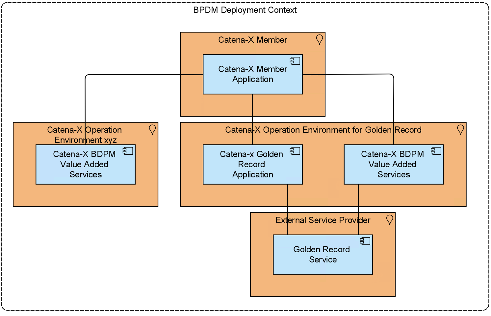

# BPDM Golden Record Application

- [BPDM Golden Record Application](#bpdm-golden-record-application)
- [Introduction and Goals](#introduction-and-goals)
  - [Requirements Overview](#requirements-overview)
  - [Quality Goals {#\_quality\_goals}](#quality-goals-_quality_goals)
  - [Stakeholders](#stakeholders)
- [Architecture Constraints](#architecture-constraints)
- [System Scope and Context](#system-scope-and-context)
  - [Business Context](#business-context)
    - [Clients/Consumer of the API](#clientsconsumer-of-the-api)
    - [API Consumption](#api-consumption)
  - [Technical Context](#technical-context)
  - [Deployment Context](#deployment-context)
- [Solution Strategy](#solution-strategy)
- [Building Block View](#building-block-view)
  - [Whitebox Overall System](#whitebox-overall-system)
    - [Class Diagram Pool](#class-diagram-pool)
  - [Blackbox (API Authentication)](#blackbox-api-authentication)
- [Runtime View](#runtime-view)
- [Deployment View](#deployment-view)
  - [BPDM Gate Deployment](#bpdm-gate-deployment)
  - [Golden Record Pool Deployment](#golden-record-pool-deployment)
- [Cross-cutting Concepts](#cross-cutting-concepts)
  - [Business Partner Domain Model](#business-partner-domain-model)
  - [What is the Business Partner Number (BPN)?](#what-is-the-business-partner-number-bpn)
- [Architecture Decisions](#architecture-decisions)
- [Quality Requirements](#quality-requirements)
- [Risks and Technical Debts](#risks-and-technical-debts)
- [Glossary](#glossary)

# Introduction and Goals

Every participant in the Catena-X (CX) network shall be equipped with a unique business partner identification number (BPN) according to the concept defined by the Catena-X BPN concept. The task of the BPN Generator is to issue such a BPN for a presented Business Partner data object. In that, the BPN Generator serves as the central issuing authority for BPNs within Catena-X. Technically, it constitutes a service that is available as a singleton within the network.

The CX datapool aims at collecting the business partner data objects from the service provider and giving the opportunity for other use cases and services to consume the data via an interface. The CX datapool is the central instance for business partner data within Catena-X.

In general, we have implemented most of the adapter based on the Interface to a SaaS (Software as a Service) Provider, who currently has the responsibility to clean up the data.

## Requirements Overview

Essentially constituting a service-oriented architecture running distributedly on distinct CX Nodes, there can - in principle - be multiple consumers submitting business partner data objects for identification. To fulfil this purpose, the following requirements shall apply:

| Req-Id  | Requirements                                                                                             |
| ------- | -------------------------------------------------------------------------------------------------------- |
| BPDM-R1 | The BPN Generator shall fit into the BPDM Architectural Framework.                                       |
| BPDM-R2 | The BPN Generator shall support the modes of operation as described in BPN Generator: Modes of Operation |
| BPDM-R3 | Regarding implementation technologies the BPN Generator shall follow the overall guidelines for Catena-X |
| BPDM-R4 | The datapool should follow the business partner data model BPDM Data Model Business Partner              |
| BPDM-R5 | The data should be available via API                                                                     |
## Quality Goals {#\_quality\_goals}

| Priority | Quality Goal            | Scenario                                                                                                                                                                                                                                                                                                                                                                                              |
| -------- | ----------------------- | ----------------------------------------------------------------------------------------------------------------------------------------------------------------------------------------------------------------------------------------------------------------------------------------------------------------------------------------------------------------------------------------------------- |
| 1        | Security                | All users and services which access the Golden Record Application must be authenticated and authorised. Only the Golden Record Application itself is allowed to perform changes on data. Consuming services/users are only allowed to read data. In addition they are only allowed to read the specific data that belongs with this, the Data Souvereignty principles of Catena-X has to be fulfilled |
| 1        | Integrity               | Only the Golden Record Application is allowed to perform changes on the data. In addition, all changes must be traceable and must be able to be rolled back                                                                                                                                                                                                                                           |
| 1        | Legally                 | No natural persons are allowed to get uploaded and stored. For all other uploaded data (Business Partners) it is mandatory that Users (Sharing Members) can only see their own uploaded that and that it is not possible to draw conclusions about other business partner relationships                                                                                                               |
| 1        | Integrity & Correctness | It must be ensured that the data of the golden record which is created during the process is correct.                                                                                                                                                                                                                                                                                                 |
| 2        | Reliability             | The Golden Record Application is a central foundation in the Catena-X Network. It provides all participants and services, business partner data and the unique Business Partner Number (BPN) as identifier. Therefore the BPDM Services must be always/highly available                                                                                                                               |
| 2        | Functional Stability    | Since the Golden Record Application is a central foundation in the Catena-X Network the defined standards of the API and datamodel for the associated Release Version must be fulfilled                                                                                                                                                                                                               |
| 1        | Sensitivity of data     | the uploaded business partner data is highly sensitive, that's why it must be ensured that no unauthorized user/system can access data which does not belong to it. More over it must be guaranteed that no one can see the business partners related to the specific Catena-X Member.  |

## Stakeholders
| Role/Name           | Expectations                                                                                                | Example |
| ------------------- | ----------------------------------------------------------------------------------------------------------- | ------- |
| Company (CX-Member) | Company wants to have cleaned and enriched business partner data objects with a BPN.                        |         |
| CX Apps             | Other apps and their use cases want to use the business partner data objects and the BPN for their processes | The CX Portal will use the BPN for on-boarding new companies into the network. Traceability Apps will use BPN to describe business partners |

# Architecture Constraints

(Follows the framework: BPDM Architectural Framework?)

| Contraint ID | Description                                                                                         |
| ------------ | --------------------------------------------------------------------------------------------------- |
| C-1          | Developed under an open-source license and all used frameworks and libraries suites to this license |
| C-2          | Must fulfill the Catena-X Guidelines                                                                |
| C-3          | Eclipse Dataspace Connector must be used for data transfer between different legal entites |

# System Scope and Context 

The Golden Record Gate and Golden Record Pool is the transhipment point for the incoming data from the service provider and for the outgoing data to the consumers. Consumers are mostly other apps that participate in the Catena-X network.

## Business Context

**Catena-X Member**
* A company that's participating in the Catena-X Network and consuming digital services or data assets.

**Catena-X Portal/Marketplace**
* The Portal which provides an entry point for the Catena-X Members, to discover Apps that are offered in Catena-X.

**Catena-X App Provider**
* App Provider that provide data or service offers based on Catena-X Network data. The Apps are provided via the Catena-X Marketplace.

**Catena-X Opeartion Environment for Golden Record**
* Within Catena-X there will be only one central operation environment that operates the Golden Record Application. This operation environment provides the services and data for other operation environment or applications which needs to consume business partner data or golden record data.

**Catena-X Golden Record Application**
* The BPDM Golden Record Application which offers services to Catena-X Members, Catena-X Use Cases and Catena-X BPDM Value Added Services for consuming and processing business partner data as well as Golden Record Information and BPN Numbers.

**Catena-X Use Cases**
* Use Cases withing Catena-X. For example regarding Sustainability, Traceability, Quality Management and so on.

**Catena-X BPDM Value Added Services**
* There are several value added services that can be offered in context of business partner data. For example a Fraud Prevention Dashboard/API, Country Risk Scoring and so on.

**External Service Provider**
* To offer the BPDM and Golden Record Services, Catena-X uses services from external third party service providers.
### Clients/Consumer of the API

In order to inform you in a timely manner whenever breaking changes to our BPDM API are plannend, please fill in the table below. Especially the column "Contact Person" is relevant as these persons will be informed before the PI Planning in order to evaluate and plan the changes to their product. This site is just to support the collaboration.

### API Consumption
| #   | Use-Case             | BPDM API | Requirements to API and Data | Persistence Requirements         | Contact Person | Comment |
| --- | -------------------- | -------- | ---------------------------- | -------------------------------- | -------------- | ------- |
| 1   | Quality-Mgmt         |          |                              |                                  |                |         |
| 2   | DCM                  | x        | BPN-L-S-A                    | Live Data                        |                |         |
| 3   | Portal               | x        | BPN-L                        |                                  |                |         |
| 4   | EDC                  |          |                              |                                  |                |         |
| 5   | Traceability         |          |                              |                                  |                |         |
| 6   | Sustainability - Co2 | x        | BPN-L-S-A                    | via Message Broker and Live Data |                |         |
| 7   | Circular Economy     | x        |                              |                                  |                |         |
| 8   | Marketplace          | ?        |                              |                                  |                |         |
| 9   | OSIM                 | x        |                              |                                  |                |         |
| 10  | ESS                  | x        | BPN-L-S-A -> Search by addresses independent to L-S-A |                                  |                |         |

(X = Will be used / is used by)
## Technical Context

**Catena-X Golden Record Application**
* The BPDM Golden Record Application which offers services to Catena-X Members, Catena-X Use Cases and Catena-X BPDM Value Added Services for consuming and processing business partner data as well as Golden Record Information and BPN Numbers.

**Golden Reocrd Gate**
* The Golden Record Gate provides the interfaces for Catena-X Members to manage their business partner data within Catena-X. It forwards the uploaded business partners to a third party service provider to create a Golden Record Proposal.
* Currently the Gate only provides an API to interact with the data pools of the third party service providers. In the future, an own persistence layer will be introduced within the Gate, handling state and business logic.

**Golden Record Pool**
* The Golden Record Pool provides the interface and persistance for accessing Golden Record Data and the unique Business Partner Number.

**Catena-X Use Cases, Value Added Services, Member Applications**
* All of these Applications uses the Interface provided by Golden Record Pool to consume Golden Record Information.

## Deployment Context

**Catena-X Operation Environment for Golden Record**

* The Golden Record Application will be a single central component. Therefore it will only be deployed in the environment of this operation company. This company can of course also operate or offer other Catena-X Services.

**External Service Provider**

* To create a golden record proposal, Catena-X uses external third party services. These services are operated and own by the external service provider.

**Catena-X Operations Enviornment xyz**

* In contrast to the central golden record component, other BPDM Value Added services are decentral and can be operated in any operation environment.

# Solution Strategy

Use a microservice approach to separate the different components of the system and design a generic part as well as a specific data provider and data consumer part.

* Kotlin
* Spring Boot
* Maven
* PostgreSQL Database
* REST
* OpenSearch
* Keycloak
* Helm
* Kubernetes

# Building Block View

## Whitebox Overall System

| Name          | Responsibility                                                                                                                                 |
| ------------- | ---------------------------------------------------------------------------------------------------------------------------------------------- |
| API           | In this block the communication with other services (e.g. CX Portal) takes place.The API offers different end points, functions and data offer |
| SaaS Adapter  | In this block the received data objects from an external data source will be converted to the CX data model.                                   |
| BPN Generator | In this block for each data object a Business Partner Number will be created and assigned to the data object.                                  |
| Elastic Search Component    | In this block the Elastic Search Component needs to interact with the Elastic Search Service to provide the search function via API. |

### Class Diagram Pool

## Blackbox (API Authentication)

For authentication the API uses a Bearer authentication (also called token authentication) is an HTTP authentication scheme that involves security tokens called bearer tokens.

The client must send this token in the Authorization header when making requests to protected resources:

Authorization: Bearer <token>

Keycloak

OAuth2

# Runtime View

# Deployment View

How to run the service: 

## BPDM Gate Deployment

## Golden Record Pool Deployment

# Cross-cutting Concepts

## Business Partner Domain Model

## What is the Business Partner Number (BPN)?
A BPN is a unique identifier for a Business Partner, standardized for the Catena-X environment with overall 16 digits.

BPN ID syntax / structure:

| Prefix                                          | Classification                        | Identifier   | Check Digit                                     | Representation of a BPN |
| ----------------------------------------------- | ------------------------------------- | ------------ | ----------------------------------------------- | ----------------------- |
| 3 digits                                        | 1 digit                               | 10 digits    | 2 digits                                        | BPNL1234567890ZZ        |
| Issuing Agency Code based on IS/IEC 15458 “BPN” | L = Legal entity S = Site A = Address | Alphanumeric | Checking algorithm based on ISO7064 MOD 1271-36 | BPN is used as a placeholder for the Issuing Agency according to ISO/IEC 15459. L identifies the legal entity of the Business Partner. ZZ is the individual check digit, which is formed according to ISO 7064. Note, for the human-readable representation of the BPN, the following input or reading aid is recommended: BPNL 1234 5678 90ZZ The use of a barcode or QR code can be assigned for machine-readable representation. |  

# Architecture Decisions
[Architecture Decision Logs](https://confluence.catena-x.net/display/CORE/BPDM+%7C+Decision+Logs)

# Quality Requirements

* see: [Quality Goals](#quality-goals-_quality_goals)

# Risks and Technical Debts

**Open EDC Questions**
* What capabilites will be provided in the future?
* How to deal with APIs provided behind an EDC? Swagger documentation cannot be seen by the requesting service?
* How can we authorize and authenticate a User/System with individual permissions after it passes the EDC?
* ...

**Lack on Developer Resources**
* To less developer resources in contrast to the expectations that the BPDM Product and its Golden Record will be a foundation component within Catena-X.

**Semantic Model and SSI Integration of the Golden Record**
* Not done yet.

**Dependency on third party service provider**
* Currently we are not flexible enough to easiliy change the third party service provider for golden record creation. Therefore the next step will be to introduce an own data persistence layer, getting more independent.

**Data Storage concept**
* How to seperate Data and ensure data sovereignty?

**Accessability for SMEs**
* Uploading via CSV File. Does it requires an EDC?

# Glossary

| Term               | Definition                                                                                                                                                                                                                                                                                                                                                                                                                                                                                                                                                                                                                                                                               |
| ------------------ | ---------------------------------------------------------------------------------------------------------------------------------------------------------------------------------------------------------------------------------------------------------------------------------------------------------------------------------------------------------------------------------------------------------------------------------------------------------------------------------------------------------------------------------------------------------------------------------------------------------------------------------------------------------------------------------------- |
| *Golden Record*    | *The Golden Record is a concept within Master Data Management (MDM) that identifies and defines the single version of truth, where truth is understood to be data that is trusted to both accurate and correct. When building database tables from disparate data sources, there commonly are issues of duplication of records, incomplete values within a record, and records with poor data quality. The golden record solves these issues by correcting e.g. duplication, by enriching values when a value may not exist, and by improving data quality within a record.Moreover, the Golden Record is a record that an organization assumes to best possible record to be utilized.* |
| business partner   | In the context of Catena-X BPDM, a business partner can represent a legal entiy, a site or an additional address of a legal entity. Natural persons are not allowed.                                                                                                                                                                                                                                                                                                                                                                                                                                                                                                                     |
| Legal Entity       | A legal entity is a juristic person or group which has legal rights and duties related to contracts, agreements, obligations etc. The term applies to any kind of organization which was founded under the particular set of law governing the country. A legal entity has at least one address which can be checked against an official register (if an official register like a commercial register exists in a country). As part of Catena-X, all business partners with whom your company has a customer relationship or a supplier relationship are interesting. This comprises the transfer of information, goods or cash (flow).                                                  |
| Site               | A site is a delimited geographical area where a legal entity does business (geographical address with geo coordinates). Providing a primary physical address for a site is mandatory. It is possible to specify further physical addresses for this location. P.O. box details are only possible in addition to the physical address. A site has a main address, for example the address of a production plant. If that site has more than one address, like a second gate, additional addresses must be used.                                                                                                                                                                           |
| Additional address | An additional address is a collection of information used to give the location of a building, apartment, or other structure or a plot of land, generally using political boundaries and street names as references, along with other identifiers such as organization name or plant. Addresses may contain also special codes, such as a postal code or geocodes, to make identification easier and aid in the routing of deliveries.                                                                                                                                                                                                                                                    |
| BPDM Gate          | The BPDM Gate is a Software Component / Solution that handles input, communication and state for sharing data betweeen CX Members, their business partner data and Golden Record information                                                                                                                                                                                                                                                                                                                                                                                                                                                                                             |
| Golden Reocrd Pool | The Golden Record Pool is a Software Component / Solution that offers an interface to the Golden Record data persistence and also generating and serving the BPNs |

