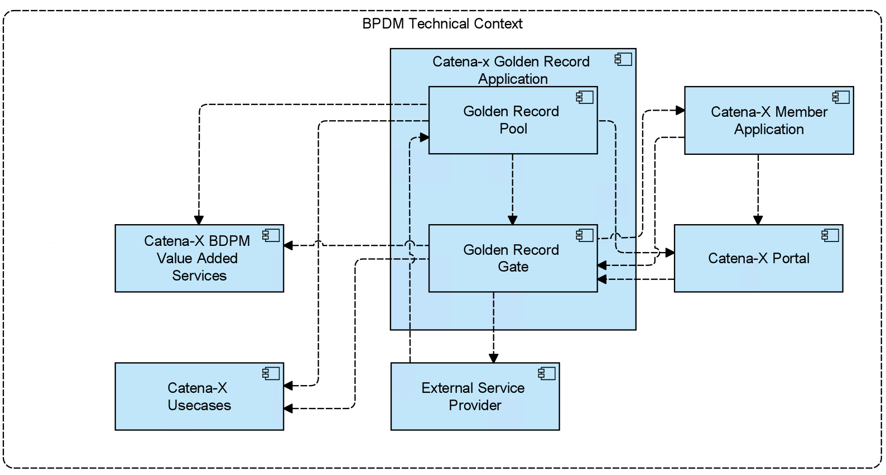

# BPDM Golden Record Application

- [BPDM Golden Record Application](#bpdm-golden-record-application)
- [Introduction and Goals {#section-introduction-and-goals}](#introduction-and-goals-section-introduction-and-goals)
  - [Requirements Overview {#\_requirements\_overview}](#requirements-overview-_requirements_overview)
  - [Quality Goals {#\_quality\_goals}](#quality-goals-_quality_goals)
  - [Stakeholders {#\_stakeholders}](#stakeholders-_stakeholders)
- [Architecture Constraints {#section-architecture-constraints}](#architecture-constraints-section-architecture-constraints)
- [System Scope and Context {#section-system-scope-and-context}](#system-scope-and-context-section-system-scope-and-context)
  - [Business Context {#\_business\_context}](#business-context-_business_context)
  - [Technical Context {#\_technical\_context}](#technical-context-_technical_context)
  - [Deployment Context](#deployment-context)
- [Solution Strategy {#section-solution-strategy}](#solution-strategy-section-solution-strategy)
- [Building Block View {#section-building-block-view}](#building-block-view-section-building-block-view)
  - [Whitebox Overall System {#\_whitebox\_overall\_system}](#whitebox-overall-system-_whitebox_overall_system)
  - [Blackbox (API Authentication)](#blackbox-api-authentication)
- [Runtime View {#section-runtime-view}](#runtime-view-section-runtime-view)
- [Deployment View {#section-deployment-view}](#deployment-view-section-deployment-view)
- [Cross-cutting Concepts {#section-concepts}](#cross-cutting-concepts-section-concepts)
- [Architecture Decisions {#section-design-decisions}](#architecture-decisions-section-design-decisions)
- [Quality Requirements {#section-quality-scenarios}](#quality-requirements-section-quality-scenarios)
  - [Quality Tree {#\_quality\_tree}](#quality-tree-_quality_tree)
  - [Quality Scenarios {#\_quality\_scenarios}](#quality-scenarios-_quality_scenarios)
- [Risks and Technical Debts {#section-technical-risks}](#risks-and-technical-debts-section-technical-risks)
- [Glossary {#section-glossary}](#glossary-section-glossary)

# Introduction and Goals {#section-introduction-and-goals}

Every participant in the Catena-X (CX) network shall be equipped with a unique business partner identification number (BPN) according to the concept defined by the Catena-X BPN concept. The task of the BPN Generator is to issue such a BPN for a presented Business Partner data object. In that, the BPN Generator serves as the central issuing authority for BPNs within Catena-X. Technically, it constitutes a service that is available as a singleton within the network.

The CX datapool aims at collecting the business partner data objects from the service provider and giving the opportunity for other use cases and services to consume the data via an interface. The CX datapool is the central instance for business partner data within Catena-X.

In general, we have implemented most of the adapter based on the Interface to a SaaS (Software as a Service) Provider, who currently has the responsibility to clean up the data.

## Requirements Overview {#_requirements_overview}

Essentially constituting a service-oriented architecture running distributedly on distinct CX Nodes, there can - in principle - be multiple consumers submitting business partner data objects for identification. To fulfil this purpose, the following requirements shall apply:

| Req-Id  | Requirements                                                                                             |
| ------- | -------------------------------------------------------------------------------------------------------- |
| BPDM-R1 | The BPN Generator shall fit into the BPDM Architectural Framework.                                       |
| BPDM-R2 | The BPN Generator shall support the modes of operation as described in BPN Generator: Modes of Operation |
| BPDM-R3 | Regarding implementation technologies the BPN Generator shall follow the overall guidelines for Catena-X |
| BPDM-R4 | The datapool should follow the business partner data model BPDM Data Model Business Partner              |
| BPDM-R5 | The data should be available via API                                                                     |
## Quality Goals {#_quality_goals}

| Priority | Quality Goal            | Scenario                                                                                                                                                                                                                                                                                                                                                                            |
| -------- | ----------------------- | ----------------------------------------------------------------------------------------------------------------------------------------------------------------------------------------------------------------------------------------------------------------------------------------------------------------------------------------------------------------------------------- |
| 1        | Security                | All users and services which access the Golden Record Application must be authenticated and authorised. Only the Golden Record Application itself is allowed to perform changes on data. Consuming services/users are only allowed to read data. In addition they are only allowed to read the specific data that belongs with this, the Data Souvereignty principles of Catena-X has to be fulfilled |
| 1        | Integrity               | Only the Golden Record Application is allowed to perform changes on the data. In addition, all changes must be traceable and must be able to be rolled back                                                                                                                                                                                                                                  |
| 1        | Legally                 | No natural persons are allowed to get uploaded and stored. For all other uploaded data (Business Partners) it is mandatory that Users (Sharing Members) can only see their own uploaded that and that it is not possible to draw conclusions about other business partner relationships                                                                                             |
| 1        | Integrity & Correctness | It must be ensured that the data of the golden record which is created during the process is correct.                                                                                             |
| 2        | Reliability             | The Golden Record Application is a central foundation in the Catena-X Network. It provides all participants and services, business partner data and the unique Business Partner Number (BPN) as identifier. Therefore the BPDM Services must be always/highly available                                                                                                                      |
| 2        | Functional Stability    | Since the Golden Record Application is a central foundation in the Catena-X Network the defined standards of the API and datamodel for the associated Release Version must be fulfilled                                                                                                                                                                                                      |

## Stakeholders {#_stakeholders}
| Role/Name           | Expectations                                                                                                | Example |
| ------------------- | ----------------------------------------------------------------------------------------------------------- | ------- |
| Company (CX-Member) | Company wants to have cleaned and enriched business partner data objects with a BPN.                        |         |
| CX Apps             | Other apps and their use cases want to use the business partner data objects and the BPN for their processes | The CX Portal will use the BPN for on-boarding new companies into the network. Traceability Apps will use BPN to describe business partners |

# Architecture Constraints {#section-architecture-constraints}

(Follows the framework: BPDM Architectural Framework?)

| Contraint ID | Description                                                                                         |
| ------------ | --------------------------------------------------------------------------------------------------- |
| C-1          | Developed under an open-source license and all used frameworks and libraries suites to this license |
| C-2          | Must fulfill the Catena-X Guidelines                                                                |
| C-3          | Eclipse Dataspace Connector must be used for data transfer between different legal entites |

# System Scope and Context {#section-system-scope-and-context}

The Golden Record Gate and Golden Record Pool is the transhipment point for the incoming data from the service provider and for the outgoing data to the consumers. Consumers are mostly other apps that participate in the Catena-X network.

## Business Context {#_business_context}

**Catena-X Member**
* A company that's participating in the Catena-X Network and consuming digital services or data assets.

**Catena-X Portal/Marketplace**
* The Portal which provides an entry point for the Catena-X Members, to discover Apps that are offered in Catena-X.

**Catena-X App Provider**
* App Provider that provide data or service offers based on Catena-X Network data. The Apps are provided via the Catena-X Marketplace.

**Catena-X Opeartion Environment for Golden Record**
* Within Catena-X there will be only one central operation environment that operates the Golden Record Application. This operation environment provides the services and data for other operation environment or applications which needs to consume business partner data or golden record data.

**Catena-X Golden Record Application**
* The BPDM Golden Record Application which offers services to Catena-X Members, Catena-X Use Cases and Catena-X BPDM Value Added Services for consuming and processing business partner data as well as Golden Record Information and BPN Numbers.

**Catena-X Use Cases**
* Use Cases withing Catena-X. For example regarding Sustainability, Traceability, Quality Management and so on.

**Catena-X BPDM Value Added Services**
* There are several value added services that can be offered in context of business partner data. For example a Fraud Prevention Dashboard/API, Country Risk Scoring and so on.

**EXTERNAL SERVICE PROVIDER**
* To offer the BPDM and Golden Record Services, Catena-X uses services from external third party service providers.

## Technical Context {#_technical_context}

**Catena-X Golden Record Application**
* The BPDM Golden Record Application which offers services to Catena-X Members, Catena-X Use Cases and Catena-X BPDM Value Added Services for consuming and processing business partner data as well as Golden Record Information and BPN Numbers.

**Golden Reocrd Gate**
* The Golden Record Gate provides the interfaces for Catena-X Members to manage their business partner data within Catena-X. It creates the linkage between the Catena-X Members and their business partners.

**Golden Record Pool**
* The Golden Record Pool provides the interface and persistance for accessing Golden Record Data and the unique Business Partner Number.

## Deployment Context

# Solution Strategy {#section-solution-strategy}

Use a microservice approach to separate the different components of the system and design a generic part as well as a specific data provider and data consumer part.

* Kotlin
* Spring Boot
* Maven
* PostgreSQL Database
* REST
* OpenSearch
* Keycloak
* Helm
* Kubernetes

# Building Block View {#section-building-block-view}

## Whitebox Overall System {#_whitebox_overall_system}

| Name          | Responsibility                                                                                                                                 |
| ------------- | ---------------------------------------------------------------------------------------------------------------------------------------------- |
| API           | In this block the communication with other services (e.g. CX Portal) takes place.The API offers different end points, functions and data offer |
| SaaS Adapter  | In this block the received data objects from an external data source will be converted to the CX data model.                                   |
| BPN Generator | In this block for each data object a Business Partner Number will be created and assigned to the data object.                                  |
| OpenSearch    | In this block the Open Search Component needs to interact with the Elastic Search Service to provide the search function via API. |

## Blackbox (API Authentication)

For authentication the API uses a Bearer authentication (also called token authentication) is an HTTP authentication scheme that involves security tokens called bearer tokens.

The client must send this token in the Authorization header when making requests to protected resources:

Authorization: Bearer <token>

Keycloak

OAuth2

# Runtime View {#section-runtime-view}

# Deployment View {#section-deployment-view}

How to run the service: README.adoc

# Cross-cutting Concepts {#section-concepts}

# Architecture Decisions {#section-design-decisions}

# Quality Requirements {#section-quality-scenarios}

## Quality Tree {#_quality_tree}

## Quality Scenarios {#_quality_scenarios}

# Risks and Technical Debts {#section-technical-risks}

# Glossary {#section-glossary}

+-----------------------+-----------------------------------------------+
| Term                  | Definition                                    |
+=======================+===============================================+
| *\<Term-1\>*          | *\<definition-1\>*                            |
+-----------------------+-----------------------------------------------+
| *\<Term-2\>*          | *\<definition-2\>*                            |
+-----------------------+-----------------------------------------------+
