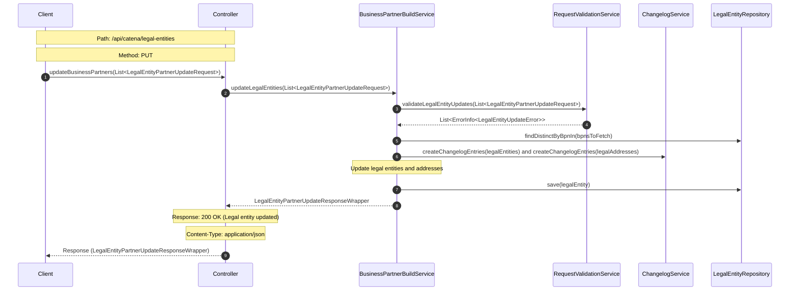

# Sequence Diagram for Business Partner Data Management (BPDM) Pool

## Sequence Diagram Explanation for Updating Legal Entities

### 1. **Client Request**

The client sends a request to update business partners. This is the initial trigger for the entire flow.

### 2. **Controller Handling**

Upon receiving the client's request, the controller forwards it to the `BusinessPartnerBuildService` for further processing.

### 3. **Business Partner Update**

The `BusinessPartnerBuildService` starts the process to update legal entities based on the provided request.

### 4. **Validation**

Before proceeding with the update, the `RequestValidationService` validates the request. This step ensures that the data provided meets the necessary criteria
and is free of errors. If there are any discrepancies during validation, the `RequestValidationService` returns a list of error messages to
the `BusinessPartnerBuildService`if no error are find it will be empty.

### 5. **Repository Fetch**

The `BusinessPartnerBuildService` retrieves existing legal entities from the repository based on the provided BPNs.

### 6. **Changelog for Legal Entities and Addresses**

Every update made to the legal entities and their associated addresses is logged by the `BusinessPartnerBuildService` using the `ChangelogService`.

### 7. **Repository Update**

After validation and processing, the legal entities are updated in the repository.

### 8. **Response Preparation**

Post the successful update of the legal entities, the `BusinessPartnerBuildService` prepares a response wrapper that contains the details of the updated
entities.

### 9. **Controller Response**

Finally, the controller sends the prepared response back to the client, signaling the successful update of the legal entities.

## NOTICE

This work is licensed under the [Apache-2.0](https://www.apache.org/licenses/LICENSE-2.0).

- SPDX-License-Identifier: Apache-2.0
- SPDX-FileCopyrightText: 2023,2024 ZF Friedrichshafen AG
- SPDX-FileCopyrightText: 2023,2024 Bayerische Motoren Werke Aktiengesellschaft (BMW AG)
- SPDX-FileCopyrightText: 2023,2024 Mercedes Benz Group
- SPDX-FileCopyrightText: 2023,2024 Schaeffler AG
- SPDX-FileCopyrightText: 2023,2024 Contributors to the Eclipse Foundation
- Source URL: https://github.com/eclipse-tractusx/bpdm

