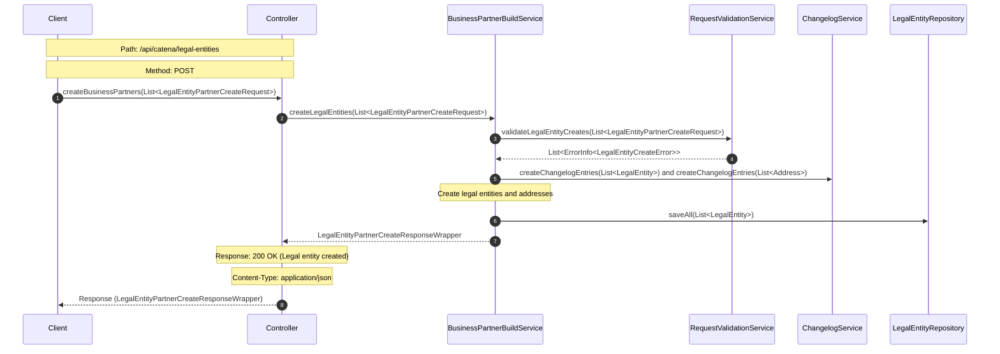

# Sequence Diagram for Business Partner Data Management (BPDM) Pool

## BPDM Pool Sequence Diagram Explanation

### 1. Client Request

The client sends a request to create business partners. This is the initial trigger for the entire flow.

### 2. Controller Handling

The controller receives the client's request and forwards it to the `BusinessPartnerBuildService` for processing.

### 3. Business Partner Creation

The `BusinessPartnerBuildService` initiates the process to create legal entities based on the provided request.

### 4. Validation

Before creating the legal entities, the `RequestValidationService` validates the request.

This ensures that the data provided meets the necessary criteria and is free of errors on legal entitys and address.

If there are any errors during validation, the `RequestValidationService` returns a list of error messages to the `BusinessPartnerBuildService` if no error are
find it will be empty.

### 5. Changelog for Legal Entities and Addresses

The `BusinessPartnerBuildService` logs the creation of new legal entities and their associated addresses using the `ChangelogService`.

### 6. Repository Save

The validated and processed legal entities are then saved to the repository.

### 7. Response Preparation

After successfully saving the legal entities, the `BusinessPartnerBuildService` prepares a response wrapper containing the details of the created entities.

### 8. Controller Response

The controller sends the prepared response back to the client, indicating the successful creation of the legal entities.
