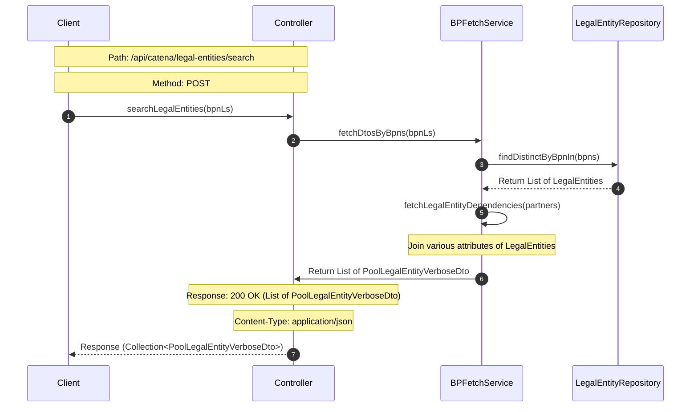

## Sequence Diagram

## Sequence Diagram Explanation for Searching Legal Entities

### 1. Client Request

The client sends a request to search for specific legal entities based on their string list BPNs.

### 2. Controller Handling

The controller receives the client's request and forwards it to the `BusinessPartnerFetchService` for processing.

### 3. Fetch Legal Entities DTOs

The `BusinessPartnerFetchService` fetches the Data Transfer Objects (DTOs) of the legal entities based on the provided BPNs.

### 4. Retrieve Legal Entities from Repository

The `BusinessPartnerFetchService` queries the `LegalEntityRepository` to retrieve the distinct legal entities based on the provided BPNs.

### 5. Fetch Legal Entity Dependencies

After retrieving the legal entities, the `BusinessPartnerFetchService` fetches additional dependencies for these entities.

### 6. Join Attributes

Inside the `BusinessPartnerFetchService`, various attributes of the legal entities are joined, such as identifiers, states, classifications, relations, and
legal forms.

### 7. Response Preparation

After fetching and joining the necessary attributes, the `BusinessPartnerFetchService` prepares a list of `PoolLegalEntityVerboseDto` to be returned.

### 8. Controller Response

The controller sends the prepared list of `PoolLegalEntityVerboseDto` back to the client, indicating a successful search operation.
