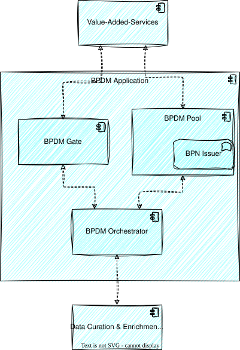

# Solution Strategy (High Level Picture)
The following high level view gives a basic overview about the BPDM Components:

**BPDM Gate**
* The BPDM Gate provides the interfaces for Catena-X Members to manage their business partner data within Catena-X.
* Based on the network data a Golden Record Proposal is created.
* The BPDM Gate has its own persistence layer in which the business partner data of the Catena-X Members are stored.
* A Gate serves several sharing members at once: every business partner record, sharing state, relation and changelog entry carries the BPNL of the tenant it belongs to, and the Gate resolves that tenant from the token of the caller. A sharing member only ever sees its own data through the API.
* An operator may still deploy a Gate per sharing member, for instance to separate the databases; this is a deployment choice, not a requirement of the implementation. It replaces the original one-Gate-per-member decision, which was overturned as infeasible for thousands of tenants (see [Architecture Decisions](09_Architectural_Decisions.md)).

**BPDM Pool**
* The BPDM Pool is the central instance for business partner data within Catena-X.
* The BPDM Pool provides the interface and persistance for accessing Golden Record Data and the unique Business Partner Number.
* In comparison to the BPDM Gate, there is only one central instance of the BPDM Pool.

**BPN Issuer**
* Every participant in the Catena-X network shall have a unique Business Partner Number (BPN) according to the concept defined by the Catena-X BPN concept. The task of the BPN Generator is to issue such a BPN for a presented Business Partner data object. In that, the BPN Generator serves as the central issuing authority for BPNs within Catena-X.
* Technically, it constitutes a service that is available as a singleton within the network.
* Issuing BPNs is part of the BPDM Pool implementation and has remained there: the Pool creates a BPN whenever the golden record process presents business partner data that does not resolve to an existing golden record. There is no separate BPN issuer component.

**BPDM Orchestrator**
* The BPDM Orchestrator is a passive component that offers standardized APIs for the BPDM Gate, BPDM Pool and refinement services to orchestrate the process of Golden Record Creation and handling the different states a business partner record can have during this process.
* It holds the golden record tasks, hands them to whichever service has reserved the step they are queued in, and keeps the submitting sharing member anonymous towards those services.

## NOTICE

This work is licensed under the [Apache-2.0](https://www.apache.org/licenses/LICENSE-2.0).

- SPDX-License-Identifier: Apache-2.0
- SPDX-FileCopyrightText: 2023,2024 ZF Friedrichshafen AG
- SPDX-FileCopyrightText: 2023,2024 SAP SE
- SPDX-FileCopyrightText: 2023,2024 Bayerische Motoren Werke Aktiengesellschaft (BMW AG)
- SPDX-FileCopyrightText: 2023,2024 Mercedes Benz Group
- SPDX-FileCopyrightText: 2023,2024 Robert Bosch GmbH
- SPDX-FileCopyrightText: 2023,2024 Schaeffler AG
- SPDX-FileCopyrightText: 2023,2024 Contributors to the Eclipse Foundation
- Source URL: https://github.com/eclipse-tractusx/bpdm