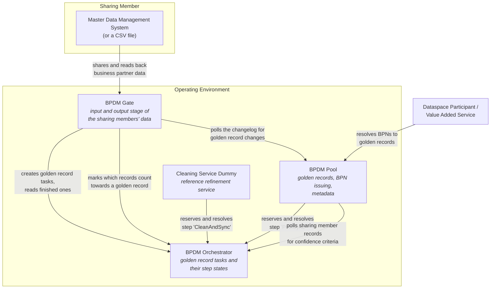

# Building Block View

## Level 1: The Deployed Services

**BPDM Gate**
* Holds the business partner data of the sharing members in an input and an output stage, together with a sharing state and a changelog per stage.
* Serves several sharing members at once; each record carries the BPNL of its tenant.
* Accepts data as JSON over the business partner endpoints and as a CSV file over the partner upload endpoints.
* Drives the process from the sharing member's side: it creates golden record tasks in the Orchestrator, picks up finished ones and writes the result into the output stage.

**BPDM Pool**
* The single source of truth for golden records, and the issuing authority for BPNs.
* Participates in the golden record process as the service that reserves the `PoolSync` step: it writes the refined data into the golden records and reports the resulting BPNs back into the task.
* Serves golden record and metadata reads to dataspace participants and value added services, and a changelog the Gate polls for golden record changes.

**BPDM Orchestrator**
* Passive component. It stores golden record tasks and their step states and hands a task to whichever service reserved the step the task is queued in; it never calls a service itself.
* Keeps the sharing member anonymous towards the refinement services: a task carries the business partner data, not the identity of the Gate that created it.
* Holds two kinds of tasks - business partner tasks and relation tasks - plus the sharing member records, which state how many sharing members share a given golden record.

**Cleaning Service Dummy**
* A reference refinement service, so that the stack can run a golden record process end to end without an external provider under contract.
* Reserves the step it is configured for (`CleanAndSync` by default) and applies rudimentary processing; it does not clean or correct data. Its restrictions are listed in [Risks and Technical Debts](11_Risks_And_Technical_Debts.md).

**EDC Operator**
* Communication between the operating environment and another legal entity goes through an EDC. Diagrams may show an EDC several times for readability; on a technical level one EDC instance serves all BPDM assets of the operator. Which communication needs an EDC is decided in [Architecture Decisions](09_Architectural_Decisions.md).

## Level 2: The Modules

The repository is a multi-module Maven project. Only four modules are deployable services; the rest are libraries and tooling.

| Module                         | Kind             | Content                                                                                     |
|--------------------------------|------------------|---------------------------------------------------------------------------------------------|
| `bpdm-gate`                    | Service          | The Gate application                                                                        |
| `bpdm-pool`                    | Service          | The Pool application                                                                        |
| `bpdm-orchestrator`            | Service          | The Orchestrator application                                                                |
| `bpdm-cleaning-service-dummy`  | Service          | The reference refinement service                                                            |
| `bpdm-gate-api`                | Library          | Gate DTOs, the OpenAPI-annotated interfaces and the generated HTTP client                   |
| `bpdm-pool-api`                | Library          | The same for the Pool                                                                       |
| `bpdm-orchestrator-api`        | Library          | The same for the Orchestrator                                                               |
| `bpdm-common`                  | Library          | Models and utilities shared by all services                                                 |
| `bpdm-common-test`             | Library          | Test fixtures, test data factories and the Keycloak realm used by the integration tests      |
| `bpdm-system-tester`           | Tool             | End-to-end test framework, packaged as a runnable jar rather than a surefire run            |
| `bpdm-migration-helper`        | Tool             | Generates SQL migration scripts from non-SQL source files                                   |
| `bpdm-coverage-aggregate`      | Tool             | Aggregates JaCoCo coverage across the modules                                               |

A service reaches another service only through that service's `-api` module, so the request and
response models of an integration are the ones the API documentation publishes.

> [!NOTE]
> `assets/` still contains the pre-Orchestrator architecture drawings
> (`cx_bpdm_architecture_v3_2`, `cx_bpdm_architecture_v3_3`, `cx_bpdm_target_architecture`,
> `cx_bpdm_context_deployment`). They are kept for history and are not referenced by any section:
> they show a Simulator Service and Data Curation Services in place of the Orchestrator and its
> refinement services, which does not match the implementation.

## NOTICE

This work is licensed under the [Apache-2.0](https://www.apache.org/licenses/LICENSE-2.0).

- SPDX-License-Identifier: Apache-2.0
- SPDX-FileCopyrightText: 2023,2024 ZF Friedrichshafen AG
- SPDX-FileCopyrightText: 2023,2024 SAP SE
- SPDX-FileCopyrightText: 2023,2024 Bayerische Motoren Werke Aktiengesellschaft (BMW AG)
- SPDX-FileCopyrightText: 2023,2024 Mercedes Benz Group
- SPDX-FileCopyrightText: 2023,2024 Robert Bosch GmbH
- SPDX-FileCopyrightText: 2023,2024 Schaeffler AG
- SPDX-FileCopyrightText: 2023,2024 Contributors to the Eclipse Foundation
- Source URL: https://github.com/eclipse-tractusx/bpdm