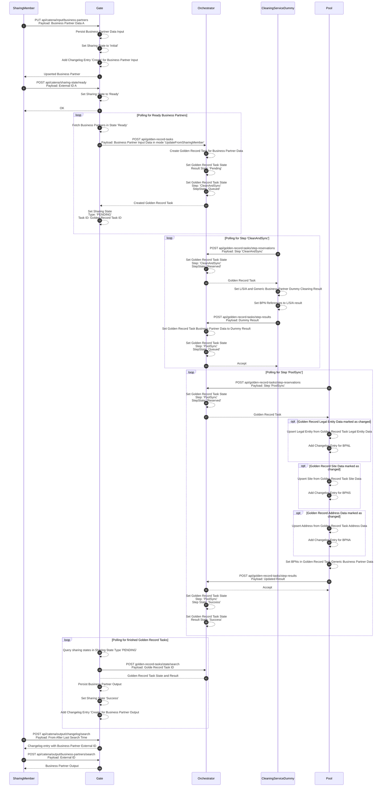
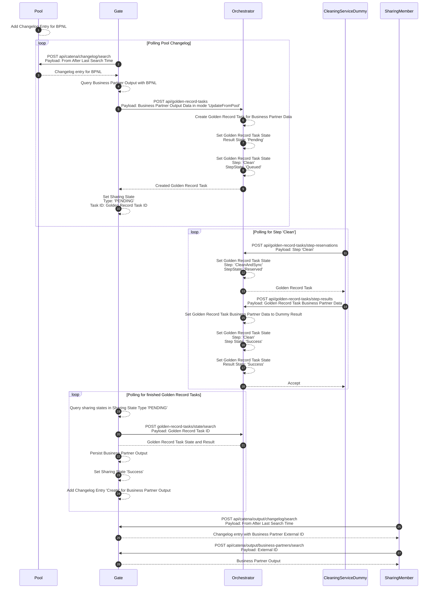
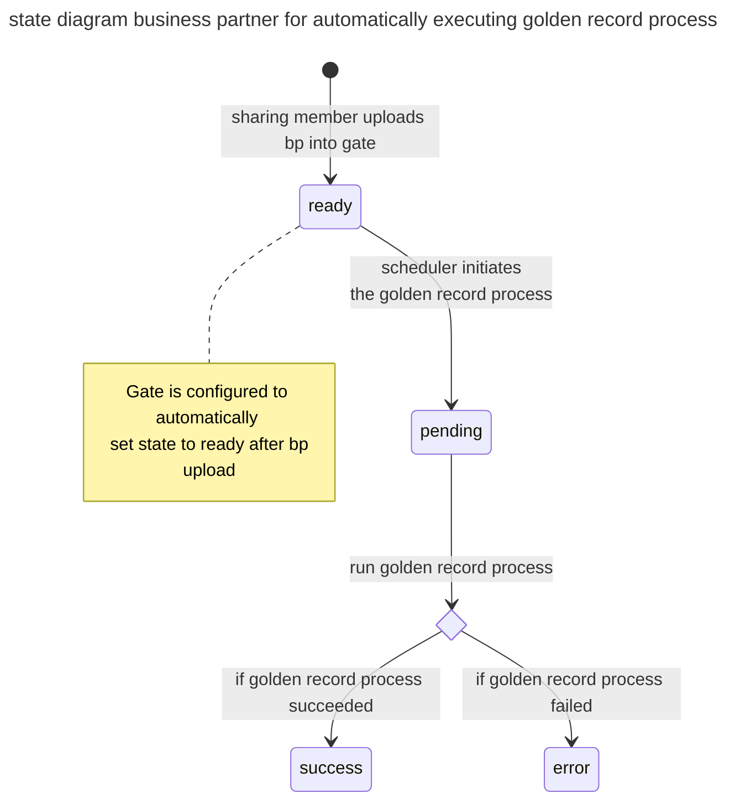
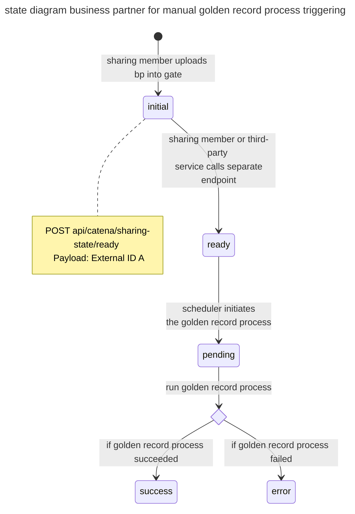

# Runtime View

## Upsert Generic Business Partner

> [!NOTE]
> An additional endpoint was implemented as requirements came up that required business partner data records not to be fed directly into the golden record process after an upload. Instead, this endpoint makes it possible to change the status of a business partner data record from "inital" to "ready". Only data records with the status "ready" are fed into the golden record process.
> We are aware that the existing integration scenarios, such as with the portal team, are impacted by this. For this reason, we recommend that the gate is configured accordingly so that the status is set to "ready" by default when a data record is uploaded. The operator can configure this behavior in the gate individually based on the requirements.

## Update on Golden Record Change

## Business Partner Data Records - States

This sections describes the different states a business partner data record can have.

### Automatically executing golden record process

### Manually triggering golden record process

## NOTICE

This work is licensed under the [Apache-2.0](https://www.apache.org/licenses/LICENSE-2.0).

- SPDX-License-Identifier: Apache-2.0
- SPDX-FileCopyrightText: 2023,2024 ZF Friedrichshafen AG
- SPDX-FileCopyrightText: 2023,2024 SAP SE
- SPDX-FileCopyrightText: 2023,2024 Bayerische Motoren Werke Aktiengesellschaft (BMW AG)
- SPDX-FileCopyrightText: 2023,2024 Mercedes Benz Group
- SPDX-FileCopyrightText: 2023,2024 Robert Bosch GmbH
- SPDX-FileCopyrightText: 2023,2024 Schaeffler AG
- SPDX-FileCopyrightText: 2023,2024 Contributors to the Eclipse Foundation
- Source URL: https://github.com/eclipse-tractusx/bpdm