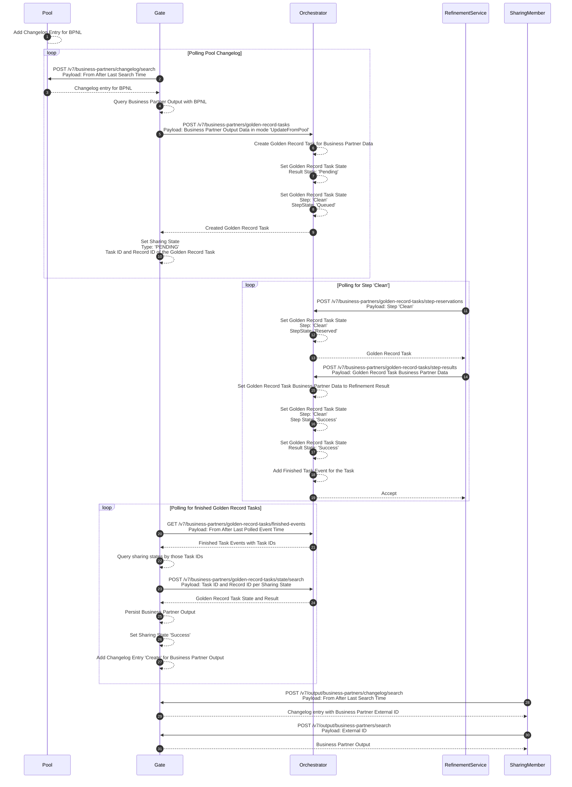
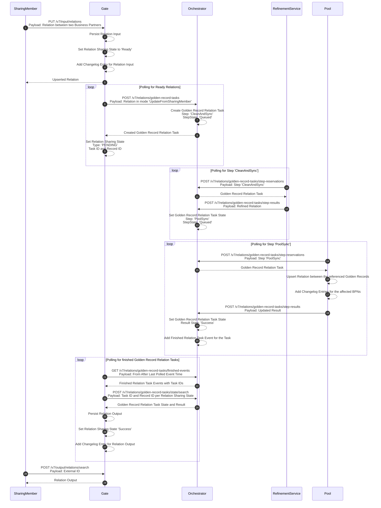
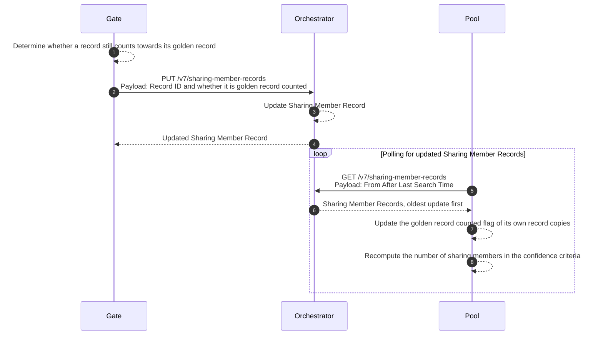
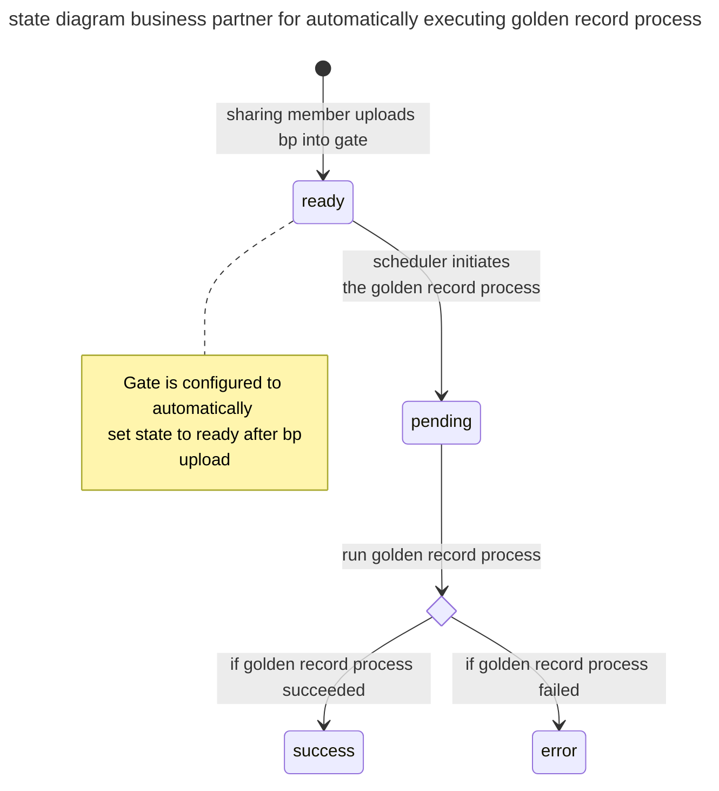
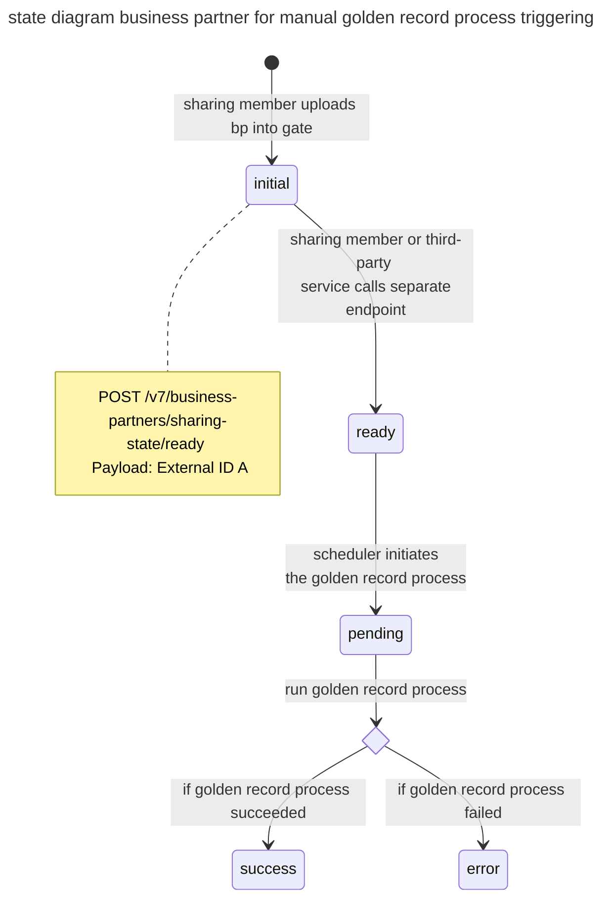

# Runtime View

The paths in this section are the current v7 API paths. The Gate, Pool and Orchestrator also still
serve a deprecated v6 API whose paths differ; the full endpoint documentation is in
[docs/api](../api/README.md).

## Sharing A Business Partner

A record a sharing member shares runs through the golden record process in mode
`UpdateFromSharingMember`, which the Orchestrator sequences as the steps `CleanAndSync` and then
`PoolSync`.

> [!NOTE]
> A record only enters the process once it is in sharing state 'Ready'. By default the Gate sets
> that state on upload, so uploading a record shares it. An operator can configure the Gate to
> leave a new record in state 'Initial' instead; the record then waits until the sharing member
> releases it over the sharing state endpoint, which is the sequence shown below.

```mermaid
sequenceDiagram
    autonumber

    SharingMember->>Gate: PUT /v7/input/business-partners <br> Payload: Business Partner Data A
    Gate-->>Gate: Persist Business Partner Data Input
    Gate-->>Gate: Set Sharing State to 'Initial'
    Gate-->>Gate: Add Changelog Entry 'Create' for Business Partner Input
    Gate-->>SharingMember: Upserted Business Partner

    SharingMember->>Gate: POST /v7/business-partners/sharing-state/ready <br> Payload: External ID A
    Gate-->>Gate: Set Sharing State to 'Ready'
    Gate-->>SharingMember: OK

    loop Polling for Ready Business Partners
        Gate-->>Gate: Fetch Business Partners in State 'Ready'
        Gate->>Orchestrator: POST /v7/business-partners/golden-record-tasks <br> Payload: Business Partner Input Data in mode 'UpdateFromSharingMember', <br> with the Record ID of an earlier sharing of the same External ID
        Orchestrator-->>Orchestrator: Create Golden Record Task for Business Partner Data <br> (and a Record, if the request carried no Record ID)
        Orchestrator-->>Orchestrator: Set Golden Record Task State <br> Result State: 'Pending'
        Orchestrator-->>Orchestrator: Set Golden Record Task State <br> Step: 'CleanAndSync' <br> StepState: 'Queued'
        Orchestrator-->>Gate: Created Golden Record Task with Task ID and Record ID
        Gate-->>Gate: Set Sharing State <br> Type: 'PENDING' <br> Task ID and Record ID of the Golden Record Task
    end

    loop Polling for Step 'CleanAndSync'
        RefinementService->>Orchestrator: POST /v7/business-partners/golden-record-tasks/step-reservations <br> Payload: Step 'CleanAndSync'
        Orchestrator-->>Orchestrator: Set Golden Record Task State <br> Step: 'CleanAndSync' <br> StepState: 'Reserved'
        Orchestrator-->>RefinementService: Golden Record Task
        RefinementService-->>RefinementService: Set L/S/A and Generic Business Partner Refinement Result
        RefinementService-->>RefinementService: Set BPN References to L/S/A result
        RefinementService->>Orchestrator: POST /v7/business-partners/golden-record-tasks/step-results <br> Payload: Refinement Result
        Orchestrator-->>Orchestrator: Set Golden Record Task Business Partner Data to Refinement Result
        Orchestrator-->>Orchestrator: Set Golden Record Task State <br> Step: 'PoolSync' <br> StepState: 'Queued'
        Orchestrator-->>RefinementService: Accept
    end

    loop Polling for Step 'PoolSync'
        Pool->>Orchestrator: POST /v7/business-partners/golden-record-tasks/step-reservations <br> Payload: Step 'PoolSync'
        Orchestrator-->>Orchestrator: Set Golden Record Task State <br> Step: 'PoolSync' <br> StepState: 'Reserved'
        Orchestrator-->>Pool: Golden Record Task
        opt Golden Record Legal Entity Data marked as changed
            Pool-->>Pool: Upsert Legal Entity from Golden Record Task Legal Entity Data
            Pool-->>Pool: Add Changelog Entry for BPNL
        end
        opt Golden Record Site Data marked as changed
            Pool-->>Pool: Upsert Site from Golden Record Task Site Data
            Pool-->>Pool: Add Changelog Entry for BPNS
        end
         opt Golden Record Address Data marked as changed
            Pool-->>Pool: Upsert Address from Golden Record Task Address Data
             Pool-->>Pool: Add Changelog Entry for BPNA
        end
        Pool-->>Pool: Set BPNs in Golden Record Task Generic Business Partner Data
        Pool->>Orchestrator: POST /v7/business-partners/golden-record-tasks/step-results <br> Payload: Updated Result
        Orchestrator-->>Pool: Accept
        Orchestrator-->>Orchestrator: Set Golden Record Task State <br> Step: 'PoolSync' <br> Step State: 'Success'
         Orchestrator-->>Orchestrator: Set Golden Record Task State <br> Result State: 'Success'
        Orchestrator-->>Orchestrator: Add Finished Task Event for the Task
    end

    loop Polling for finished Golden Record Tasks
        Gate->>Orchestrator: GET /v7/business-partners/golden-record-tasks/finished-events <br> Payload: From After Last Polled Event Time
        Orchestrator-->>Gate: Finished Task Events with Task IDs
        Gate-->>Gate: Query sharing states by those Task IDs
        Gate->>Orchestrator: POST /v7/business-partners/golden-record-tasks/state/search <br> Payload: Task ID and Record ID per Sharing State
        Orchestrator-->>Gate: Golden Record Task State and Result
        Gate-->>Gate: Persist Business Partner Output
        Gate-->>Gate: Set Sharing State 'Success'
        Gate-->>Gate: Add Changelog Entry 'Create' for Business Partner Output
    end

    SharingMember->>Gate: POST /v7/output/business-partners/changelog/search <br> Payload: From After Last Search Time
    Gate-->>SharingMember: Changelog entry with Business Partner External ID
    SharingMember->>Gate: POST /v7/output/business-partners/search <br> Payload: External ID
    Gate-->>SharingMember: Business Partner Output
```

## Update on Golden Record Change

When a golden record changes in the Pool, the Gate feeds the affected output records through the
process again in mode `UpdateFromPool`. That mode has a single step, `Clean`: the record is already
in the Pool, so nothing is written back to it.

> [!NOTE]
> The delivered Cleaning Service Dummy is configured for one step, `CleanAndSync`. Running this
> flow therefore needs a refinement service that reserves the step `Clean` - for the dummy, a
> second instance configured for that step.

```mermaid
sequenceDiagram
    autonumber

    Pool-->Pool: Add Changelog Entry for BPNL

    loop Polling Pool Changelog
        Gate->>Pool: POST /v7/business-partners/changelog/search <br> Payload: From After Last Search Time
        Pool-->>Gate: Changelog entry for BPNL
        Gate-->>Gate: Query Business Partner Output with BPNL
        Gate->>Orchestrator: POST /v7/business-partners/golden-record-tasks <br> Payload: Business Partner Output Data in mode 'UpdateFromPool'
        Orchestrator-->>Orchestrator: Create Golden Record Task for Business Partner Data
        Orchestrator-->>Orchestrator: Set Golden Record Task State <br> Result State: 'Pending'
        Orchestrator-->>Orchestrator: Set Golden Record Task State <br> Step: 'Clean' <br> StepState: 'Queued'
        Orchestrator-->>Gate: Created Golden Record Task
        Gate-->>Gate: Set Sharing State <br> Type: 'PENDING' <br> Task ID and Record ID of the Golden Record Task
    end

    loop Polling for Step 'Clean'
        RefinementService->>Orchestrator: POST /v7/business-partners/golden-record-tasks/step-reservations <br> Payload: Step 'Clean'
        Orchestrator-->>Orchestrator: Set Golden Record Task State <br> Step: 'Clean' <br> StepState: 'Reserved'
        Orchestrator-->>RefinementService: Golden Record Task
        RefinementService->>Orchestrator: POST /v7/business-partners/golden-record-tasks/step-results <br> Payload: Golden Record Task Business Partner Data
        Orchestrator-->>Orchestrator: Set Golden Record Task Business Partner Data to Refinement Result
        Orchestrator-->>Orchestrator: Set Golden Record Task State <br> Step: 'Clean' <br> Step State: 'Success'
         Orchestrator-->>Orchestrator: Set Golden Record Task State <br> Result State: 'Success'
        Orchestrator-->>Orchestrator: Add Finished Task Event for the Task
        Orchestrator-->>RefinementService: Accept
    end

    loop Polling for finished Golden Record Tasks
        Gate->>Orchestrator: GET /v7/business-partners/golden-record-tasks/finished-events <br> Payload: From After Last Polled Event Time
        Orchestrator-->>Gate: Finished Task Events with Task IDs
        Gate-->>Gate: Query sharing states by those Task IDs
        Gate->>Orchestrator: POST /v7/business-partners/golden-record-tasks/state/search <br> Payload: Task ID and Record ID per Sharing State
        Orchestrator-->>Gate: Golden Record Task State and Result
        Gate-->>Gate: Persist Business Partner Output
        Gate-->>Gate: Set Sharing State 'Success'
        Gate-->>Gate: Add Changelog Entry 'Create' for Business Partner Output
    end

    SharingMember->>Gate: POST /v7/output/business-partners/changelog/search <br> Payload: From After Last Search Time
    Gate-->>SharingMember: Changelog entry with Business Partner External ID
    SharingMember->>Gate: POST /v7/output/business-partners/search <br> Payload: External ID
    Gate-->>SharingMember: Business Partner Output

```

## Sharing A Business Partner Relation

Relations between business partners run through their own task type, with their own endpoints,
sharing state and changelog. The steps and the polling mechanism are the same as for business
partner data. Unlike a business partner record, a relation enters state 'Ready' as soon as it is
upserted; there is no separate endpoint to release it.

```mermaid
sequenceDiagram
    autonumber

    SharingMember->>Gate: PUT /v7/input/relations <br> Payload: Relation between two Business Partners
    Gate-->>Gate: Persist Relation Input
    Gate-->>Gate: Set Relation Sharing State to 'Ready'
    Gate-->>Gate: Add Changelog Entry for Relation Input
    Gate-->>SharingMember: Upserted Relation

    loop Polling for Ready Relations
        Gate->>Orchestrator: POST /v7/relations/golden-record-tasks <br> Payload: Relation in mode 'UpdateFromSharingMember'
        Orchestrator-->>Orchestrator: Create Golden Record Relation Task <br> Step: 'CleanAndSync' <br> StepState: 'Queued'
        Orchestrator-->>Gate: Created Golden Record Relation Task
        Gate-->>Gate: Set Relation Sharing State <br> Type: 'PENDING' <br> Task ID and Record ID
    end

    loop Polling for Step 'CleanAndSync'
        RefinementService->>Orchestrator: POST /v7/relations/golden-record-tasks/step-reservations <br> Payload: Step 'CleanAndSync'
        Orchestrator-->>RefinementService: Golden Record Relation Task
        RefinementService->>Orchestrator: POST /v7/relations/golden-record-tasks/step-results <br> Payload: Refined Relation
        Orchestrator-->>Orchestrator: Set Golden Record Relation Task State <br> Step: 'PoolSync' <br> StepState: 'Queued'
    end

    loop Polling for Step 'PoolSync'
        Pool->>Orchestrator: POST /v7/relations/golden-record-tasks/step-reservations <br> Payload: Step 'PoolSync'
        Orchestrator-->>Pool: Golden Record Relation Task
        Pool-->>Pool: Upsert Relation between the referenced Golden Records
        Pool-->>Pool: Add Changelog Entries for the affected BPNs
        Pool->>Orchestrator: POST /v7/relations/golden-record-tasks/step-results <br> Payload: Updated Result
        Orchestrator-->>Orchestrator: Set Golden Record Relation Task State <br> Result State: 'Success'
        Orchestrator-->>Orchestrator: Add Finished Relation Task Event for the Task
    end

    loop Polling for finished Golden Record Relation Tasks
        Gate->>Orchestrator: GET /v7/relations/golden-record-tasks/finished-events <br> Payload: From After Last Polled Event Time
        Orchestrator-->>Gate: Finished Relation Task Events with Task IDs
        Gate->>Orchestrator: POST /v7/relations/golden-record-tasks/state/search <br> Payload: Task ID and Record ID per Relation Sharing State
        Orchestrator-->>Gate: Golden Record Relation Task State and Result
        Gate-->>Gate: Persist Relation Output
        Gate-->>Gate: Set Relation Sharing State 'Success'
        Gate-->>Gate: Add Changelog Entry for Relation Output
    end

    SharingMember->>Gate: POST /v7/output/relations/search <br> Payload: External ID
    Gate-->>SharingMember: Relation Output
```

## Counting The Sharing Members Of A Golden Record

How many sharing members share a golden record is part of its confidence criteria. Neither the Gate
nor the Pool can count that on its own: the Gate does not know the golden record, and the Pool does
not know the sharing members. The Orchestrator holds the link in its sharing member records - one
per record it processes - and both sides reach it over that.

While processing a golden record task, the Pool notes which address the task's record resolved to.
The Gate states whether that record still counts towards its golden record, and the Pool polls those
statements to keep the count in the confidence criteria correct.

```mermaid
sequenceDiagram
    autonumber

    Gate-->>Gate: Determine whether a record still counts towards its golden record
    Gate->>Orchestrator: PUT /v7/sharing-member-records <br> Payload: Record ID and whether it is golden record counted
    Orchestrator-->>Orchestrator: Update Sharing Member Record
    Orchestrator-->>Gate: Updated Sharing Member Record

    loop Polling for updated Sharing Member Records
        Pool->>Orchestrator: GET /v7/sharing-member-records <br> Payload: From After Last Search Time
        Orchestrator-->>Pool: Sharing Member Records, oldest update first
        Pool-->>Pool: Update the golden record counted flag of its own record copies
        Pool-->>Pool: Recompute the number of sharing members in the confidence criteria
    end
```

## Business Partner Data Records - States

This sections describes the different states a business partner data record can have.

### Automatically executing golden record process

```mermaid
---
title: state diagram business partner for automatically executing golden record process
---
stateDiagram-v2
    [*] --> ready: sharing member uploads bp into gate
    note right of ready
      Gate is configured to automatically <br> set state to ready after bp upload
    end note
    ready --> pending: scheduler initiates <br> the golden record process
    state if_state <<choice>>
    pending --> if_state: run golden record process
    if_state --> success: if golden record process succeeded
    if_state --> error: if golden record process failed
```

### Manually triggering golden record process

```mermaid
---
title: state diagram business partner for manual golden record process triggering
---
stateDiagram-v2
    [*] --> initial: sharing member uploads bp into gate
    note right of initial
      POST /v7/business-partners/sharing-state/ready <br> Payload: External ID A
    end note
    initial --> ready: sharing member or third-party <br> service calls separate endpoint
    ready --> pending: scheduler initiates <br> the golden record process
    state if_state <<choice>>
    pending --> if_state: run golden record process
    if_state --> success: if golden record process succeeded
    if_state --> error: if golden record process failed
```

## NOTICE

This work is licensed under the [Apache-2.0](https://www.apache.org/licenses/LICENSE-2.0).

- SPDX-License-Identifier: Apache-2.0
- SPDX-FileCopyrightText: 2023,2024 ZF Friedrichshafen AG
- SPDX-FileCopyrightText: 2023,2024 SAP SE
- SPDX-FileCopyrightText: 2023,2024 Bayerische Motoren Werke Aktiengesellschaft (BMW AG)
- SPDX-FileCopyrightText: 2023,2024 Mercedes Benz Group
- SPDX-FileCopyrightText: 2023,2024 Robert Bosch GmbH
- SPDX-FileCopyrightText: 2023,2024 Schaeffler AG
- SPDX-FileCopyrightText: 2023,2024 Contributors to the Eclipse Foundation
- Source URL: https://github.com/eclipse-tractusx/bpdm