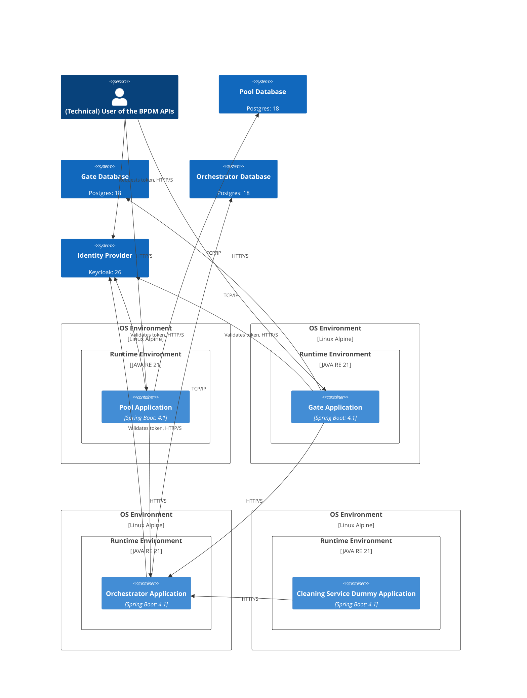
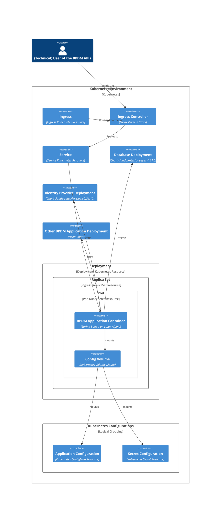

# Deployment View

## Applications Deployment without Kubernetes

Each service is a Spring Boot application in a container built on `eclipse-temurin:21-jre-alpine`;
the Alpine version is whatever that base image currently carries and is not pinned by this project.
Gate, Pool and Orchestrator each persist into a database schema of their own (`bpdmgate`, `bpdm`,
`bpdm-orchestrator`), which may live in one Postgres instance or in separate ones - the diagram
shows separate ones. Each service runs its own Flyway migrations against its schema. The Cleaning
Service Dummy is stateless.

```mermaid
C4Context

    Person(bpdm_user, "(Technical) User of the BPDM APIs")

    System(pool_postgres, "Pool Database", "Postgres: 18")
    System(gate_postgres, "Gate Database", "Postgres: 18")
    System(orchestrator_postgres, "Orchestrator Database", "Postgres: 18")
    System(keycloak, "Identity Provider", "Keycloak: 26")

    Deployment_Node(pool_machine, "OS Environment", "Linux Alpine"){
        Deployment_Node(pool_java, "Runtime Environment", "JAVA RE 21") {
            Container(pool_container, "Pool Application", "Spring Boot: 4.1")
        }
    }

    Deployment_Node(gate_machine, "OS Environment", "Linux Alpine"){
        Deployment_Node(gate_java, "Runtime Environment", "JAVA RE 21") {
            Container(gate_container, "Gate Application", "Spring Boot: 4.1")
        }
    }

    Deployment_Node(orchestrator_machine, "OS Environment", "Linux Alpine"){
        Deployment_Node(orchestrator_java, "Runtime Environment", "JAVA RE 21") {
            Container(orchestrator_container, "Orchestrator Application", "Spring Boot: 4.1")
        }
    }

     Deployment_Node(dummy_machine, "OS Environment", "Linux Alpine"){
        Deployment_Node(dummy_java, "Runtime Environment", "JAVA RE 21") {
            Container(dummy_container, "Cleaning Service Dummy Application", "Spring Boot: 4.1")
        }
    }

    Rel(bpdm_user, pool_container, "HTTP/S")
    Rel(pool_container, pool_postgres, "TCP/IP")

    Rel(bpdm_user, gate_container, "HTTP/S")
    Rel(gate_container, gate_postgres, "TCP/IP")

    Rel(orchestrator_container, orchestrator_postgres, "TCP/IP")

    Rel(pool_container, orchestrator_container, "HTTP/S")
    Rel(gate_container, orchestrator_container, "HTTP/S")
    Rel(dummy_container, orchestrator_container, "HTTP/S")

    Rel(bpdm_user, keycloak, "Requests token, HTTP/S")
    Rel(gate_container, keycloak, "Validates token, HTTP/S")
    Rel(pool_container, keycloak, "Validates token, HTTP/S")
    Rel(orchestrator_container, keycloak, "Validates token, HTTP/S")

```

Every service is an OAuth2 resource server and therefore needs an identity provider, except when it
runs with the `no-auth` profile. The `docker/compose/dependencies` compose file brings up the
Postgres and Keycloak versions the project is developed and tested against.

## Kubernetes Deployment

The `bpdm` chart is an umbrella chart: it deploys Gate, Pool, Orchestrator and Cleaning Service
Dummy as subcharts of one release and wires them to each other, and it can bring its own Postgres
and Keycloak along as further dependencies. Each of those two can be switched off to run against
infrastructure the operator already has.

The diagram below shows one of the BPDM application subcharts; the others are deployed the same way.

```mermaid
C4Context

    Person(bpdm_user, "(Technical) User of the BPDM APIs")

    Deployment_Node(kubernetes, "Kubernetes Environment", "Kubernetes"){

        Container(ingress, "Ingress", "Ingress Kubernetes Resource")
        Container(nginx, "Ingress Controller", "Nginx Reverse Proxy")
        Container(service, "Service", "Service Kubernetes Resource")

        Container(database, "Database Deployment", "Chart cloudpirates/postgres:0.11.0")
        Container(identity, "Identity Provider Deployment", "Chart cloudpirates/keycloak:0.21.10")
        Container(other_bpdm, "Other BPDM Application Deployment", "Helm Chart")

        Deployment_Node(deployment, "Deployment", "Deployment Kubernetes Resource"){
                Deployment_Node(replicaSet_1, "Replica Set", "Ingress ReplicaSet Resource"){
                    Deployment_Node(pod_1, "Pod", "Pod Kubernetes Resource"){
                        Container(container_1, "BPDM Application Container", "Spring Boot 4 on Linux Alpine")
                        Container(volume_1, "Config Volume", "Kubernetes Volume Mount")
                    }
        }
    }

    Deployment_Node(kubernetes_config, "Kubernetes Configurations", "Logical Grouping"){
        Container(configMap, "Application Configuration", "Kubernetes ConfigMap Resource")
        Container(secret, "Secret Configuration", "Kubernetes Secret Resource")

    }
}

Rel(bpdm_user, nginx, "Sends URL", "HTTPS")
Rel(ingress, nginx, "Routing Information")
Rel(nginx, service, "Routes to")
Rel(service, container_1, "HTTP")

Rel(container_1, volume_1, "mounts")
Rel(volume_1, configMap, "mounts")
Rel(volume_1, secret, "mounts")

Rel(container_1, database, "TCP/IP")
Rel(container_1, identity, "HTTP")
Rel(container_1, other_bpdm, "")

UpdateLayoutConfig($c4ShapeInRow="3", $c4BoundaryInRow="1")


```

The chart versions named here are the ones the umbrella currently depends on; the authoritative
list is the `dependencies` section of [charts/bpdm/Chart.yaml](../../charts/bpdm/Chart.yaml).
Installation and configuration are described in [INSTALL.md](../../INSTALL.md), and which
environments run which release in [the maintainer documentation](../maintainer/environments.md).

## NOTICE

This work is licensed under the [Apache-2.0](https://www.apache.org/licenses/LICENSE-2.0).

- SPDX-License-Identifier: Apache-2.0
- SPDX-FileCopyrightText: 2023-2026 ZF Friedrichshafen AG
- SPDX-FileCopyrightText: 2023-2026 SAP SE
- SPDX-FileCopyrightText: 2023-2026 Bayerische Motoren Werke Aktiengesellschaft (BMW AG)
- SPDX-FileCopyrightText: 2023-2026 Mercedes Benz Group
- SPDX-FileCopyrightText: 2023-2026 Robert Bosch GmbH
- SPDX-FileCopyrightText: 2023-2026 Schaeffler AG
- SPDX-FileCopyrightText: 2023-2026 Contributors to the Eclipse Foundation
- Source URL: https://github.com/eclipse-tractusx/bpdm