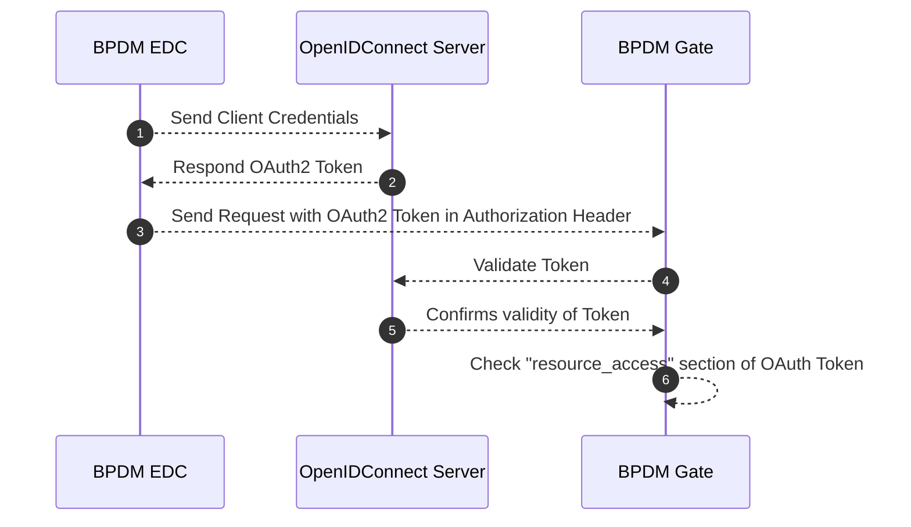

# Crosscutting Concepts

<!-- TOC -->
* [Crosscutting Concepts](#crosscutting-concepts)
  * [Authentication & Autorization](#authentication--autorization)
    * [Roles, Rights, Permissions](#roles-rights-permissions)
      * [Relevant concepts](#relevant-concepts)
      * [BPDM Permission Groups](#bpdm-permission-groups)
      * [Permissions](#permissions)
        * [Permissions as client resources](#permissions-as-client-resources)
        * [Permissions by permission group](#permissions-by-permission-group)
      * [Mapping to Portal user roles for all companies (for all Catena-X members):](#mapping-to-portal-user-roles-for-all-companies-for-all-catena-x-members)
      * [Technical Users:](#technical-users)
        * [Resulting technical users to be creatable in the Portal:](#resulting-technical-users-to-be-creatable-in-the-portal)
      * [Demo Configuration](#demo-configuration)
      * [Keycloak Example Configuration](#keycloak-example-configuration)
    * [EDC Communication](#edc-communication)
      * [Data Offer Configuration](#data-offer-configuration)
      * [Verified Credentials](#verified-credentials)
      * [Purposes](#purposes)
    * [Keycloak Authentication & Autorization Flow](#keycloak-authentication--autorization-flow)
  * [Business Partner Data Management Standards](#business-partner-data-management-standards)
  * [Logging Behavior](#logging-behavior)
  * [NOTICE](#notice)
<!-- TOC -->

## Authentication & Autorization

### Roles, Rights, Permissions

The authorization concept of the golden record process services (BPDM) has evolved.  This impacts the permissions of portal users as well as as the creation of technical users in the Portal.

#### Relevant concepts

The golden record process contains sharing members which need to share their data (input) to the golden record process and read the result of that process (output). The Pool is a central place that offers golden records that have been created from the shared business partner data. Golden records are distinguished between whether they belong to Catena-X members or not.

#### BPDM Permission Groups

We defined the following relevant permission groups in BPDM:

1. Gate Admin: Create, update and read sharing member business partner input data as well as read the output data of the golden record process
2. Gate Input Manager: Create, update and read sharing member business partner input data
3. Gate Input Consumer: Read sharing member business partner input data
4. Gate Output Consumer: Read sharing member business partner output data
5. Pool Admin: Read, create and update golden records as well as meta data in the Pool
6. Pool Cx Member: Read golden records that belong to Catena-X members from the Pool
7. Pool Sharing Member: Read golden records of Catena-X members and the overall changelog
8. Pool Use Case Consumer:  Read golden records owned by Catena-X members from the Pool (including member-owned non-member legal entity business partner data)
9. Orchestrator Admin: Full access to Golden Record Tasks
10. Orchestrator Task Creator: Create Golden Record Tasks, view task results and status
11. Orchestrator Clean And Sync Task Processor: Reserve and resolve Golden Record Tasks in step 'Clean And Sync'
12. Orchestrator Clean Task Processor: Reserve and resolve Golden Record Tasks in step 'Clean'
13. Orchestrator Pool Task Processor: Reserve and resolve Golden Record Tasks in step 'Pool'

#### Permissions

##### Permissions as client resources

<table>
  <tbody>
    <tr>
      <th>BPDM Pool</th>
      <th>BPDM Gate</th>
      <th>BPDM Orchestrator</th>
    </tr>
    <tr>
      <td>
          <ul>
            <li>read_partner</li>
            <li>write_partner</li>
            <li>read_partner_member</li>
            <li>read_partner_member_owned</li>
            <li>read_changelog</li>
            <li>read_changelog_member</li>
            <li>read_metadata</li>
            <li>write_metadata</li>
        </ul>
      </td>
      <td>
          <ul>
            <li>read_input_partner</li>
            <li>write_input_partner</li>
            <li>read_input_changelog</li>
            <li>read_output_partner</li>
            <li>read_output_changelog</li>
            <li>read_sharing_state</li>
            <li>write_sharing_state</li>
            <li>read_stats</li>
        </ul>
      </td>
      <td>
          <ul>
            <li>create_task</li>
            <li>read_task</li>
            <li>create_reservation_clean</li>
            <li>create_result_clean</li>
            <li>create_reservation_cleanAndSync</li>
            <li>create_result_cleanAndSync</li>
            <li>create_reservation_poolSync</li>
            <li>create_result_poolSync</li>
        </ul>
      </td>
    </tr>
  </tbody>
</table>

##### Permissions by permission group

Gate permissions:
<table>
  <tbody>
    <tr>
      <th>Admin</th>
      <th>Input Manager</th>
      <th>Input Consumer</th>
      <th>Output Consumer</th>
    </tr>
    <tr>
      <td>
          All of BPDM Gate
      </td>
      <td>
          <ul>
            <li>read_input_partner</li>
            <li>write_input_partner</li>
            <li>read_input_changelog</li>
            <li>read_sharing_state</li>
            <li>write_sharing_state</li>
            <li>read_stats</li>
        </ul>
      </td>
      <td>
         <ul>
            <li>read_input_changelog</li>
            <li>read_input_partner</li>
            <li>read_input_changelog</li>
            <li>read_sharing_state</li>
            <li>read_stats</li>
        </ul>
      </td>
       <td>
         <ul>
            <li>read_output_changelog</li>
            <li>read_output_partner</li>
            <li>read_output_changelog</li>
            <li>read_sharing_state</li>
            <li>read_stats</li>
        </ul>
      </td>
    </tr>
  </tbody>
</table>

Pool Permissions:

<table>
  <tbody>
    <tr>
      <th>Admin</th>
      <th>Cx Member</th>
      <th>Sharing Member</th>
      <th>Use Case Consumer</th>
    </tr>
    <tr>
      <td>
          All of BPDM Pool
      </td>
      <td>
          <ul>
            <li>read_partner_member</li>
            <li>read_changelog_member</li>
            <li>read_metadata</li>
        </ul>
      </td>
      <td>
        <ul>
            <li>read_partner</li>
            <li>read_metadata</li>
            <li>read_changelog</li>
        </ul>
      </td>
      <td>
        <ul>
            <li>read_partner_member_owned</li>
            <li>read_metadata</li>
        </ul>
      </td>
    </tr>
  </tbody>
</table>

Orchestrator Permissions:

<table>
  <tbody>
    <tr>
      <th>Admin</th>
      <th>Task Creator</th>
      <th>Clean And Sync Task Processor</th>
      <th>Clean Task Processor</th>
      <th>Pool Task Processor</th>
    </tr>
    <tr>
      <td>
          All of BPDM Orchestrator
      </td>
      <td>
          <ul>
            <li>create_task</li>
            <li>read_task</li>
        </ul>
      </td>
      <td>
        <ul>
            <li>create_reservation_clean</li>
            <li>create_result_clean</li>
        </ul>
      </td>
      <td>
        <ul>
            <li>create_reservation_cleanAndSync</li>
            <li>create_result_cleanAndSync</li>
        </ul>
      </td>
    <td>
        <ul>
            <li>create_reservation_poolSync</li>
            <li>create_result_poolSync</li>
        </ul>
      </td>
    </tr>
  </tbody>
</table>

#### Mapping to Portal user roles for all companies (for all Catena-X members):

| BPDM Permission Group | Portal Role     |
|-----------------------|-----------------|
| Gate Admin            | Service Manager |
| Pool Cx Member        | CX User         |

#### Technical Users:

The golden record service provider needs to be able to generate technical users for each permission group (1 - 8). The technical users for sharing member roles 1 - 4 should be associated with the sharing member's BPNL (So that resulting tokens will have the sharing member's BPNL for authorization purposes).  Furthermore, there needs to be one technical user option per Pool and Orchestrator permission group.

##### Resulting technical users to be creatable in the Portal:

For BPDM service:

- Gate BPNLX Admin (for each Sharing Member)
- Pool Admin
- Pool Cx Member
- Pool Sharing Member
- Pool Use Case Consumer

For VAS:

- Gate BPNLX Consumer: Having both roles 'Gate  BPNLX Input Consumer' and 'Gate BPNLX Output Consumer ' (for each Sharing Member)

Companies which have booked the golden record service should not be able to create any technical users for BPDM. Any such feature to create technical users for companies that are not the golden record service provider should be removed.

#### Demo Configuration

BPDM is configurable to have arbitrary configurations when it comes to redirect URLs and clients. As long as the above requirements are implemented, BPDM can be configured to be compatible with any Portal environment.

Still, for the sake of defining a demo configuration, here is a proposal:

**Clients:**

`BPDM Pool`

`BPDM Gate`

**BPDM Pool:**

Valid Origin: `https://business-partners.{env}.demo.catena-x.net/pool/*`

Description: BPDM Pool

**BPDM Gate:**

Valid Origin: `https://business-partners{env}.demo.catena-x.net/companies/*`

Description: BPDM Gate

#### Keycloak Example Configuration

This example configuration includes the roles, clients and client scopes that BPDM currently expects.
The actual client IDs are subject to change depending on the name they receive in the Portal Keycloak configuration.
[CX-Central.json](../../bpdm-common-test/src/main/resources/keycloak/CX-Central.json)

For more details see: https://github.com/eclipse-tractusx/sig-release/issues/565

### EDC Communication

#### Data Offer Configuration

Communication with BPDM application must be via EDC. The standards for EDC Assets are defined as follows:

* [BPDM Pool API Asset Structure](https://github.com/catenax-eV/product-standardization-prod/blob/main/standards/CX-0012-BusinessPartnerDataPoolAPI/4.0.0/CX-0012-BusinessPartnerDataPoolAPI-v4.0.0.md#223-data-asset-structure)
* [BPDM Gate API Asset Structure](https://github.com/catenax-eV/product-standardization-prod/blob/main/standards/CX-0074-BusinessPartnerGateAPI/3.0.0/CX-0074-BusinessPartnerGateAPI-v3.0.0.md#223-data-asset-structure)

An example postman collection for Asset definition you can find [here](<../postman/EDC Provider Setup.postman_collection.json>)

#### Verified Credentials

**Gate**

To enable communication for uploading and downloading from the gate through EDC, it's essential to have a Verifiable Credential stored in the wallet for BPDM Framework Agreement. This credential will be verified during EDC communication. Additionally, the BPN-Verifiable Credential needs to be validated to ensure that only the sharing member has access to its own gate.

**Pool**

To enable communication for downloading from the pool through EDC, it's essential to have a Verifiable Credential stored in the wallet for BPDM Framework Agreement. This credential will be verified during EDC communication. Additionally, the Membership Credential needs to be validated to ensure that only onboarded catena-x members have access to the pool.

#### Purposes

Additionally each of the purposes need to be checked. You can find them [here](https://github.com/catenax-eV/cx-odrl-profile/blob/main/profile.md#usagepurpose). All purposes beginning with `cx.bpdm.gate` and `cx.bpdm.pool` are relevant.

### Keycloak Authentication & Autorization Flow

## Business Partner Data Management Standards
[bpdm_standards](https://catena-x.net/de/standard-library)

## Logging Behavior

As Spring Boot applications BPDM employs Spring
specific [logging behavior](https://docs.spring.io/spring-boot/docs/3.0.0/reference/htmlsingle/#features.logging)

We enhance the default log entries with user request information including the determined user ID and a generated request ID.
Not all logs belong to an ongoing user request in which case these entries are empty.

In addition to the Spring standard logs the BPDM applications keep a log of the following events:

* INFO: User requesting resource with resource name and HTTP verb
* INFO: Request HTTP response
* INFO: Update/Create Golden Record Business Partners
* INFO: Creating BPNs
* ERROR: Uncaught exceptions occurring in the service logic

## NOTICE

This work is licensed under the [Apache-2.0](https://www.apache.org/licenses/LICENSE-2.0).

- SPDX-License-Identifier: Apache-2.0
- SPDX-FileCopyrightText: 2023,2024 ZF Friedrichshafen AG
- SPDX-FileCopyrightText: 2023,2024 SAP SE
- SPDX-FileCopyrightText: 2023,2024 Bayerische Motoren Werke Aktiengesellschaft (BMW AG)
- SPDX-FileCopyrightText: 2023,2024 Mercedes Benz Group
- SPDX-FileCopyrightText: 2023,2024 Robert Bosch GmbH
- SPDX-FileCopyrightText: 2023,2024 Schaeffler AG
- SPDX-FileCopyrightText: 2023,2024 Contributors to the Eclipse Foundation
- Source URL: https://github.com/eclipse-tractusx/bpdm