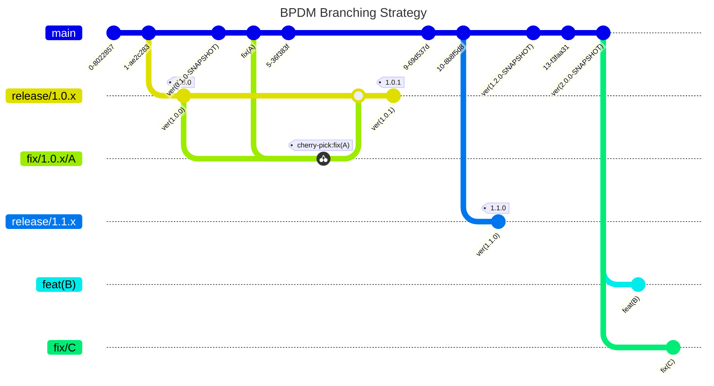

# Developer View

Documentation here concerns developers who want to contribute to this repository.

## License Check

Licenses of all maven dependencies need to be approved by eclipse.
The Eclipse Dash License Tool can be used to check the license approval status of dependencies and to request reviews by the intellectual property team.

Generate summary of dependencies and their approval status:

```bash
mvn org.eclipse.dash:license-tool-plugin:license-check -Ddash.summary=DEPENDENCIES
```

Automatically create IP Team review requests:

```bash
mvn org.eclipse.dash:license-tool-plugin:license-check -Ddash.iplab.token=<token>
```

Check the [Eclipse Dash License Tool documentation](https://github.com/eclipse/dash-licenses) for more detailed information.

## Branching Strategy



## NOTICE

This work is licensed under the [Apache-2.0](https://www.apache.org/licenses/LICENSE-2.0).

- SPDX-License-Identifier: Apache-2.0
- SPDX-FileCopyrightText: 2023,2024 ZF Friedrichshafen AG
- SPDX-FileCopyrightText: 2023,2024 SAP SE
- SPDX-FileCopyrightText: 2023,2024 Bayerische Motoren Werke Aktiengesellschaft (BMW AG)
- SPDX-FileCopyrightText: 2023,2024 Mercedes Benz Group
- SPDX-FileCopyrightText: 2023,2024 Robert Bosch GmbH
- SPDX-FileCopyrightText: 2023,2024 Schaeffler AG
- SPDX-FileCopyrightText: 2023,2024 Contributors to the Eclipse Foundation
- Source URL: https://github.com/eclipse-tractusx/bpdm