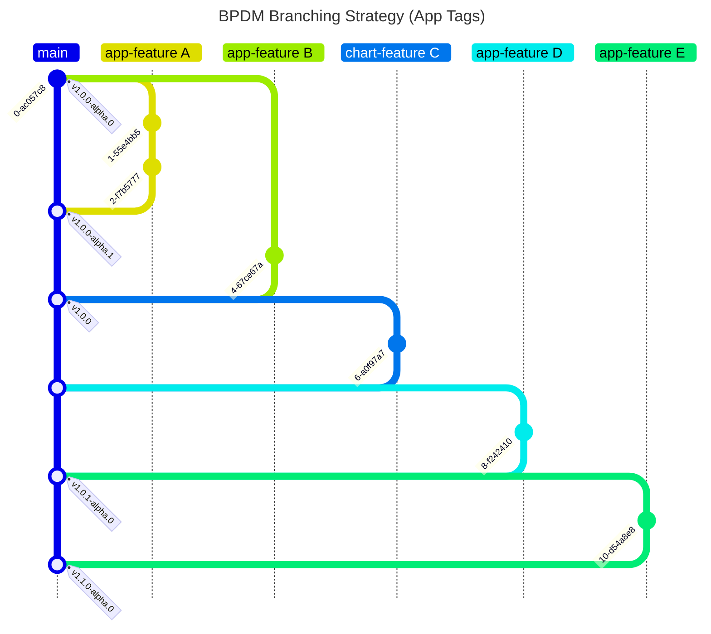

# Developer View

Documentation here concerns developers who want to contribute to this repository.

## Apps and Charts

The CICD pipeline tests new code contributions by deploying them in the current version of the BPDM chart.
In this way we can perform system tests in an environment that get close to actual productive environments as possible.
As a result, the BPDM charts always should be up-to-date with the newest code contributions.
If a breaking change of an app feature would lead to incompatibility with the current charts, the charts need to be updated.
You can say that changing the chart accordingly is also part of any app feature or fix. This has the following advantages and disadvantages.

Advantages:
- The whole code base is always up-to-date and compatible with each other
- Allows for more sophisticated testing leading to lower errors on the main branch

Disadvantages:
- Changes in the apps have direct impact on the charts (Leading to potentially bigger and more complicated pull requests)

## License Check

Licenses of all maven dependencies need to be approved by eclipse.
The Eclipse Dash License Tool can be used to check the license approval status of dependencies and to request reviews by the intellectual property team.

Generate summary of dependencies and their approval status:

```bash
mvn org.eclipse.dash:license-tool-plugin:license-check -Ddash.summary=DEPENDENCIES
```

Automatically create IP Team review requests:

```bash
mvn org.eclipse.dash:license-tool-plugin:license-check -Ddash.iplab.token=<token>
```

Check the [Eclipse Dash License Tool documentation](https://github.com/eclipse/dash-licenses) for more detailed information.

## Branching Strategy




## Adapting Golden Record Process Steps

The golden record process is made of single process steps a business partner record sequentially goes through.
A golden record process provider might want to adjust these steps like adding more steps to realize their own golden record process.
In order to do so, the following changes are required:

1. Adapt the available task steps in the [TaskStep Enum](../../bpdm-orchestrator-api/src/main/kotlin/org/eclipse/tractusx/orchestrator/api/model/TaskStep.kt)
2. Change the golden record process [state machine configuration](../../bpdm-orchestrator/src/main/kotlin/org/eclipse/tractusx/bpdm/orchestrator/config/StateMachineConfig.kt)
3. Adapt the Central-IDP configuration to include roles for the new steps. This should be done [locally](../../bpdm-common-test/src/main/resources/keycloak/CX-Central.json) as well as [remotely](https://github.com/eclipse-tractusx/portal-iam).
    Alternatively, you can also override the generated standard permission names with ones that already exist in Central-IDP see next point)
4. Optionally: Adapt the step permissions in the [application properties](../../bpdm-orchestrator/src/main/resources/application.yml) for documentation purposes or for overriding the generated standard permission names
5. Optionally: Adapt the [task worker authentication tests](../../bpdm-orchestrator/src/test/kotlin/org/eclipse/tractusx/bpdm/orchestrator/auth) for testing the new step permission configuration

## GitHub Workflows

We employ Github workflows for continuous integration and deployment.
By convention the workflows can be found under in the [standard Github workflows folder](../../.github/workflows).

On each pull request the workflows perform checks to test the application behaviour and conventions.
This includes but is not limited to version checks, Maven tests, Chart deployment tests and static code scanning.

On merging with the main branch the BPDM apps and Charts are deployed based on the current version:

1. Release and release candidate version: Deploy the BPDM containers to Dockerhub and release Helm Chart
2. Snapshot version: Deploy the BPDM containers on Dockerhub as latest SNAPSHOTs

For the release of the Helm Charts we use the [helm/chart-releaser-action](https://github.com/helm/chart-releaser-action).
Therefore, a Helm Chart repository is stored on the `gh-pages` branch of the repository indexing the released Charts.

## Create API Documentation

We use Springdoc and Swagger-UI in order to automatically generate Open-API documents for our BPDM apis.
If you need to update the api documents in the repository, you can start the applications, go to the Swagger-UI page and fetch the underlying Open-API documents.
You need to update the documents both in JSON and YAML format.
Luckily, Swagger-UI supports the creation of both formats quite easily.
You can obtain the generated Open-API documents from the running apps at these subpaths:

- JSON: /docs/api-docs/docs
- YAML: /docs/api-docs.yaml/docs

Please use the formatting as-is when updating the corresponding documents in the api documentation folder.

## Deny Requests on Unsecured Endpoints By Default

In BPDM we make use of two Spring supported security strategies: Request-based and method-based security.
In the request-based security we define which URL paths and HTTP methods of our APIs should be authenticated or not.
The actual authorization happens then on individual method-level via Spring's method security implementations.
Each method that is resolved through request mapping will then evaluate the necessary permissions to access it. 
A drawback of method-security-based authorization is that there is no default denial on missing method security configuration.
This means, if a developer forgets to put on a RestController method a permission requirement, any authenticated user can access the endpoint.

For this reason BPDM implements a default behaviour in which we require each RestController method to have a method security annotation.
If such an annotation is not present, the corresponding request will be denied with a 403 forbidden response.

For the developer this means, they should make sure to give any method in a RestController class an appropriate security annotation.
Also, all methods in such a controller should be for the sole purpose of request mapping.
Alternative authorization mechanisms that do not involve method security annotations are thus not supported at the moment.

## NOTICE

This work is licensed under the [Apache-2.0](https://www.apache.org/licenses/LICENSE-2.0).

- SPDX-License-Identifier: Apache-2.0
- SPDX-FileCopyrightText: 2023,2024 ZF Friedrichshafen AG
- SPDX-FileCopyrightText: 2023,2024 SAP SE
- SPDX-FileCopyrightText: 2023,2024 Bayerische Motoren Werke Aktiengesellschaft (BMW AG)
- SPDX-FileCopyrightText: 2023,2024 Mercedes Benz Group
- SPDX-FileCopyrightText: 2023,2024 Robert Bosch GmbH
- SPDX-FileCopyrightText: 2023,2024 Schaeffler AG
- SPDX-FileCopyrightText: 2023,2024 Contributors to the Eclipse Foundation
- Source URL: https://github.com/eclipse-tractusx/bpdm