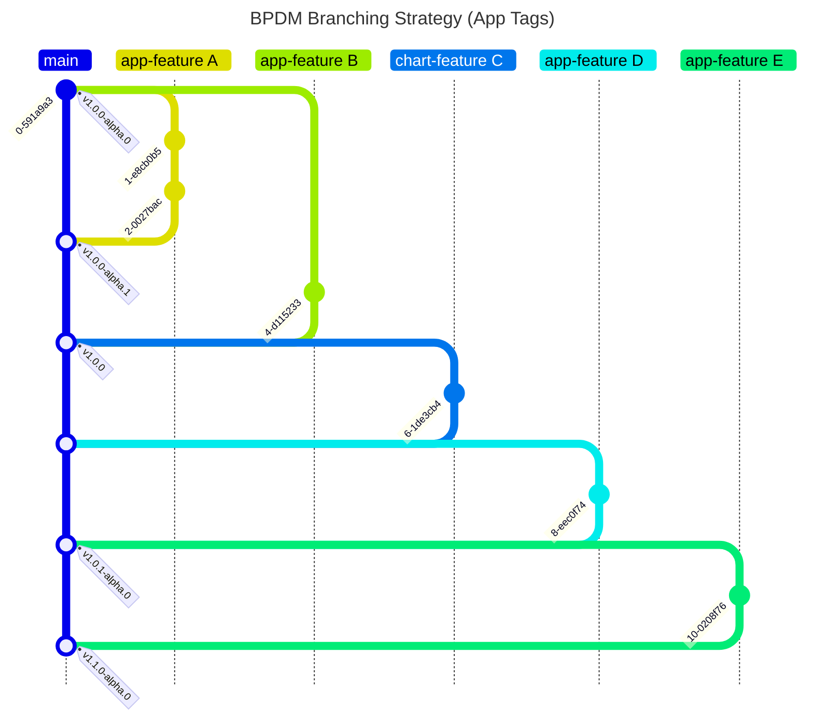

# Developer View

Documentation here concerns developers who want to contribute to this repository.

## Apps and Charts

The CICD pipeline tests new code contributions by deploying them in the current version of the BPDM chart.
In this way we can perform system tests in an environment that get close to actual productive environments as possible.
As a result, the BPDM charts always should be up-to-date with the newest code contributions.
If a breaking change of an app feature would lead to incompatibility with the current charts, the charts need to be updated.
You can say that changing the chart accordingly is also part of any app feature or fix. This has the following advantages and disadvantages.

Advantages:
- The whole code base is always up-to-date and compatible with each other
- Allows for more sophisticated testing leading to lower errors on the main branch

Disadvantages:
- Changes in the apps have direct impact on the charts (Leading to potentially bigger and more complicated pull requests)

## License Check

Licenses of all maven dependencies need to be approved by eclipse.
The Eclipse Dash License Tool can be used to check the license approval status of dependencies and to request reviews by the intellectual property team.

Generate summary of dependencies and their approval status:

```bash
mvn org.eclipse.dash:license-tool-plugin:license-check -Ddash.summary=DEPENDENCIES
```

Automatically create IP Team review requests:

```bash
mvn org.eclipse.dash:license-tool-plugin:license-check -Ddash.iplab.token=<token>
```

Check the [Eclipse Dash License Tool documentation](https://github.com/eclipse/dash-licenses) for more detailed information.

## Branching Strategy




## Adapting Golden Record Process Steps

The golden record process is made of single process steps a business partner record sequentially goes through.
A golden record process provider might want to adjust these steps like adding more steps to realize their own golden record process.
In order to do so, the following changes are required:

1. Adapt the available task steps in the [TaskStep Enum](../../bpdm-orchestrator-api/src/main/kotlin/org/eclipse/tractusx/orchestrator/api/model/TaskStep.kt)
2. Change the golden record process [state machine configuration](../../bpdm-orchestrator/src/main/kotlin/org/eclipse/tractusx/bpdm/orchestrator/config/StateMachineConfig.kt)
3. Adapt the Central-IDP configuration to include roles for the new steps. This should be done [locally](../../bpdm-common-test/src/main/resources/keycloak/CX-Central.json) as well as [remotely](https://github.com/eclipse-tractusx/portal-iam).
    Alternatively, you can also override the generated standard permission names with ones that already exist in Central-IDP see next point)
4. Optionally: Adapt the step permissions in the [application properties](../../bpdm-orchestrator/src/main/resources/application.yml) for documentation purposes or for overriding the generated standard permission names
5. Optionally: Adapt the [task worker authentication tests](../../bpdm-orchestrator/src/test/kotlin/org/eclipse/tractusx/bpdm/orchestrator/auth) for testing the new step permission configuration

## GitHub Workflows

We employ Github workflows for continuous integration and deployment.
By convention the workflows can be found under in the [standard Github workflows folder](../../.github/workflows).

On each pull request the workflows perform checks to test the application behaviour and conventions.
This includes but is not limited to version checks, Maven tests, Chart deployment tests and static code scanning.

On merging with the main branch the BPDM apps and Charts are deployed based on the current version:

1. Release and release candidate version: Deploy the BPDM containers to Dockerhub and release Helm Chart
2. Snapshot version: Deploy the BPDM containers on Dockerhub as latest SNAPSHOTs

For the release of the Helm Charts we use the [helm/chart-releaser-action](https://github.com/helm/chart-releaser-action).
Therefore, a Helm Chart repository is stored on the `gh-pages` branch of the repository indexing the released Charts.

## Create API Documentation

We use Springdoc and Swagger-UI in order to automatically generate Open-API documents for our BPDM apis.
If you need to update the api documents in the repository, you can start the applications, go to the Swagger-UI page and fetch the underlying Open-API documents.
You need to update the documents both in JSON and YAML format.
Luckily, Swagger-UI supports the creation of both formats quite easily.
You can obtain the generated Open-API documents from the running apps at these subpaths:

- JSON: /docs/api-docs/docs
- YAML: /docs/api-docs.yaml/docs

Please use the formatting as-is when updating the corresponding documents in the api documentation folder.


## BPDM Design Paradigms

In any software application developers are faced with the issue of balancing maintainability, reusability and performance.
This guide introduces guidelines for developers of the BPDM applications.
In BPDM we generally have the following priorities when developing an application:

1. Make the code easy and maintainable
2. Make the code reusable
3. Make the code performant

Ideally, code in BPDM should fulfill all three criteria.
But if for whatever reason there are only solutions that constitute big trade-offs between each criterion, we adhere to the priorities.
First and foremost code should be simple and easy to maintain with clear rules.
Since this is an open source project, we must be open and expect new developers contributing code.
This  can only happen successfully if new developers can easily understand the BPDM code base.
This guide with its principles helps as well with that but in the end also the actual code needs to be clear and understandable.

If we don't introduce too much complexity new classes and code contributions should be designed with reusability in mind.
This generally means, that classes and services should be more modularized and independent.
In the long run, such a code base becomes easier to understand and maintain as services and be reused almost "plug-and-play" to create more complex features.

The biggest impact to maintainability and reusability comes from performance criteria.
Performance optimizations typically introduce more complex and specialized code which directly goes against our most important paradigms.
That is why performance is still important but we only want to optimize so far as necessary.
Typically, complex performance optimizations should be abstracted in low-level helper functionality and be kept away from code that is close to business logic.

In BPDM we generally make the following concessions to performance when designing BPDM applications:

1. Requests should be processed in batches
2. We want to retain queried entities for further processing

One of the biggest performance bottlenecks in BPDM applications are accesses to the database.
By minimizing the amount of accesses we can gain huge performance boosts.
Processing requests in batches, instead of one at a time, is the single most important paradigm to reduce the number of database accesses.
As an example we can consider that processing one business partner object may involve 10 database accesses.
If we have 100 business partner objects to process we would need already 1000 database accesses.
However, if we perform batch processing of 100 records at a time we can, in theory, reduce that number down to the original 10 database accesses.
But even if our batch processing is not as efficient (due to maintainability concerns) and we may 20 database access for processing for a batch we are a great deal lower than the 1000 accesses from single processing.

One drawback of batch processing is of course that it increases the complexity of the system quite significantly.
Since the introduction of batch processing yields such awesome performance benefits, it is one of the few exceptions in BPDM where we sacrifice maintainability for performance.

The reason for wanting to retain entities in processing is the same: We want to reduce the number of database accesses.
This principle is being used first and foremost in the validation of requests.
For example, there is an incoming update request for a business partner.
During validation, we need to check whether the referenced business partner exists.
Later we need to update its data.
In both cases we need to fetch the business partner.
So it makes sense that during validation we not only check whether the business partner exists but also keep it for the consecutive update operation.
This reduces the amount of database accesses needed in total to perform validation and the operation.

The following sections introduce paradigms for creating maintainable, reusable code which keeps batch processing and retaining entities.

### Requirements for Validation

The previous considerations deal with non-functional code requirements.
In BPDM a general, additional functional requirement of applications is the validation of requests.
Since BPDM deals with very complex objects, the business partners, we need to expect requests to contain several constraint violations at once.
For example, a referenced business partner identifier type may not exist or a name is too long.
The golden record process takes a while and would be very frustrating if a processed business partner is being rejected one error at a time.

For this reason, BPDM applications should return as many validation errors as possible per request.
This means, it is typically not enough to just validate on-the-fly and stop processing once we encounter a validation error.
Instead, we need a setup in which a request can be fully validated first, gathering all errors and only process the request if there are no errors found.

The following sections will deal how to incorporate this functional requirement within the general considerations of maintainability, reusability and performance.

### BPDM Class Taxonomy

In BPDM we mainly use 'POJOs' and logic classes.
POJO stands for plain old JAVA object and constitutes a class whose main purpose is storing data or a data state.
It typically does not have methods containing business logic or framework specific code.
In BPDM we refer to POJOs typically as data model classes.
Except for entities we use immutable Kotlin data classes as our model classes.

On the other hand, strategy classes contain logic that operates on the data model classes, during processing changing the state from one to another.
This is where business and framework logic is to be found.

BPDM makes use of the popular layer principle in which model and logic classes belonging to a specific layer and can only access classes on their own or lower layer.
We differentiate between these layers from higher to lower:

- Control Layer: Responsible for handling incoming HTTP requests
- Validation Layer: Responsible for validating requests according to business logic
- Operation Layer: Responsible for executing requested operations according to business logic
- Database Layer: Responsible for accessing the database and returning information as entities

Each layer uses classes of the lower layer to realize its logic.
As we can see the typical business layer in BPDM applications is separated into validation and operation layer.
Validation in this context strictly means validation of incoming requests.
Of course, validation can happen in other layers as well.

Each layer has its own data model on which it operates.

- Control Layer: API model
- Validation Layer: Unvalidated service model
- Operation Layer: Validated service model
- Database Layer: Entity model


Analogously, each layer also has typical logic classes:

- Control Layer: Controller, especially REST Controller
- Validation Layer: Validation Service or Validator
- Operation Layer: Operation Service or Operator
- Database Layer: Repository

Keep in mind, that each layer may have additional utility classes like mappers.
But even in a business layer such utility classes should contain only technical logic and no business logic.

One concern for the business layer is how the services of the validation layer and the operation layer really interact with each other.
In order to still be reusable we need to strictly separate validation and operation logic.
This means Validators contain no operation logic and also invoke no operation services.
In turn, also Operators contain no validation logic and also invoke no validation services.

Instead, as entry points for the control layer the business layer contains entry services which combine Validators and Operators to realize the business logic.
Such entry services can't be reusable for other business layer services but can be reused in the Control layer.
With this insight the services invoke each other like this:


In this setup Validators only contain validation logic and are this, reusable to contain more complex validation logic.
The same goes for Operators.
q

## NOTICE

This work is licensed under the [Apache-2.0](https://www.apache.org/licenses/LICENSE-2.0).

- SPDX-License-Identifier: Apache-2.0
- SPDX-FileCopyrightText: 2023,2024 ZF Friedrichshafen AG
- SPDX-FileCopyrightText: 2023,2024 SAP SE
- SPDX-FileCopyrightText: 2023,2024 Bayerische Motoren Werke Aktiengesellschaft (BMW AG)
- SPDX-FileCopyrightText: 2023,2024 Mercedes Benz Group
- SPDX-FileCopyrightText: 2023,2024 Robert Bosch GmbH
- SPDX-FileCopyrightText: 2023,2024 Schaeffler AG
- SPDX-FileCopyrightText: 2023,2024 Contributors to the Eclipse Foundation
- Source URL: https://github.com/eclipse-tractusx/bpdm