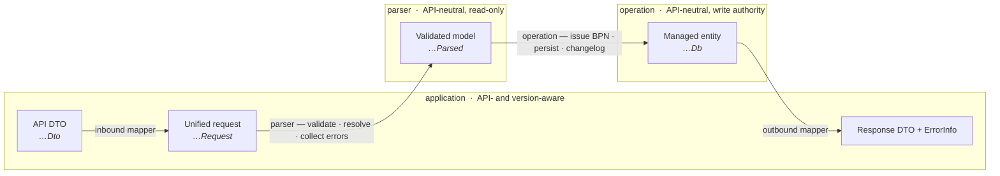
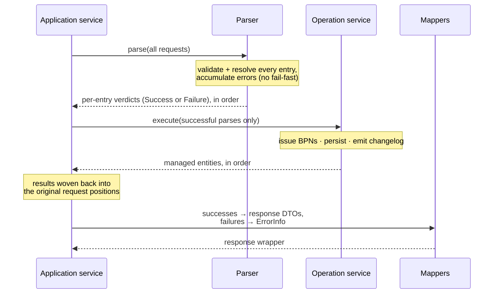

# BPDM Application Code Guide

This guide describes how we design and organize **application code** in BPDM services — the code that turns a request into an operation on the service's data and a response.
It applies to every BPDM service: Pool, Gate, Orchestrator, and any service added later.

> **Note:** This guide describes the ideal we strive toward — not a description of the current state of the codebase.
> The Pool create/update write-path is the reference implementation. Gate and Orchestrator do not follow it yet, and even in Pool the flat `service/` package still holds code that predates this structure.
> Contributions that bring application code closer to this ideal are very welcome.

---

## Table of Contents

- [Part 1 — The Big Picture](#part-1--the-big-picture)
  - [1.1 What "application code" means here](#11-what-application-code-means-here)
  - [1.2 The layered pipeline](#12-the-layered-pipeline)
  - [1.3 The three layers](#13-the-three-layers)
  - [1.4 Supporting components](#14-supporting-components)
  - [1.5 How a batch flows](#15-how-a-batch-flows)
  - [1.6 When this pattern applies](#16-when-this-pattern-applies)
- [Part 2 — Rules](#part-2--rules)
  - [2.1 Layering & dependencies](#21-layering--dependencies)
  - [2.2 Application layer](#22-application-layer)
  - [2.3 Parser layer](#23-parser-layer)
  - [2.4 Operation layer](#24-operation-layer)
  - [2.5 Models & naming](#25-models--naming)
  - [2.6 Mappers](#26-mappers)
  - [2.7 Errors](#27-errors)
  - [2.8 Transactions](#28-transactions)
  - [2.9 Batch & correlation contract](#29-batch--correlation-contract)
- [NOTICE](#notice)

---

# Part 1 — The Big Picture

*This part is explanatory. It gives the shared mental model and the rationale behind it. The binding rules are in [Part 2](#part-2--rules).*

## 1.1 What "application code" means here

Application code is the request-handling core of a service: everything between the REST controller and the database. Its job is to take a request, decide whether it is valid, carry out the operation, and report the outcome. An *operation* is any service action — in principle the full range of create, read, search, update, and delete — and a single operation may combine several of these, sometimes across more than one entity.

We split that job into **three layers** that never blur together, connected by **four representations of the same concept** as data flows through them. The guiding idea is a strict separation between *deciding* (pure, reads only, can fail) and *doing* (impure — reads or changes stored data, must not fail silently).

## 1.2 The layered pipeline

A request is transformed step by step. Each arrow is a translation; each layer owns one kind of work.

The four representations, by suffix:

| Representation | Suffix | Nature |
| --- | --- | --- |
| API model | `…Dto` | The versioned wire contract. Lives only in the application layer and mappers. |
| Unified request | `…Request` | A loose, source-neutral **superset** of every inbound shape (v6, v7, Orchestrator). Nullable, unvalidated. |
| Validated model | `…Parsed` | Fully validated and non-null; carries already-resolved entities. Safe to persist as-is. |
| Entity | `…Db` | The JPA entity. Lives only in the operation layer and the entity mapper. |

## 1.3 The three layers

**Application** — the API boundary. One service per *(domain × operation × API version)*. It is the only layer that knows about API DTOs and API versions. It maps the incoming DTO to a `…Request`, drives the parse-then-execute flow, owns the transaction, and maps the outcome back to response DTOs and errors. It contains no validation and no business rules of its own.

**Parser** — the decision layer. Its main purpose is to **validate data entering the application from outside** — requests received on our API endpoints, and responses we get back from calls the application makes to other services. Anything not coming from our own database is untrusted and must pass through a parser first; data read from our own database is trusted and is not parsed. It turns a loose `…Request` into a validated `…Parsed`, or into a list of accumulated errors. It is pure: it only reads (metadata lookups, resolving a BPN to an entity), never writes. It is API- and version-neutral — it never sees a DTO. Because it is neutral and composable, one parser serves every version and every context that embeds the same content (a standalone address, a site's main address, a legal entity's address).

**Operation** — the execution layer. It carries out the operation against the service's data — reading, writing, or both — and in principle spans the full range of CRUD; one operation may be composite, combining several CRUD steps, sometimes across more than one entity. For any part that writes, the operation service is *the single authority* for that entity's write — the one place it happens — so BPN issuance, persistence, and changelog live in exactly one location. It works in internal domain and managed models and returns them, never response DTOs.

*Why separate `…Request` from the DTO?* So the parser and operation never depend on a versioned API model. Every inbound source maps into the one `…Request`, and a single body of parsing and writing logic serves all of them.

*Why separate parse from execute?* Deciding can fail and must be exhaustive; doing must not. Keeping them apart lets us validate a whole batch, report every problem, and then execute only what survived — without half-written state.

## 1.4 Supporting components

- **`ParseResult<T, E>`** — the backbone type: per entry, either `Success(parsed)` or `Failure(errors)`. It is covariant in the error type, so a parser with a narrow error type composes into an operation with a wider one.
- **Combinators** — `zipParseResults` (combine several parsers for the same entry, accumulating errors), `chainParseResults` (feed one parse stage into the next), and `parseAndExecute` (the application-to-operation contract: parse the batch, execute only the successes, weave results back into the original positions).
- **Mappers** — `@Component`, translation only, one per direction: *inbound* (DTO → `…Request`), *entity* (`…Parsed` → `…Db`), *outbound* (errors and results → response DTOs / `ErrorInfo`).
- **`Pending…Write`** — a staged entity plus its `UpsertType` (`Created` / `Updated` / `NoChange`); the currency between staging and committing when a write must be split (see [2.4](#24-operation-layer)).

## 1.5 How a batch flows

Application code is batch-first: a request carries many entries, and each entry gets its own verdict. `parseAndExecute` is what keeps a bad entry from spoiling its neighbours while still writing valid ones in a single pass.

The list is **positional throughout**: the same size in and out, and the i-th result always belongs to the i-th request. That order *is* the correlation between request and response — no separate identifier is needed.

## 1.6 When this pattern applies

This structure governs **operations** — create, read, search, update, and delete, and the composite operations built from them. It is the target for all of them across every service.

The write-specific obligations — single write authority, changelog, owning the transaction — apply to whichever parts of an operation change state. A pure read or search uses the same layering, with the parser validating any external input and the operation layer querying rather than writing.

Background jobs and internal process orchestration are not request-driven operations of this kind and are not forced into this exact shape, though the same principles (pure vs. impure, API-neutral core, mappers for translation) still guide them.

---

# Part 2 — Rules

*Binding rules. MUST = required; MUST NOT = forbidden; SHOULD = strong default, deviate only with a documented reason. A few rules describe the target where current code differs; these are marked and are still the direction of travel.*

## 2.1 Layering & dependencies

- The layers MUST depend only downward: application → parser and application → operation. Parser and operation MUST NOT depend on the application layer.
- Parser and operation code MUST be API-neutral and version-neutral: no `…Dto` types, no awareness of API versions.
- Only the application layer and mappers MAY reference API DTOs or be partitioned by API version.
- Business decisions and side effects MUST live in the parser (decisions) and operation (side effects) layers, never in the application layer.

## 2.2 Application layer

- There MUST be one application service per *(domain × operation × API version)*. A single service MAY host several closely related endpoints of the same operation.
- It MUST contain only orchestration and translation — no validation, no business rules, no persistence.
- It MUST be the only layer that maps to or from API DTOs.
- It MUST own the outer transaction boundary.
- It MUST drive the flow through `parseAndExecute` (parse the whole batch, execute only successes) and preserve input order in the response.

## 2.3 Parser layer

- A parser MUST validate all data entering the application from outside its own database — both requests received on our API endpoints and responses received from calls the application makes to other services. Data read from our own database is trusted and MUST NOT require parser validation.
- A parser MUST be free of side effects other than database reads; it MUST NOT write.
- A parser MUST accumulate errors, reporting every problem for an entry rather than failing on the first.
- A parser MUST honour the positional contract: the output list has the same size and order as the input, and the i-th result is the verdict for the i-th request.
- A parser MUST be annotated `@Transactional(readOnly = true)` when a single parse issues more than one database query. *(Current gap: several parsers do multiple reads without this annotation.)*
- A parser SHOULD be decomposed into single-responsibility parsers (content validation, reference/BPN resolution, cross-cutting checks) composed with the `ParseResult` combinators, rather than written as one monolith.
- A parser SHOULD fetch metadata once per batch, not once per entry.

## 2.4 Operation layer

- An operation service MUST carry out one operation against the service's data — a single CRUD action (create, read, search, update, delete) or a composite built from several of them.
- It MUST consume validated `…Parsed` input wherever the operation takes external input, and MUST return internal domain or managed models (`…Db` / `UpsertResult` / query results); it MUST NOT return or reference API DTOs or response models.
- For any part of an operation that writes, the operation service MUST be the single authority for that entity's write: the only place that issues the entity's BPN, persists it, and emits its changelog at the entity's own aggregate boundary.
- An operation service SHOULD expose the simplest form its callers need. The stage/commit split MUST be introduced only when a composite must wire an unsaved, cyclically-referenced graph before flushing — not as a default shape.
- An update MUST NOT be able to change an entity's identity or parentage. This MUST be enforced structurally (e.g. a mutator that exposes only the permitted writes), not by convention.

## 2.5 Models & naming

- Every representation MUST carry its suffix: `…Dto` (API), `…Request` (unified input), `…Parsed` (validated), `…Db` (entity).
- The `…Request` model MUST be a superset that captures the content of all inbound sources (v6, v7, Orchestrator), so one parsing path feeds one domain model.
- A `…Parsed` value MUST be fully validated and non-null — safe to persist without further checks.
- Internal domain models (`…Request`, `…Parsed`) MUST NOT reference API DTO types.
- Types SHOULD be named domain-noun first, with the role/stage as a suffix (`AddressCreateParsed`, not `ParsedAddressCreate`).

## 2.6 Mappers

- A mapper MUST be a `@Component`, do translation only (no business logic, no side effects), and live in the `mapper` package.
- There MUST be one mapper per direction: inbound (DTO → `…Request`), entity (`…Parsed` → `…Db`), and outbound (errors/results → response DTO / `ErrorInfo`).
- All mapping — including response shaping — MUST live in the `mapper` package as a proper mapper. Mapping logic MUST NOT be left as loose extension functions in the service package. *(Current gap: outbound response mapping still lives as extension functions outside the mapper package.)*

## 2.7 Errors

- Parse errors MUST be modelled as sealed hierarchies.
- A shared content error SHOULD subtype each embedding operation's error interface, so it surfaces as that operation's error directly, without wrapping.
- Error-to-code mapping MUST be exhaustive over the sealed type, so that adding a new error fails to compile until it is mapped.
- A genuinely unreachable or internal error SHOULD map to a thrown 500, not to a client-facing error code.

## 2.8 Transactions

- A class MUST declare `@Transactional` only when it needs it: the application layer owns the outer boundary; operation methods are transactional so they are safe as standalone entry points and participate in the outer transaction otherwise; parsers use `@Transactional(readOnly = true)` when they read repeatedly (see [2.3](#23-parser-layer)).

## 2.9 Batch & correlation contract

- Every layer MUST preserve order: the i-th response corresponds to the i-th request.
- New APIs MUST NOT introduce a client-supplied correlation index; request/response order is the correlation. Existing index fields are legacy and are not to be extended to new operations.

---

## NOTICE

This work is licensed under the [Apache-2.0](https://www.apache.org/licenses/LICENSE-2.0).

- SPDX-License-Identifier: Apache-2.0
- SPDX-FileCopyrightText: 2023,2026 ZF Friedrichshafen AG
- SPDX-FileCopyrightText: 2023,2026 SAP SE
- SPDX-FileCopyrightText: 2023,2026 Bayerische Motoren Werke Aktiengesellschaft (BMW AG)
- SPDX-FileCopyrightText: 2023,2026 Mercedes Benz Group
- SPDX-FileCopyrightText: 2023,2026 Robert Bosch GmbH
- SPDX-FileCopyrightText: 2023,2026 Schaeffler AG
- SPDX-FileCopyrightText: 2023,2026 Contributors to the Eclipse Foundation
- Source URL: https://github.com/eclipse-tractusx/bpdm
