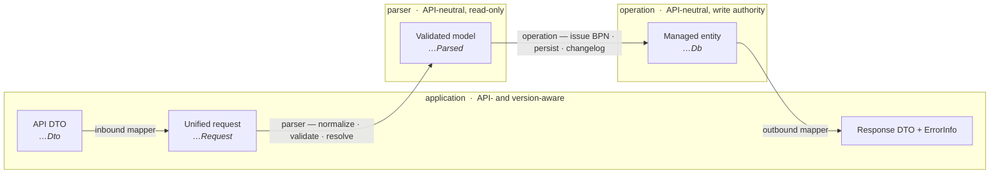
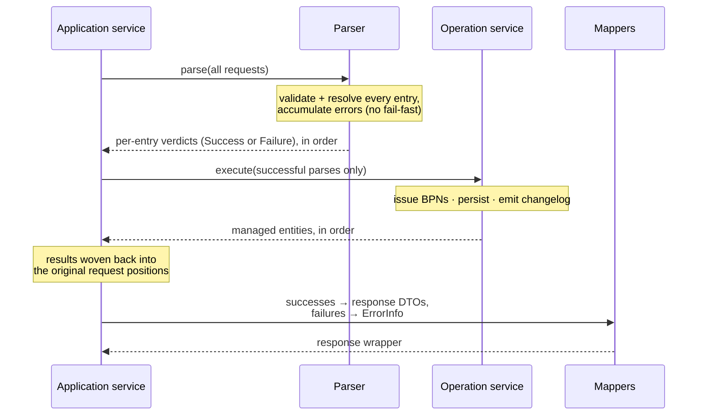

# BPDM Application Code Guide

This guide describes how we design and organize **application code** in BPDM services — the code that turns a request into an operation on the service's data and a response.
It applies to every BPDM service: Pool, Gate, Orchestrator, and any service added later.

> **Note:** This guide describes the ideal we strive toward — not a description of the current state of the codebase.
> The Pool create/update write-path is the reference implementation. Gate and Orchestrator do not follow it yet, and even in Pool the flat `service/` package still holds code that predates this structure.
> Contributions that bring application code closer to this ideal are very welcome.

---

## Table of Contents

- [Part 1 — The Big Picture](#part-1--the-big-picture)
  - [1.1 What "application code" means here](#11-what-application-code-means-here)
  - [1.2 The layered pipeline](#12-the-layered-pipeline)
  - [1.3 The three layers](#13-the-three-layers)
  - [1.4 Supporting components](#14-supporting-components)
  - [1.5 How a batch flows](#15-how-a-batch-flows)
  - [1.6 When this pattern applies](#16-when-this-pattern-applies)
- [Part 2 — Rules](#part-2--rules)
  - [2.1 Layering & dependencies](#21-layering--dependencies)
  - [2.2 Application layer](#22-application-layer)
  - [2.3 Parser layer](#23-parser-layer)
  - [2.4 Operation layer](#24-operation-layer)
  - [2.5 Models & naming](#25-models--naming)
  - [2.6 Naming of properties, variables & methods](#26-naming-of-properties-variables--methods)
  - [2.7 Mappers](#27-mappers)
  - [2.8 Errors](#28-errors)
  - [2.9 Transactions](#29-transactions)
  - [2.10 Batch & correlation contract](#210-batch--correlation-contract)
- [NOTICE](#notice)

---

# Part 1 — The Big Picture

*This part is explanatory. It gives the shared mental model and the rationale behind it. The binding rules are in [Part 2](#part-2--rules).*

## 1.1 What "application code" means here

Application code is the request-handling core of a service: everything between the REST controller and the database. Its job is to take a request, decide whether it is valid, carry out the operation, and report the outcome. An *operation* is any service action — in principle the full range of create, read, search, update, and delete — and a single operation may combine several of these, sometimes across more than one entity.

We split that job into **three layers** that never blur together, connected by **four representations of the same concept** as data flows through them. The guiding idea is a strict separation between *deciding* (pure, reads only, can fail) and *doing* (impure — reads or changes stored data, must not fail silently).

## 1.2 The layered pipeline

A request is transformed step by step. Each arrow is a translation; each layer owns one kind of work.

```mermaid
flowchart LR
    DTO["API DTO<br/><i>…Dto</i>"]
    REQ["Unified request<br/><i>…Request</i>"]
    PARSED["Validated model<br/><i>…Parsed</i>"]
    DB["Managed entity<br/><i>…Db</i>"]
    OUT["Response DTO + ErrorInfo"]

    DTO -->|inbound mapper| REQ
    REQ -->|"parser — normalize · validate · resolve"| PARSED
    PARSED -->|"operation — issue BPN · persist · changelog"| DB
    DB -->|outbound mapper| OUT

    subgraph APP["application &nbsp;·&nbsp; API- and version-aware"]
        DTO
        REQ
        OUT
    end
    subgraph PARSE["parser &nbsp;·&nbsp; API-neutral, read-only"]
        PARSED
    end
    subgraph OP["operation &nbsp;·&nbsp; API-neutral, write authority"]
        DB
    end
```

The four representations, by suffix:

| Representation  | Suffix     | Nature                                                                                                     |
|-----------------|------------|------------------------------------------------------------------------------------------------------------|
| API model       | `…Dto`     | The versioned wire contract. Lives only in the application layer and mappers.                              |
| Unified request | `…Request` | A loose, source-neutral **superset** of every inbound shape (v6, v7, Orchestrator). Nullable, unvalidated. |
| Validated model | `…Parsed`  | Fully validated and non-null; carries already-resolved entities. Safe to persist as-is.                    |
| Entity          | `…Db`      | The JPA entity. Lives only in the operation layer and the entity mapper.                                   |

## 1.3 The three layers

**Application** — the API boundary. One service per *(domain × operation × API version)*. It is the only layer that knows about API DTOs and API versions. It maps the incoming DTO to a `…Request`, drives the parse-then-execute flow, owns the transaction, and maps the outcome back to response DTOs and errors. It contains no validation and no business rules of its own.

**Parser** — the decision layer. It turns a loose `…Request` into a validated `…Parsed`, or into a list of accumulated errors. It is the only layer that handles **data entering the application from outside** — requests received on our API endpoints, and responses we get back from calls the application makes to other services. Anything not coming from our own database is untrusted and must pass through a parser first; data read from our own database is trusted and is not parsed.

It has exactly three responsibilities:

- **Normalization** — bringing an accepted value into the one canonical form the rest of the code works in: trimming, dropping blanks, upper-casing a BPN, defaulting an omitted identifier type. Normalization decides nothing and rejects nothing; it removes variation that no later layer should have to know about.
- **Validation** — deciding whether the value is acceptable at all, and rejecting it with an error when it is not.
- **Resolution** — turning an accepted reference into the thing it names: a BPN into its entity, a metadata key into its record. Resolution is how the parser decides a reference is valid, so the resolved entity is part of its verdict.

The three run in that order — a value is normalized before it is judged, and judged before it is resolved — which is why a caller never normalizes on a parser's behalf.

A rejection is data, not control flow: the parser hands it back as a `ParseResult` failure and never throws. What the client ultimately sees — an `ErrorInfo` entry, or an HTTP error for an operation that has no per-entry error channel — is the application layer's translation of that failure. The parser itself is pure (it only reads) and API-neutral (it never sees a DTO), which is what lets one parser serve every version and every context that embeds the same content: a standalone address, a site's main address, a legal entity's address.

**What a `…Parsed` value promises**

Holding a `…Parsed` value means the parser that made it has run all of its rules. The operation layer uses the value and checks nothing itself.

Some rules are visible in the type: a `CountryCode` instead of a `String`, a resolved `LegalEntityDb` instead of a BPN. Others leave no trace in the value — identifier uniqueness, a consistency rule between two fields. For those the type name is the promise: `LegalEntityCreateParsed` comes only from `LegalEntityCreateParser`. One `…Parsed` type, one parser, one set of rules.

**Parsers call other parsers**

A parser calls the parsers that produce the `…Parsed` values it needs as parts of its own result, and holds those results rather than copying their fields. Parsers form a tree with the same shape as the parsed model. `LegalEntityCreateParser` calls the header parser, the identifier duplicate check and the address parser, and puts their results into `LegalEntityCreateParsed`.

**Operation** — the execution layer. It carries out the operation against the service's data — reading, writing, or both — and in principle spans the full range of CRUD; one operation may be composite, combining several CRUD steps, sometimes across more than one entity. For any part that writes, the operation service is *the single authority* for that entity's write — the one place it happens — so BPN issuance, persistence, and changelog live in exactly one location. It works in internal domain and managed models and returns them, never response DTOs.

*Why separate `…Request` from the DTO?* So the parser and operation never depend on a versioned API model. Every inbound source maps into the one `…Request`, and a single body of parsing and writing logic serves all of them.

*Why separate parse from execute?* Deciding can fail and must be exhaustive; doing must not. Keeping them apart lets us validate a whole batch, report every problem, and then execute only what survived — without half-written state.

## 1.4 Supporting components

- **`ParseResult<T, E>`** — the backbone type: per entry, either `Success(parsed)` or `Failure(errors)`. It is covariant in the error type, so a parser with a narrow error type composes into an operation with a wider one.
- **Combinators** — `zipParseResults` (combine several parsers for the same entry, accumulating errors), `chainParseResults` (feed one parse stage into the next), `parseWherePresent` (run a strict parse over the entries a request actually names), and `parseAndExecute` (the application-to-operation contract: parse the batch, execute only the successes, weave results back into the original positions).
- **Mappers** — `@Component`, translation only, each covering a single direction: *inbound* (DTO → `…Request`), *entity* (`…Parsed` → `…Db`), *outbound* (errors and results → response DTOs / `ErrorInfo` / the error an endpoint raises).
- **`Pending…Write`** — a staged entity plus its `UpsertType` (`Created` / `Updated` / `NoChange`); the currency between staging and committing when a write must be split (see [2.4](#24-operation-layer)).

## 1.5 How a batch flows

Application code is batch-first: a request carries many entries, and each entry gets its own verdict. `parseAndExecute` is what keeps a bad entry from spoiling its neighbours while still writing valid ones in a single pass.

```mermaid
sequenceDiagram
    participant App as Application service
    participant Parser as Parser
    participant Op as Operation service
    participant Map as Mappers

    App->>Parser: parse(all requests)
    Note over Parser: validate + resolve every entry,<br/>accumulate errors (no fail-fast)
    Parser-->>App: per-entry verdicts (Success or Failure), in order
    App->>Op: execute(successful parses only)
    Note over Op: issue BPNs · persist · emit changelog
    Op-->>App: managed entities, in order
    Note over App: results woven back into<br/>the original request positions
    App->>Map: successes → response DTOs,<br/>failures → ErrorInfo
    Map-->>App: response wrapper
```

The list is **positional throughout**: the same size in and out, and the i-th result always belongs to the i-th request. That order *is* the correlation between request and response — no separate identifier is needed.

**When entries of a batch affect each other.** Batch-first assumes every entry can be judged on its own. Two kinds of dependence break that, and they have different answers.

*The entries share a value.* Two entries of one batch state a value that may only exist once — the same identifier, or the "ultimate owner" flag within one ownership tree. Neither entry is wrong by itself; together they are. A parser can still decide this, because both values are in the request: it judges each entry against the state the *whole batch* would leave behind rather than against the state in the database today. Nothing about the flow changes — the batch is still parsed as a whole and then executed.

*The entries share an entity that the batch itself creates.* Two golden record task entries of one reservation name the same business partner. The first one creates it, and it receives its BPN in that moment. The second one must then update that very business partner instead of creating a second one. So whether the second entry is a create or an update depends on whether the first entry has already run — and the parser cannot know that, because issuing the BPN is the operation layer's work and has not happened yet when parsing runs. Looking harder at the request does not answer the question.

The second case is a real exception to the flow above: such an operation is processed **one entry at a time** — parse an entry, execute it, then parse the next one against the state the previous one left behind. Pool's `GoldenRecordTaskUpsertParser` is the example, and its class documentation states the reason. The request and response stay positional exactly as before; only the interleaving changes.

## 1.6 When this pattern applies

This structure governs **operations** — create, read, search, update, and delete, and the composite operations built from them. It is the target for all of them across every service.

The write-specific obligations — single write authority, changelog, owning the transaction — apply to whichever parts of an operation change state. A pure read or search uses the same layering, with the parser validating any external input and the operation layer querying rather than writing.

Sometimes there is nothing left for the operation layer to do. Because a parser resolves the references it validates, a fetch-by-identifier has already produced its own result by the time parsing is done: the entity the response is built from. Such an operation gets no operation service — the application service maps what the parser resolved. An operation service earns its place by carrying out work the parse did not: a query with criteria, a fetch of associations, a projection, or any write.

Background jobs and internal process orchestration are not request-driven operations of this kind and are not forced into this exact shape, though the same principles (pure vs. impure, API-neutral core, mappers for translation) still guide them.

---

# Part 2 — Rules

*Binding rules. MUST = required; MUST NOT = forbidden; SHOULD = strong default, deviate only with a documented reason.*

## 2.1 Layering & dependencies

- The layers MUST depend only downward: application → parser and application → operation. Parser and operation MUST NOT depend on the application layer.
- Parser and operation code MUST be API-neutral and version-neutral: no `…Dto` types, no awareness of API versions.
- Only the application layer and mappers MAY reference API DTOs or be partitioned by API version.
- Business decisions and side effects MUST live in the parser (decisions) and operation (side effects) layers, never in the application layer.

## 2.2 Application layer

- There MUST be one application service per *(domain × operation × API version)*. A single service MAY host several closely related endpoints of the same operation.
- It MUST contain only orchestration and translation — no validation, no business rules, no persistence.
- It MUST be the only layer that maps to or from API DTOs.
- It MUST own the outer transaction boundary.
- It MUST drive the flow through `parseAndExecute` (parse the whole batch, execute only successes) and preserve input order in the response, unless the operation is one of the entry-at-a-time exceptions of [2.10](#210-batch--correlation-contract).

## 2.3 Parser layer

A parser has exactly three responsibilities — **normalization**, **validation** and **resolution** — and it MUST own all three, in that order, for the data it accepts.

**Scope and purity**

- A parser MUST parse all data entering the application from outside its own database: both requests received on our API endpoints and responses received from calls the application makes to other services. Data read from our own database is trusted and MUST NOT require parsing.
- A parser MUST be free of side effects other than database reads; it MUST NOT write.
- A parser MUST be annotated `@Transactional(readOnly = true)` when a single parse issues more than one database query.

**Normalization**

- No other layer MAY normalize an inbound value: not the controller, not the application service, not a mapper, and not a caller preparing input for a parser. Normalization MUST happen once, in the parser that owns the value — for a shared reference, that is the resolving parser every path funnels through, not each of its callers. A value that reaches a `…Parsed` MUST already be canonical.
- A parser SHOULD normalize the inbound value rather than widen its lookup. Matching a stored value loosely (a case-insensitive or otherwise tolerant query) hides the canonical form and gives up an exact indexed lookup; normalizing the input keeps both.

**Validation**

- A parser MUST accumulate errors, reporting every problem for an entry rather than failing on the first.
- A parser MUST return every rejection it decides as a `ParseResult` failure and MUST NOT throw to signal one — not even where the operation reports a single outcome and the endpoint answers with an HTTP error. Translating a failure into the client-facing error is the application layer's job, through an outbound error mapper (see [2.8](#28-errors)). This governs validation outcomes only; a genuinely exceptional failure, such as a broken database read, is unaffected.
- An error a parser reports SHOULD quote the value as the caller sent it, not its normalized form, so the client recognises its own input.
- A rule the parser can only decide against the current database state, such as identifier uniqueness, SHOULD also be enforced by a database constraint.
- A parser that can reject nothing MAY return its `…Parsed` value directly instead of a `ParseResult`. Normalizing search criteria is the typical case: an unknown or malformed filter value simply matches nothing, so there is no verdict to report. As soon as one input can be rejected, the parser MUST return a `ParseResult`.

**Resolution**

- A parser SHOULD resolve the references it validates to the entities they name, rather than passing the identifier on for a later layer to look up.
- A resolving parser MUST NOT offer optional resolution: A parser always reports a missing referenced object as a parse error. Where a reference is optional, the *caller* handles that.

**Composition**

- A parser MUST be named after the `…Parsed` type it produces, never after an operation that uses it.
- A parser MUST call the parser that produces the type it needs, and no larger one.
- A rule MUST sit in the parser that produces the `…Parsed` value the rule is about. A rule that only makes sense between two parts sits in the parser that has both.
- A parser MUST NOT offer a method that skips one of its own rules.
- A parser whose rule serves several callers SHOULD take their difference as a parameter rather than leave each caller to decide whether the rule applies — `LegalEntityIdentifierDuplicateValidator` takes an owner BPN that is `null` on create and the resolved target on update.
- A rule that produces errors but no `…Parsed` value is a **validation**. A parser MAY hold its validations itself.
- A validation SHOULD be extracted into its own `…Validator` only where more than one parser needs it, or where it has grown complex enough to stand alone. A validator produces errors and never a `…Parsed` value.

## 2.4 Operation layer

- An operation service MUST carry out one operation against the service's data — a single CRUD action (create, read, search, update, delete) or a composite built from several of them.
- It MUST consume validated `…Parsed` input wherever the operation takes external input, and MUST return internal domain or managed models (`…Db` / `UpsertResult` / query results); it MUST NOT return or reference API DTOs or response models.
- For any part of an operation that writes, the operation service MUST be the single authority for that entity's write: the only place that issues the entity's BPN, persists it, and emits its changelog at the entity's own aggregate boundary.
- An operation service MUST NOT be created for an operation the parse already completes. Where a parser's resolution has produced the operation's whole result — a fetch by identifier is the typical case — the application service maps that result directly; a pass-through operation service adds a layer without adding authority.
- An operation service SHOULD expose the simplest form its callers need. The stage/commit split MUST be introduced only when a composite must wire an unsaved, cyclically-referenced graph before flushing — not as a default shape.
- An update MUST NOT be able to change an entity's identity or parentage. This MUST be enforced structurally (e.g. a mutator that exposes only the permitted writes), not by convention.

## 2.5 Models & naming

- Every representation MUST carry its suffix: `…Dto` (API), `…Request` (unified input), `…Parsed` (validated), `…Db` (entity).
- The `…Request` model MUST be a superset that captures the content of all inbound sources (v6, v7, Orchestrator), so one parsing path feeds one domain model.
- A `…Parsed` value MUST be fully validated, normalized and non-null — safe to persist without further checks, and carrying every value in its canonical form.
- A `…Parsed` type MUST be produced by exactly one parser; that parser's rules are what the type promises.
- A `…Parsed` value MUST NOT be created anywhere but in its own parser.
- A parser SHOULD put a guarantee into the type wherever it can — a narrow value type, the resolved entity instead of the BPN naming it — and rely on the type name alone only for rules that leave no trace in the value.
- A `…Parsed` built from other parsed values MUST hold them instead of copying their fields into one flat record.
- Internal domain models (`…Request`, `…Parsed`) MUST NOT reference API DTO types. Where an internal model duplicates the shape of an API DTO, it SHOULD reuse the shared value types and enums rather than cloning them — only the DTO wrapper is duplicated, not the vocabulary it is built from.
- Types SHOULD be named domain-noun first, with the role/stage as a suffix (`AddressCreateParsed`, not `ParsedAddressCreate`).

## 2.6 Naming of properties, variables & methods

Properties and variables:

- A name MUST identify its subject, not its kind: `legalEntityReference`, not `reference`. This covers references, BPNs, ids and entities alike.
- Qualification is required only where more than one candidate is in scope. Where a scope holds one value of a kind — including one whose subject the enclosing class name already fixes — the unqualified name MUST be kept.
- Where two or more values of one kind are in scope, each of them MUST carry a qualifier. Leaving one of them bare is forbidden.
- A qualifier MUST state the value's role in the request or the rule, never its type.
- A value narrowed or filtered out of another MUST name the narrowing.
- A name MUST use the vocabulary of the types and errors it belongs to, not wording invented in comments.
- One word MUST NOT denote two different things within one scope.
- A collection MUST be plural and MUST name its elements.
- A name MUST describe the whole value. A pair or an indexed element MUST be named for the composite, not for the part destructured out of it on the next line.
- A name established for a subject MUST be kept downstream, including in lambda parameters; it MUST NOT be abbreviated. Only the representation suffix (`…Request` / `…Parsed` / `…Db`) distinguishes its forms.
- A layer-generic stand-in (`parsed`, `content`, `result`, `resolved`, `created`, `updated`) MAY stand alone only where the scope performs that operation exactly once. Count the operations the scope performs, not the types it declares.
- A word naming a role or a provenance (`target`, `stated`, `existing`) MUST be used only where the contrasting case is present in the same scope.
- A value MUST be named for what it is, never for what a later step will do to it.
- A preposition MUST NOT serve as a name.

Methods:

- A method name MUST be a verb phrase. A noun-named method is forbidden; where a noun is the only honest name, the member MUST be a property rather than a method.
- A method MUST be named for the work it does or the rule it enforces — never for the failure it detects, and never for the type it returns.
- A method name MUST use the established prefix for its kind: `parse…` for a parse step, `to…` for a pure conversion named after the type produced, `validate…` for a rule check, `find…` / `collect…` for a lookup.
- A method name MUST NOT take its verb from a domain type family.
- A helper's parameters MUST be named from the helper's own scope, not from a call site, and sibling helpers MUST agree with each other. Where only one call site justifies a qualifier, the qualifier belongs at that call site.

## 2.7 Mappers

- A mapper MUST be a `@Component` — not a `@Service`, because it is a humble translation object and holds none of a service's authority — do translation only (no business logic, no side effects), and live in the `mapper` package.
- A decision, a rule-based default, or a branch on business state is business logic: it MUST NOT appear in a mapper, and MUST live in the parser (if it decides) or the operation (if it acts). No size or convenience argument justifies an exception.
- The reverse does not hold: a service MAY carry out a translation inline. Deterministic conversions — `Instant`↔`LocalDateTime`, enum and key formatting, restructuring — are translation wherever they live, and a one-off two-line conversion does not deserve its own mapper.
- Translation SHOULD be extracted into a mapper once it grows beyond a few lines or is needed in more than one place. The threshold is a judgement call; extract before the mapping starts to obscure what the service does.
- A mapper MUST cover exactly one direction: inbound (DTO → `…Request`), entity (`…Parsed` → `…Db`), or outbound (errors/results → response DTO / `ErrorInfo`). It MUST NOT merge two directions, and one direction MUST NOT be fragmented across several mappers for the same content.
- Once extracted, mapping — including response shaping — MUST live in the `mapper` package as a proper `@Component` mapper. It MUST NOT be left as loose extension functions in a service package.

## 2.8 Errors

- Parse errors MUST be modelled as sealed hierarchies.
- A parser's declared error type MUST name exactly the errors that parser can report — no more and no less. Every member of the declared type must be reachable from that parser, and every rejection it can reach must be a member. Widening to a shared top-level hierarchy "because it all ends up there anyway" is forbidden: the signature is what tells a reader and a test the parser's whole range of rejections, and a member that cannot occur forces callers to write branches for states that never arise. Where a parser reports a single error, that error's own type is the error type; no interface is needed for one member.
- A shared content error SHOULD subtype each embedding operation's error interface, so it surfaces as that operation's error directly, without wrapping.
- Error-to-code mapping MUST be exhaustive over the sealed type, so that adding a new error fails to compile until it is mapped.
- An operation that answers with a single result rather than per-entry outcomes — a get, a search — MUST still model its parse errors as a sealed hierarchy and map them exhaustively. The mapping yields the error the endpoint raises instead of an `ErrorInfo` entry, and the application layer raises it; the parser still only returns the failure.
- A genuinely unreachable or internal error SHOULD map to a thrown 500, not to a client-facing error code.

## 2.9 Transactions

- A class MUST declare `@Transactional` only when it needs it: the application layer owns the outer boundary; operation methods are transactional so they are safe as standalone entry points and participate in the outer transaction otherwise; parsers use `@Transactional(readOnly = true)` when they read repeatedly (see [2.3](#23-parser-layer)).

## 2.10 Batch & correlation contract

- Every layer MUST preserve order: the i-th response corresponds to the i-th request. A parser's verdict list and an operation's result list therefore have the same size as their input.
- Every layer MUST query and write in batch, not once per entry: a lookup a batch shares — metadata, referenced entities, existing rows — is issued once for the whole batch. This applies to parsers and operation services alike.
- New APIs MUST NOT introduce a client-supplied correlation index; request/response order is the correlation. Existing index fields are legacy and are not to be extended to new operations.
- A validation rule whose scope is wider than one entry — a uniqueness rule, or an invariant over data the batch touches from several entries — MUST NOT be judged against the stored state alone. Judging each entry as if it were the only one accepts a request that leaves the invariant broken, and a rule of this kind rarely has a database constraint to catch it. Judge such a rule against the state the whole batch would leave behind, or reject the entries that interact with one another.
- An operation whose entries can create the entities that later entries reference MAY be processed one entry at a time — parse and execute an entry before parsing the next — instead of parsing the whole batch first. Its parser MUST state that reason in its class documentation. For such an operation:
  - The interleaving MUST live in the application service, which loops over the entries. A parser MUST NOT drive it, because interleaving means executing between parses and a parser neither writes nor calls the operation layer.
  - That parser's entry point therefore takes **one entry** and returns **one verdict**, rather than a list of each. The positional contract holds where it is observable — the application service still answers the i-th request with the i-th response — not in the parser's own signature.
  - The batch-query rule applies within the entry instead of across the request: the content parsers the entry delegates to stay batch-shaped and are handed that one entry's worth of input.
  - The consequence to accept: when two entries conflict, only the later one is rejected, so reordering the request can change which entry fails.

---

## NOTICE

This work is licensed under the [Apache-2.0](https://www.apache.org/licenses/LICENSE-2.0).

- SPDX-License-Identifier: Apache-2.0
- SPDX-FileCopyrightText: 2023,2026 ZF Friedrichshafen AG
- SPDX-FileCopyrightText: 2023,2026 SAP SE
- SPDX-FileCopyrightText: 2023,2026 Bayerische Motoren Werke Aktiengesellschaft (BMW AG)
- SPDX-FileCopyrightText: 2023,2026 Mercedes Benz Group
- SPDX-FileCopyrightText: 2023,2026 Robert Bosch GmbH
- SPDX-FileCopyrightText: 2023,2026 Schaeffler AG
- SPDX-FileCopyrightText: 2023,2026 Contributors to the Eclipse Foundation
- Source URL: https://github.com/eclipse-tractusx/bpdm
