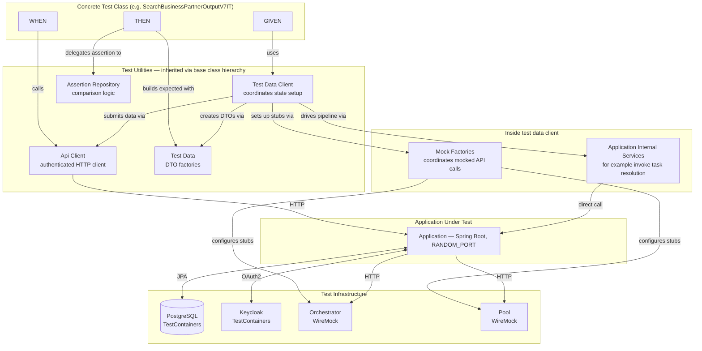

# BPDM System Test Contributor Guide

This guide explains the philosophy, architecture, and conventions of the BPDM test suite.
Read it before writing a new test or modifying the test infrastructure.

> **Note:** This guide describes the ideal we strive toward — not a description of the current state of the codebase.
> Some existing tests and test utilities may not yet fully follow these conventions and will need to be refactored over time.
> Contributions that bring the test code closer to this ideal are very welcome.

---

## Table of Contents

1. [Philosophy & Goals](#1-philosophy--goals)
2. [Test Environment](#2-test-environment)
3. [Base Class Hierarchy](#3-base-class-hierarchy)
4. [Anatomy of a Test Case](#4-anatomy-of-a-test-case)
5. [Test Data Factories](#5-test-data-factories)
6. [TestDataClient](#6-testdataclient)
7. [API Clients](#7-api-clients)
8. [Mock Factories](#8-mock-factories)
9. [Assertion Repository](#9-assertion-repository)
10. [Parameterized Tests](#10-parameterized-tests)
11. [Adding a New Test: Step-by-Step Checklist](#11-adding-a-new-test-step-by-step-checklist)
12. [Common Mistakes & Anti-Patterns](#12-common-mistakes--anti-patterns)

---

## Overview

The diagram below shows how the components of the test suite fit together.
Each section of this guide covers one of these components in detail.



---

## 1. Philosophy & Goals

BPDM tests are **system-level black-box tests**.
Every test case exercises one or more real API endpoints and asserts on the HTTP response — not on internal state, database rows, or private methods.

This approach has a deliberate consequence: tests do not know or care how the code achieves a result.
They only verify that a given API endpoint, under given conditions, produces the specified response.
This keeps tests decoupled from implementation details and lets them serve as living documentation of the API contract.

### Why no unit or integration tests below the API level?

Unit tests that mock collaborators tend to verify the implementation rather than the contract.
When the implementation changes — even correctly — those tests break.
They also give false confidence when the mocked behaviour diverges from the real behaviour of the dependency.

BPDM's system tests start the full Spring Boot application with a real PostgreSQL database, a real Keycloak instance, and WireMock servers simulating external BPDM services.
The result is a high degree of real-world similarity: if the tests pass, the application does what the API contract says, under real authentication, against real data.

### Conceptualising a test as acceptance criteria

Each test case is conceptualised using the **GIVEN / WHEN / THEN** structure commonly used for acceptance criteria:

- **GIVEN** — the system state required before the action. What needs to exist in the database? Which mocks need to be in place?
- **WHEN** — the API invocation being tested: which endpoint, which payload.
- **THEN** — the expected response, followed by an assertion that the actual response matches it.

This structure is not decorative.
It forces each test to answer three precise questions: What world am I in? What action am I taking? What must be true afterwards?

---

## 2. Test Environment

A test environment is the complete runtime configuration under which a group of tests runs.
It covers:

- The Spring Boot application under test
- A containerised PostgreSQL database (via Testcontainers)
- A containerised Keycloak instance (via Testcontainers)
- WireMock servers simulating external BPDM services (Pool, Orchestrator)
- Spring profiles that apply test-specific application properties

### Expressing an environment as an annotation

Each distinct test environment is expressed as a **Kotlin meta-annotation** — an annotation that itself carries `@SpringBootTest`, `@ContextConfiguration`, and `@ActiveProfiles`.
Test base classes (not individual test classes) are annotated with it.

Here is the Gate module's primary test environment:

```kotlin
// bpdm-gate/src/test/kotlin/org/eclipse/tractusx/bpdm/gate/UnscheduledTestEnvironment.kt

@SpringBootTest(webEnvironment = SpringBootTest.WebEnvironment.RANDOM_PORT, classes = [Application::class])
@ContextConfiguration(initializers = [
    PostgreSQLContextInitializer::class,
    KeyCloakInitializer::class,
    OrchestratorMockContextInitializer::class,
    PoolMockContextInitializer::class
])
@ActiveProfiles("test-unscheduled")
annotation class UnscheduledTestEnvironment
```

Each `ContextInitializer` in `@ContextConfiguration` is responsible for starting one piece of infrastructure and injecting the resulting connection properties into the Spring context before beans are created:

| Initializer | What it starts | What it configures |
|---|---|---|
| `PostgreSQLContextInitializer` | PostgreSQL container | `spring.datasource.*` |
| `KeyCloakInitializer` | Keycloak container | OAuth2 issuer URL, test client credentials |
| `OrchestratorMockContextInitializer` | WireMock server | `bpdm.client.orchestrator.base-url` |
| `PoolMockContextInitializer` | WireMock server | `bpdm.client.pool.base-url` |

`@ActiveProfiles("test-unscheduled")` activates a Spring profile that applies test-specific properties (e.g., disabling background scheduling tasks).

### Why use an annotation?

Collecting all environment concerns into a single annotation keeps the base class declaration minimal and makes it immediately clear which environment a test suite runs in.
If a new variant is needed (e.g., an environment without the Pool mock, or one with scheduled tasks enabled), a new annotation is added — existing test classes are unaffected.

---

## 3. Base Class Hierarchy

Test classes in BPDM inherit from a hierarchy of abstract base classes.
Each layer adds a distinct set of capabilities.
Test classes themselves contain only test definitions.

```
GateTestBase  (resets DB, provides testName seed)
    └── GateTestBaseV7  (provides API clients, factories, assert repo, mock factories)
            └── UnscheduledGateTestBaseV7  (@UnscheduledTestEnvironment)
                    └── ConcreteTestClassV7IT  (test cases only)
```

### `GateTestBase`

`bpdm-gate/src/test/kotlin/org/eclipse/tractusx/bpdm/gate/GateTestBase.kt`

The root base class.
It provides two fundamental capabilities shared by every test:

1. **Database reset** — `databaseHelpers.truncateDbTables()` is called before each test via `@BeforeEach`.
   This ensures each test starts with a clean database, making tests fully independent.
2. **Test name as seed** — `testName` is populated from `testInfo.displayName` before each test.
   This string is used as the seed for all factory-generated test data (see [Test Data Factories](#5-test-data-factories)).
   Because JUnit display names are unique within a class, each test gets deterministic but distinct data without any manual coordination.

```kotlin
abstract class GateTestBase {
    val tenantBPNL = KeyCloakInitializer.TENANT_BPNL

    @Autowired
    lateinit var databaseHelpers: DbTestHelpers

    lateinit var testName: String

    @BeforeEach
    open fun beforeEach(testInfo: TestInfo) {
        testName = testInfo.displayName
        databaseHelpers.truncateDbTables()
    }
}
```

### `GateTestBaseV7`

`bpdm-gate/src/test/kotlin/org/eclipse/tractusx/bpdm/gate/v7/GateTestBaseV7.kt`

The API-version-specific base class.
It autowires all test utilities and exposes them to test classes as protected members.
A `@PostConstruct` method initialises the two utilities that require the running server's port (available only after Spring Boot starts):

```kotlin
abstract class GateTestBaseV7 : GateTestBase() {

    // Assertion utility for the THEN section
    @Autowired lateinit var assertRepo: GateAssertRepositoryV7

    // Factory for creating authenticated API clients
    @Autowired lateinit var testClientProvider: GateTestClientProviderV7

    // Hierarchical test data factory (request builders and response converters)
    @Autowired lateinit var testData: TestDataFactoryGateV7

    // Gate internal services — triggered directly in TestDataClient to drive the sharing pipeline
    @Autowired lateinit var taskCreationBatchService: TaskCreationBatchService
    @Autowired lateinit var taskResolutionBatchService: TaskResolutionBatchService
    @Autowired lateinit var relationTaskCreationService: RelationTaskCreationService
    @Autowired lateinit var relationTaskResolutionService: RelationTaskResolutionService

    // Mock factories for simulating Pool and Orchestrator APIs
    @Autowired lateinit var orchestratorMockDataFactory: OrchestratorMockDataFactory
    @Autowired lateinit var poolMockDataFactory: PoolMockDataFactory
    @Autowired lateinit var goldenRecordMockFactory: GoldenRecordMockFactory

    // Initialised after startup (requires the random server port)
    lateinit var gateClient: GateClient
    lateinit var testDataClient: GateTestDataClientV7

    @PostConstruct
    fun init() {
        gateClient = testClientProvider.createClient(KeyCloakInitializer.CLIENT_ID_OPERATOR)
        testDataClient = GateTestDataClientV7(
            gateClient, testData, orchestratorMockDataFactory,
            taskCreationBatchService, taskResolutionBatchService,
            relationTaskResolutionService, relationTaskCreationService,
            goldenRecordMockFactory, tenantBPNL
        )
    }
}
```

### `UnscheduledGateTestBaseV7`

`bpdm-gate/src/test/kotlin/org/eclipse/tractusx/bpdm/gate/v7/UnscheduledGateTestBaseV7.kt`

A thin class whose only purpose is to attach the `@UnscheduledTestEnvironment` annotation to `GateTestBaseV7`.
This separation means that if a second environment variant is needed (e.g., with scheduling enabled), a new class is added without changing `GateTestBaseV7`.

```kotlin
@UnscheduledTestEnvironment
abstract class UnscheduledGateTestBaseV7 : GateTestBaseV7()
```

### Concrete test classes

A concrete test class inherits from the appropriate environment base class and contains only test methods:

```kotlin
class SearchBusinessPartnerOutputV7IT : UnscheduledGateTestBaseV7() {
    @Test
    fun `search legal entity business partner output`() { ... }
}
```

It declares no additional `@Autowired` fields, no `@BeforeEach` methods, and no configuration.
Everything it needs is inherited.

---

## 4. Anatomy of a Test Case

Each test method follows the GIVEN / WHEN / THEN structure with inline comments marking each section.
An optional KDoc block above the method restates the same structure in prose — useful for tests where the scenario needs a sentence or two of context.

Here is a complete example:

```kotlin
/**
 * GIVEN business partner output based on legal entity
 * WHEN output consumer searches for output with that external-ID
 * THEN output consumer sees received golden record result
 */
@Test
fun `search legal entity business partner output`() {
    //GIVEN
    val createdInput = testDataClient.businessPartner.upsertInput(testName)
    val legalEntityGoldenRecord = testDataClient.businessPartner.refineToLegalEntity(createdInput)

    //WHEN
    val response = gateClient.businessParters.getBusinessPartnersOutput(listOf(createdInput.externalId))

    //THEN
    val expectedOutput = testData.businessPartner.output.fromLegalEntity(createdInput, legalEntityGoldenRecord)
    val expectedResponse = PageDto(1, 1, 0, 1, listOf(expectedOutput))
    assertRepo.assertBusinessPartnerOutput(response, expectedResponse)
}
```

### The GIVEN section

The GIVEN section establishes the system state required for the test.
It should be **few lines and high-level**.
A reader skimming the test should immediately understand what precondition matters — not wade through low-level setup detail.

`testDataClient` is the primary tool for the GIVEN section.
Its methods are named after the business outcome they achieve, not the technical steps they perform:

```kotlin
// Good — the name tells you what state you're creating
val createdInput = testDataClient.businessPartner.upsertInput(testName)
val goldenRecord = testDataClient.businessPartner.refineToLegalEntity(createdInput)

// Bad — manually assembling the same state through low-level calls
val request = testData.businessPartner.input.request.fromSeed(testName)
gateClient.businessParters.upsertBusinessPartnersInput(listOf(request))
gateClient.sharingState.postSharingStateReady(PostSharingStateReadyRequest(listOf(testName)))
taskCreationBatchService.createTasksForReadyBusinessPartners()
// ... more steps
```

Both produce identical system state.
The first version communicates intent; the second buries it.

The GIVEN section ends when the precondition is established.
It should not contain any assertions.

### The WHEN section

The WHEN section is a single API call through the module's API client.
It captures the response in a local variable.

```kotlin
//WHEN
val response = gateClient.businessParters.getBusinessPartnersOutput(listOf(createdInput.externalId))
```

The WHEN section should be exactly one call.
If you find yourself making two calls here, consider whether you are testing two different things — which means two different test methods.

### The THEN section

The THEN section constructs the expected response using a factory method, then delegates to the assertion repository to compare it against the actual response.

```kotlin
//THEN
val expectedOutput = testData.businessPartner.output.fromLegalEntity(createdInput, legalEntityGoldenRecord)
val expectedResponse = PageDto(1, 1, 0, 1, listOf(expectedOutput))
assertRepo.assertBusinessPartnerOutput(response, expectedResponse)
```

Build the expected object from factory methods rather than constructing it field by field.
Factories are aware of which fields are incidental (seeded randomly) and produce consistent, comparable objects.
The assertion is always delegated to the assertion repository — never written inline.

---

## 5. Test Data Factories

Test data factories create DTO objects for use in request payloads and response expectations.
They live in `bpdm-common-test` so they can be shared across modules.

A module's factories are typically exposed through a single hierarchical entry point that mirrors the domain.
The Gate V7 tests use `testData` (of type `TestDataFactoryGateV7`) with this structure:

```
testData
  ├── businessPartner
  │   ├── input
  │   │   ├── request.fromSeed(seed)         → BusinessPartnerInputRequest
  │   │   └── response.fromRequest(request)  → BusinessPartnerInputDto
  │   └── output
  │       ├── fromLegalEntity(input, legalEntity)
  │       ├── fromLegalEntityOnSite(input, legalEntity, site)
  │       ├── fromSite(input, legalEntity, site)
  │       └── fromAdditionalAddressOnSite(input, legalEntity, site, additionalAddress)
  ├── relation
  │   ├── input
  │   │   ├── request.fromSeed(seed)         → RelationPutEntry
  │   │   └── response.fromRequest(entry)    → RelationDto
  │   └── output
  │       └── fromGoldenRecord(externalId, goldenRecord)
  └── changelog
      └── ofOnePage(vararg entries)
```

### Seeded creation

Factories use a **seed string** to generate deterministic data.
Given the same seed, a factory always produces the same object.
This makes tests reproducible and simplifies debugging.

The seed drives a `Random` instance via `Random(seed.hashCode())`, which is used for all random choices within the object graph — enum values, list sizes, numeric ranges, and so on:

```kotlin
class BusinessPartnerInputRequestV7Factory(val testMetadata: GateTestMetadataV7) {

    fun fromSeed(seed: String): BusinessPartnerInputRequest = SeededCreator(seed).create()

    private inner class SeededCreator(private val seed: String) {
        private val random = Random(seed.hashCode())

        fun create(): BusinessPartnerInputRequest = BusinessPartnerInputRequest(
            externalId = seed,
            nameParts = (1..2).map { "Name Part $it $seed" },
            identifiers = createIdentifiers(),
            legalEntity = createLegalEntity(),
            // ...
        )

        private fun createIdentifiers(): List<BusinessPartnerIdentifierDto> =
            testMetadata.identifierTypes.shuffled(random).take(2).mapIndexed { i, type ->
                BusinessPartnerIdentifierDto(
                    type = type,
                    value = "Identifier Value ${i + 1} $seed",
                    issuingBody = "Issuing Body ${i + 1} $seed"
                )
            }
    }
}
```

In practice, test classes pass `testName` as the seed.
This ties the generated data to the test that uses it, ensuring each test produces a unique and repeatable object without any coordination.

### Treating random values as incidental

Fields that the factory fills with seeded-random values are **incidental** — they have no bearing on what the test is verifying.
Tests must not assert on them individually, and must not hard-code expected values for them.
The assertion repository handles comparison of full objects, including incidental fields, through recursive comparison of factory-produced expected objects against actual responses.

### Overriding specific values with `copy()`

When a test needs to control a specific field — because that field is the subject of the test — it uses Kotlin's `copy()` method to override only that field:

```kotlin
// The test cares about the externalId and relationType, not the rest of the relation fields
val updatedRequest = testData.relation.input.request.fromSeed(updateSeed).copy(
    externalId = original.externalId,
    relationType = relationType
)
```

This pattern makes the intent explicit: the seeded values are defaults; the `copy()` call marks what actually matters.
Extension functions can provide named shortcuts for common overrides to keep test code readable.

### Conversion factories

Alongside request factories, there are factories that convert between related DTO types.
The Gate V7 tests illustrate the pattern:

- `testData.businessPartner.input.response.fromRequest(request)` — converts an input request to the expected response DTO (adding server-assigned fields like timestamps as placeholder values)
- `testData.businessPartner.output.fromLegalEntity(input, goldenRecord)` — constructs the expected output DTO by combining the submitted input with the golden record data returned by the Pool mock
- `testData.relation.output.fromGoldenRecord(externalId, goldenRecord)` — constructs the expected relation output DTO from the relation input and the orchestrator refinement result

These conversion factories encode the mapping rules between what was sent and what the API should return.
Keeping them in shared modules ensures that the same mapping logic is used everywhere the expectation is constructed.

### Factory naming conventions

Factories are named after the DTO type they produce, and the factory method reflects how the input is provided.
The Gate V7 factories illustrate the conventions:

| Access path | Input | Output |
|---|---|---|
| `testData.businessPartner.input.request.fromSeed(seed)` | A seed string | A fully populated input request DTO |
| `testData.businessPartner.input.response.fromRequest(request)` | A previously created request | The corresponding input response DTO |
| `testData.businessPartner.output.fromLegalEntity(input, goldenRecord)` | Input DTO + golden record | The expected business partner output DTO |
| `testData.relation.input.request.fromSeed(seed)` | A seed string | A fully populated relation put entry |
| `testData.relation.output.fromGoldenRecord(externalId, goldenRecord)` | Relation external ID + orchestrator result | The expected relation output DTO |

---

## 6. TestDataClient

The TestDataClient is the primary tool for the GIVEN section.
It encapsulates multi-step state setup behind named, business-level methods.

When the domain is complex enough, a TestDataClient is itself a thin coordinator that delegates to namespaced sub-clients — one per domain area.
The Gate V7 TestDataClient (`GateTestDataClientV7`) follows this pattern, exposing two sub-clients:

```kotlin
testDataClient.businessPartner   // BusinessPartnerTestDataClientV7
testDataClient.relation          // RelationTestDataClientV7
```

### `testDataClient.businessPartner`

Setting up a business partner that has gone through the full sharing pipeline involves:
1. Submitting the business partner input via the Gate API
2. Configuring the Orchestrator WireMock to return a task response
3. Configuring the Pool WireMock to return a golden record search result
4. Triggering the Gate's task creation service
5. Triggering the Gate's task resolution service

`testDataClient.businessPartner.refineToLegalEntity(input)` does all of this.
In a test method, it appears as two lines:

```kotlin
//GIVEN
val createdInput = testDataClient.businessPartner.upsertInput(testName)
val legalEntityGoldenRecord = testDataClient.businessPartner.refineToLegalEntity(createdInput)
```

**Upsert** — submit business partner data to the Gate API:
```kotlin
fun upsertInput(seed: String): BusinessPartnerInputDto
fun upsertInput(request: BusinessPartnerInputRequest): BusinessPartnerInputDto
```

**Refinement** — drive a business partner through the sharing pipeline to a specific golden record outcome:
```kotlin
fun refineToLegalEntity(input: BusinessPartnerInputDto): LegalEntityWithLegalAddressVerboseDto
fun refineToLegalEntityOnSite(input: BusinessPartnerInputDto): PoolMockDataFactory.SiteWithLegalEntityParent
fun refineToSite(input: BusinessPartnerInputDto): PoolMockDataFactory.SiteWithLegalEntityParent
fun refineToAdditionalAddressOfSite(input: BusinessPartnerInputDto): PoolMockDataFactory.AdditionalAddressOfSiteResult
fun refineToSuccess(input: BusinessPartnerInputDto): BusinessPartnerOutputDto
```

**Compound** — upsert and immediately refine in one call:
```kotlin
fun createOutput(seed: String): BusinessPartnerOutputDto
fun updateOutput(output: BusinessPartnerOutputDto, newSeed: String): BusinessPartnerOutputDto
```

**State progression** — move a sharing state to a specific stage without full refinement:
```kotlin
fun setStateToReady(externalId: String)
fun setStateToPending(externalId: String, seed: String = externalId): TaskClientStateDto
fun setStateToSuccess(externalId: String, seed: String = externalId): TaskClientStateDto
fun setStateToError(externalId: String, seed: String = externalId, errorType: TaskErrorType): TaskClientStateDto
```

### `testDataClient.relation`

Relation setup follows the same principle.
A relation output requires both business partner endpoints to be refined first, so the methods coordinate business partner and relation setup together:

```kotlin
//GIVEN
val (relationInput, goldenRecord) = testDataClient.relation.createLegalEntityRelationOutput(testName)
```

**Upsert** — submit relation data to the Gate API:
```kotlin
fun upsertRelationInput(entry: RelationPutEntry, createIfNotExist: Boolean = true): RelationDto
fun upsertRelationInput(externalId: String, source: BusinessPartnerInputDto, target: BusinessPartnerInputDto): RelationDto
fun upsertRelationInputWithBusinessPartners(entry: RelationPutEntry, createIfNotExist: Boolean = true): RelationDto
fun upsertRelationInputWithBusinessPartners(seed: String, relationType: RelationType): RelationDto
```

**Compound** — set up the full relation pipeline including business partner refinement:
```kotlin
fun createRelationInputWithRefinedLegalEntityBPs(seed: String, relationType: RelationType): RelationDto
fun createLegalEntityRelationOutput(seed: String, relationType: RelationType): Pair<RelationDto, BusinessPartnerRelations>
fun createAddressRelationOutput(seed: String, relationType: RelationType): Pair<RelationDto, BusinessPartnerRelations>
fun updateLegalEntityRelationOutput(original: RelationDto, updateSeed: String, relationType: RelationType): BusinessPartnerRelations
fun refineRelationToSuccess(input: RelationDto, seed: String = input.externalId): BusinessPartnerRelations
```

**State progression** — move a relation sharing state to a specific stage:
```kotlin
fun setRelationStateToPending(externalId: String, seed: String = externalId): TaskClientRelationsStateDto
fun setRelationStateToSuccess(externalId: String, seed: String = externalId): TaskClientRelationsStateDto
fun setRelationStateToError(externalId: String, seed: String = externalId, errorType: TaskRelationsErrorType): TaskClientRelationsStateDto
```

### Naming principle

Method names in `TestDataClient` should read as acceptance-criteria language — they describe the resulting system state, not the technical steps taken to achieve it.
If adding a new method requires explaining how it works in its name, that is a sign the name is describing implementation rather than outcome.

---

## 7. API Clients

All interaction with BPDM API endpoints in test cases goes through the BPDM API clients.
Tests never construct HTTP requests manually.

### Configuration

Clients are created by `GateTestClientProviderV7`, which builds a `GateClient` pointed at the running test application.
Because the application starts on a random port (`RANDOM_PORT`), clients are initialised in `@PostConstruct` — after the port is known — not at field declaration time.

```kotlin
@PostConstruct
fun init() {
    gateClient = testClientProvider.createClient(KeyCloakInitializer.CLIENT_ID_OPERATOR)
}
```

### Role-based clients

`testClientProvider.createClient(registrationId)` creates a client authenticated as a specific Keycloak client, which corresponds to a specific role.
The standard roles available in the test Keycloak realm are:

| Registration ID | Role |
|---|---|
| `CLIENT_ID_OPERATOR` | Operator — standard write/read access |
| `CLIENT_ID_ADMIN` | Admin — elevated permissions |
| `CLIENT_ID_GUEST` | Guest — read-only access |

Most test cases use `gateClient`, which is pre-configured as `OPERATOR`.
Authentication tests that need to verify role-based access control use `testClientProvider.createClient(...)` directly to create clients with the role under test.

---

## 8. Mock Factories

When the application under test calls out to external services, those calls are intercepted by WireMock servers.
Mock factories configure WireMock stubs that define what those servers return.

### Structure

Mock factories are part of `bpdm-common-test` and are organised at two levels:

**Low-level factories** — configure stubs for a single service:

- `PoolMockDataFactory` — stubs Pool API endpoints (legal entity search, site search, address search)
- `OrchestratorMockDataFactory` — stubs Orchestrator API endpoints (task creation, task status, refinement results)

**High-level coordinator** — coordinates both services for end-to-end refinement scenarios:

- `GoldenRecordMockFactory` — sets up both Pool and Orchestrator stubs together for a complete refinement scenario

For example, a legal entity refinement requires a Pool stub (returning the golden record data) and an Orchestrator stub (returning the task result that references it).
`GoldenRecordMockFactory.mockLegalEntityRefinement(seed, owningCompany, nameParts)` sets up both stubs and returns the Pool mock result, which the test can use to build its expected output DTO:

```kotlin
fun mockLegalEntityRefinement(seed: String, owningCompany: String?, nameParts: List<String>): LegalEntityWithLegalAddressVerboseDto {
    val poolMockResult = poolMockDataFactory.mockLegalEntityAndLegalAddressSearchResult(seed)
    orchestratorMockDataFactory.mockRefineToLegalEntity(seed, poolMockResult, owningCompany, nameParts)
    return poolMockResult
}
```

### How mock factories relate to TestDataClient

Tests do not call mock factories directly in the GIVEN section.
`TestDataClient` methods call them internally.
This ensures mock setup and business-logic state setup are coordinated correctly and the GIVEN section stays readable.

The exception is when a test needs a custom mock configuration that `TestDataClient` does not offer.
In that case, a mock factory can be called directly — but this should be rare and should prompt consideration of whether a new `TestDataClient` method is warranted.

---

## 9. Assertion Repository

Each module has a single assertion repository that is the only place where comparison logic lives.
All `THEN` sections call it — never AssertJ directly.
In the Gate V7 tests this is `GateAssertRepositoryV7` (`bpdm-gate/src/test/kotlin/.../gate/v7/util/GateAssertRepositoryV7.kt`), accessed via the inherited `assertRepo` field.

### Recursive comparison

Assertions use AssertJ's `.usingRecursiveComparison()` to compare the full object graph field by field:

```kotlin
fun assertBusinessPartnerOutput(actual: Collection<BusinessPartnerOutputDto>, expected: Collection<BusinessPartnerOutputDto>) {
    Assertions.assertThat(actual.sortedBy { it.externalId }.map { it.sortContent() })
        .usingRecursiveComparison()
        .ignoringFields(
            BusinessPartnerOutputDto::createdAt.name,
            BusinessPartnerOutputDto::updatedAt.name
        )
        .withComparatorForType(instantSecondsComparator, Instant::class.java)
        .withComparatorForType(localDatetimeSecondsComparator, LocalDateTime::class.java)
        .isEqualTo(expected.sortedBy { it.externalId }.map { it.sortContent() })
}
```

### Ignored fields

Fields that are genuinely non-deterministic — `createdAt`, `updatedAt`, `sharingProcessStarted`, changelog `timestamp` — are ignored in the comparison.
These fields cannot be meaningfully predicted in a test, and asserting on them would make tests fragile without adding value.

The set of ignored fields is decided once, in the assertion repository, and applied consistently.
Test cases never ignore fields themselves.

### Collection normalisation

Before comparison, collections are sorted (e.g., by `externalId` or `validFrom`) and nested lists are normalised via `sortContent()`.
This ensures that comparison order matches regardless of how the database returns rows.
This normalisation lives exclusively in the assertion repository.

### Custom comparators

Some timestamp types from external systems arrive with sub-second precision that the database or serialiser does not preserve.
For these, the assertion repository registers custom comparators that compare at seconds precision:

```kotlin
.withComparatorForType(instantSecondsComparator, Instant::class.java)
.withComparatorForType(localDatetimeSecondsComparator, LocalDateTime::class.java)
```

When adding assertions for new DTO types, check whether the new type contains `Instant` or `LocalDateTime` fields and apply the same comparators.

---

## 10. Parameterized Tests

Some tests need to verify the same behaviour across multiple values — for example, testing that all legal-entity relation types produce valid output, or that all address relation types are handled correctly.
Rather than duplicating test methods, use JUnit 5's `@ParameterizedTest` with `@EnumSource`.

The enum passed to `@EnumSource` can be an existing application model enum (e.g., `RelationType`) or a dedicated test utility enum that wraps or subsets domain values.
Dedicated test enums belong in `bpdm-common-test` so they are reusable across modules.
The Gate V7 tests use `GateTestTypes` for this purpose:

```kotlin
object GateTestTypes {
    enum class LegalEntityRelationType(val gateRelationType: RelationType) {
        IsOwnedBy(RelationType.IsOwnedBy),
        IsAlternativeHeadquarterFor(RelationType.IsAlternativeHeadquarterFor),
        IsManagedBy(RelationType.IsManagedBy)
    }

    enum class AddressRelationType(val gateRelationType: RelationType) {
        IsReplacedBy(RelationType.IsReplacedBy)
    }
}
```

A parameterized test receives the enum value as a parameter and uses it to drive both the GIVEN setup and the WHEN call:

```kotlin
@ParameterizedTest
@EnumSource(GateTestTypes.LegalEntityRelationType::class)
fun `search relation output between legal entities`(legalEntityRelationType: GateTestTypes.LegalEntityRelationType) {
    //GIVEN
    val (relationInput, goldenRecord) = testDataClient.relation.createLegalEntityRelationOutput(
        testName,
        legalEntityRelationType.gateRelationType
    )

    //WHEN
    val response = gateClient.relationOutput.postSearch()

    //THEN
    val expectedOutput = testData.relation.output.fromGoldenRecord(relationInput.externalId, goldenRecord)
    assertRepo.assertRelationOutput(response, PageDto(1, 1, 0, 1, listOf(expectedOutput)))
}
```

JUnit generates one test case per enum constant, each with a display name that includes the constant name.
The `testName` seed therefore differs per constant, keeping test data isolated.

Prefer `@EnumSource` with a named enum over `@MethodSource` or `@ValueSource` with inline values — a named enum is self-documenting and keeps the value set in one discoverable place.

---

## 11. Adding a New Test: Step-by-Step Checklist

Use this checklist when writing a new test case.

**Before writing the test:**

- [ ] Identify the API endpoint being tested and the scenario (what condition makes this test distinct from others in the same class?)
- [ ] Write the acceptance criteria in GIVEN / WHEN / THEN prose to confirm you understand what the test should verify
- [ ] Check whether a test class already exists for this endpoint. If so, add the test there. If not, create a new class inheriting from the appropriate environment base class.

**GIVEN section:**

- [ ] Use the module's TestDataClient to set up system state — avoid calling API clients or mock factories directly in the test method
- [ ] Pass `testName` as the seed to all TestDataClient methods that accept one
- [ ] Limit the GIVEN section to the state that is *necessary* for this specific scenario. Avoid creating data that the WHEN or THEN section does not use.

**WHEN section:**

- [ ] Use the module's API client to call exactly one endpoint
- [ ] Capture the response in a local variable

**THEN section:**

- [ ] Construct the expected response using the appropriate test data factory method
- [ ] Delegate the assertion to the assertion repository — do not use `Assertions.assertThat(...)` directly in a test method
- [ ] Do not assert on individual fields unless the factory cannot express the expectation

**Test method name:**

- [ ] Write the test name as a readable sentence describing the scenario, not the technical steps: `` `search legal entity business partner output` `` not `` `callGetOutputEndpointWithLegalEntityId` ``

**If the test covers multiple domain values (e.g., all relation types):**

- [ ] Use `@ParameterizedTest` + `@EnumSource` with an appropriate application model or test utility enum
- [ ] If a dedicated test enum is needed, add it to the module's test types utility in `bpdm-common-test`

**If you need a new TestDataClient method:**

- [ ] Add it to the module's TestDataClient (or the appropriate domain sub-client if the TestDataClient is namespaced by domain area)
- [ ] Name it after the business outcome, not the implementation steps
- [ ] If it requires new WireMock stubs, add factory methods to the appropriate mock factory rather than inlining WireMock calls in the TestDataClient
- [ ] Ensure the method returns the data the test will need for building expected DTOs

**If you need a new assertion method:**

- [ ] Add it to the module's assertion repository, not inline in the test
- [ ] Apply `.usingRecursiveComparison()` with the standard ignored fields for the DTO type
- [ ] Register `instantSecondsComparator` and `localDatetimeSecondsComparator` if the DTO contains `Instant` or `LocalDateTime` fields

---

## 12. Common Mistakes & Anti-Patterns

### Injecting utilities directly into a test class

```kotlin
// Bad
class MyTestIT : UnscheduledGateTestBaseV7() {
    @Autowired
    lateinit var someService: SomeService  // already available via base class or testDataClient
}
```

Test classes should not declare `@Autowired` fields.
If a utility is missing from the base class, add it there — not in the concrete test class.

### Calling low-level APIs in the GIVEN section

```kotlin
// Bad — test reveals implementation, not intent
//GIVEN
val request = testData.businessPartner.input.request.fromSeed(testName)
gateClient.businessParters.upsertBusinessPartnersInput(listOf(request))
gateClient.sharingState.postSharingStateReady(PostSharingStateReadyRequest(listOf(testName)))
taskCreationBatchService.createTasksForReadyBusinessPartners()
taskResolutionBatchService.resolveTasks()

// Good — test communicates what state it needs
//GIVEN
val createdInput = testDataClient.businessPartner.upsertInput(testName)
testDataClient.businessPartner.refineToLegalEntity(createdInput)
```

### Asserting on incidental fields

```kotlin
// Bad — the city is a seeded-random value; asserting on it adds no value
//THEN
assertThat(response.address.physicalPostalAddress.city).isEqualTo("City search legal entity business partner output")
```

Use the assertion repository methods to compare full expected objects.
If a specific field value matters for the test scenario, the test should have explicitly set that field via `copy()` in the GIVEN section and the assertion should cover the full object.

### Duplicating assertion logic in tests

```kotlin
// Bad — comparison logic written inline in a test
//THEN
assertThat(response.content).hasSize(1)
assertThat(response.content[0].externalId).isEqualTo(expected.externalId)
assertThat(response.content[0].legalEntity.legalName).isEqualTo(expected.legalEntity.legalName)
// ... 20 more fields
```

Write the assertion once in the assertion repository and call it from every test that needs it.
Duplicated assertion logic means that when the DTO changes, every test that duplicated the logic must be updated.

### Testing multiple scenarios in one test method

```kotlin
// Bad — two distinct scenarios merged into one test
@Test
fun `test business partner output`() {
    val legalEntity = testDataClient.businessPartner.refineToLegalEntity(
        testDataClient.businessPartner.upsertInput(testName)
    )
    val site = testDataClient.businessPartner.refineToSite(
        testDataClient.businessPartner.upsertInput("other")
    )
    // ... assertions on both
}
```

Each test method covers exactly one scenario.
If the GIVEN section sets up two independent preconditions and the THEN section asserts on two independent outcomes, split it into two test methods.

### Using hardcoded string values instead of testName

```kotlin
// Bad — hardcoded seed creates a conflict if another test in the class uses the same seed
val input = testDataClient.businessPartner.upsertInput("my-test-data")  // Gate V7 example

// Good — testName is unique per test and automatically reset between tests
val input = testDataClient.businessPartner.upsertInput(testName)  // Gate V7 example
```

`testName` is populated from the JUnit display name before each test and the database is reset between tests.
Always use `testName` as the seed unless you have a specific reason to use a different value (e.g., creating two distinct entities in one test, in which case derive both seeds from `testName`: `"$testName source"`, `"$testName target"`).

### Misusing the TestDataClient structure

When a TestDataClient groups methods by domain area, use the correct namespace.
For example, in the Gate V7 tests `GateTestDataClientV7` exposes `testDataClient.businessPartner` and `testDataClient.relation` — calling business-partner setup methods on the wrong sub-client, or calling flat methods that do not exist, will not compile and signals a misunderstanding of the TestDataClient's structure.

Consult the TestDataClient for the module you are working in to understand which sub-clients and method categories are available before writing a GIVEN section.

---

## NOTICE

This work is licensed under the [Apache-2.0](https://www.apache.org/licenses/LICENSE-2.0).

- SPDX-License-Identifier: Apache-2.0
- SPDX-FileCopyrightText: 2023,2024 Contributors to the Eclipse Foundation
- Source URL: https://github.com/eclipse-tractusx/bpdm
