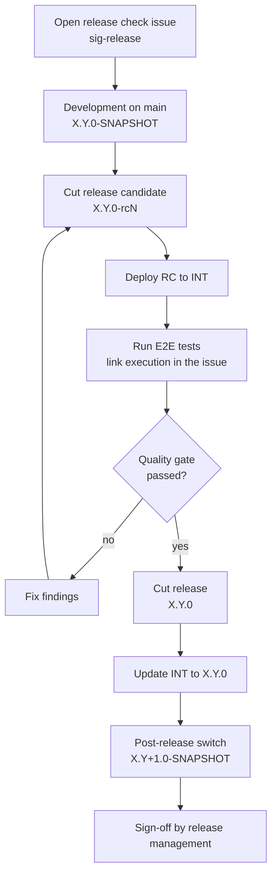

# Release Process

This guide walks a maintainer through one BPDM release cycle.
It is the ordering narrative: each step links to the checklist, template or guide that carries the detail.

<!-- TOC -->
* [Release Process](#release-process)
  * [The Release Guidelines Come First](#the-release-guidelines-come-first)
  * [What Gets Released](#what-gets-released)
  * [The Two Tracking Issues](#the-two-tracking-issues)
  * [Cycle Overview](#cycle-overview)
  * [1. Open the Release Check Issue](#1-open-the-release-check-issue)
    * [Deadlines](#deadlines)
  * [2. Development Phase](#2-development-phase)
  * [3. Cut a Release Candidate](#3-cut-a-release-candidate)
  * [4. Deploy the Release Candidate to INT](#4-deploy-the-release-candidate-to-int)
  * [5. Run the End-to-End Tests](#5-run-the-end-to-end-tests)
  * [6. Quality Gate Assessment](#6-quality-gate-assessment)
  * [7. Cut the Release](#7-cut-the-release)
    * [Tag the application release by hand](#tag-the-application-release-by-hand)
    * [Write the release entries](#write-the-release-entries)
  * [8. Update INT to the Release](#8-update-int-to-the-release)
  * [9. Post-Release Switch](#9-post-release-switch)
    * [Release branches are kept](#release-branches-are-kept)
  * [10. Sign-Off](#10-sign-off)
  * [STABLE](#stable)
  * [NOTICE](#notice)
<!-- TOC -->

## The Release Guidelines Come First

**Read the [Catena-X Release Guidelines](https://eclipse-tractusx.github.io/docs/release) before starting a release.**
They **trump everything in this repository** — this guide, the pull request templates, the developer guides. Where they disagree with this guide, this guide is wrong and needs fixing.
Compliance with them is what the [quality gate issue](#6-quality-gate-assessment) records, section by section.

**Check the [TRG 0 changelog](https://eclipse-tractusx.github.io/docs/release/trg-0) every cycle**, rather than working from memory or the previous assessment.
TRGs are added, updated and deprecated between releases, and one marked as a prerelease carries the date from which it becomes mandatory.

## What Gets Released

A BPDM release publishes two independently versioned artifact families from the same commit:

- **The applications** — Pool, Gate, Orchestrator and Cleaning Service Dummy, published as container images on Docker Hub under the Maven `<revision>` version (e.g. `7.5.0`).
- **The Helm charts** — the umbrella `bpdm` chart and its four subcharts, published to the chart repository on the `gh-pages` branch. Each chart carries its own semantic version, independent of the application version (e.g. application `7.5.0` shipped with umbrella chart `7.1.0`).

Both are driven off the version fields in `pom.xml` and the `Chart.yaml` files; the workflows decide what to publish from the version suffix.
See [Apps and Charts](../developer/README.md#apps-and-charts) and [GitHub Workflows](../developer/README.md#github-workflows) for the mechanics.

Each family also gets its own git tag and GitHub release, and the two are created in different ways:

| Tag              | Example         | Tag and entry created by                                       | Created for            |
|------------------|-----------------|----------------------------------------------------------------|------------------------|
| Chart, per chart | `bpdm-7.1.0`    | Automatically by the chart release workflow on merge to `main`   | Releases **and** release candidates |
| Application      | `v7.5.0`        | **By hand, by the maintainer**                                  | Full releases only     |

The asymmetry is deliberate: INT deploys the chart, so a candidate needs a chart tag; an application tag for a candidate would add nothing.
Automatic creation covers the tag and an empty-ish entry, not the release notes — [both entries are written by hand](#write-the-release-entries) for a full release.

A release is part of a Tractus-X **release train**, named by year and month (e.g. `26.09`).
The train, not this repository, sets the schedule.

## The Two Tracking Issues

A release is not done when the artifacts are published — it is done when the release management team signs it off.
Two issues carry that, and both have to exist before the release work starts:

| Issue | Where | Purpose |
|-------|-------|---------|
| **Release Checks** | [`eclipse-tractusx/sig-release`](https://github.com/eclipse-tractusx/sig-release/issues) | The release train's gate for BPDM. Collects versions, contacts, the feature summary, test results and release documentation. Signed off by the release management team, who maintain that repository. |
| **Quality Gate Checklist** | this repository | The TRG compliance assessment, one new issue per release, labelled `documentation` — e.g. [#1647](https://github.com/eclipse-tractusx/bpdm/issues/1647), `QG X checks (Release 26.6)`. The Release Checks template requires it to be opened separately in the product repository. |

Copy the shape of a previous cycle's pair rather than starting from the bare templates — [#1726](https://github.com/eclipse-tractusx/sig-release/issues/1726) (`[BPDM][26.09] Release Checks`) and [#1647](https://github.com/eclipse-tractusx/bpdm/issues/1647) are worked examples.

## Cycle Overview



STABLE is not part of this cycle — see [STABLE](#stable).

## 1. Open the Release Check Issue

Create the issue in [`eclipse-tractusx/sig-release`](https://github.com/eclipse-tractusx/sig-release/issues/new/choose) from the **Release Checks** template, at the start of the cycle rather than at the end — its feature summary is filled as features land, and the release management team uses it to see what is coming.

Fill in:

- **Title** — `[BPDM][<train>] Release Checks`, e.g. `[BPDM][26.09] Release Checks`
- **Label** — `bpdm`; **milestone** — the release train, e.g. `26.09`
- **Release Info** — the responsible contacts (committer, expert group, contributor contact), the planned application and Helm chart versions, and the leading repository
- The remaining sections — compliance, functionality, performance, testing, feature summary, standard summary, release documentation, summary — are worked through the cycle and are what the sign-off is given against

The template also requires the **Quality Gate Checklist** issue to be opened in this repository; see [step 6](#6-quality-gate-assessment).

Every feature listed in the feature summary has to be closed before the release can be approved, so the summary doubles as the cycle's scope.

### Deadlines

The train's dates are published on the [Release Planning project board](https://github.com/orgs/eclipse-tractusx/projects/26) in the `eclipse-tractusx` organisation.
Check it when the cycle opens, because the dates — not this repository — determine when the release candidate has to exist, when the end-to-end tests have to be reported and when the release check issue has to be ready for sign-off.

## 2. Development Phase

`main` carries a `X.Y.0-SNAPSHOT` version.
Every merge to `main` publishes the application images as `latest` SNAPSHOTs; nothing is released.

During this phase the maintainer keeps three things aligned:

- **The release check issue.** Features that land get added to its feature summary table with their test status.
- **The INT snapshot deployment.** The `bpdm-snapshot` ArgoCD app tracks the chart straight from the `main` branch, so it reflects the current development state. See [Association Environments](environments.md).
- **The changelogs.** `CHANGELOG.md` and `charts/bpdm/CHANGELOG.md` each have an open `## [X.Y.0] - unreleased` section that contributions fill as they land. If a contribution needs an operator action on upgrade, it also belongs in the [migration guide](../admin/MIGRATION_GUIDE.md).

If a feature needs to be validated on a real environment before it is merged, it can get its own ArgoCD app deployed from its feature branch — see [feature branch deployments](environments.md#feature-branch-deployments).

## 3. Cut a Release Candidate

A release candidate is a pull request that only changes version fields.

1. Branch off `main`.
2. Open the PR with the [snapshot / release candidate switch template](../../.github/PULL_REQUEST_TEMPLATE/snapshot-release-candidate-switch.md), selecting the **Create release candidate** scenario and setting the target version to `X.Y.0-rcN`.
3. Work the checklist in the template: `pom.xml` revision, `appVersion` and `version` in all five charts, the umbrella chart's dependency versions, regenerated chart READMEs, and the `info.version` of the OpenAPI documents.
4. Get the PR reviewed and merged.

On merge the workflows publish the `X.Y.0-rcN` application images to Docker Hub and release the release-candidate charts — which includes tagging each chart (`bpdm-X.Y.Z-rcN` and one tag per subchart) and creating its GitHub release entry.

No application tag is created for a release candidate, and none should be added by hand.
The candidate's chart release entries are left as the workflow generated them; only the [final release's entries](#write-the-release-entries) get written up.

**The changelogs are not touched here.** Both keep their `unreleased` / `tbd` headings through every release candidate; the release date goes in when the release is cut, in [step 7](#7-cut-the-release).

## 4. Deploy the Release Candidate to INT

The release candidate has to run on the association's INT environment before it can be released.
INT always follows the newest release version, so the release candidate goes onto the regular INT deployment rather than a separate app.

1. In [`int/bpdm/spec.yaml`](https://github.com/eclipse-tractusx/bpdm/blob/environments/int/bpdm/spec.yaml) on the `environments` branch, set `targetRevision` to the new chart release-candidate version.
2. Do the same for the sharing member deployments that take part in the end-to-end tests, listed in [Association Environments](environments.md).
3. Apply the changed spec in [INT ArgoCD](https://argocd.int.catena-x.net) and synchronize the app.
4. Wait for the app to reach a green state and check that the migrations ran — a chart upgrade that changes the database schema fails visibly here rather than in the tests.

INT carries the data of every previous end-to-end run, so this is a genuine upgrade of a populated database rather than a fresh install.

If the chart introduced new or renamed configuration, adapt the `values.yaml` of the affected deployments in the same step.
The [migration guide](../admin/MIGRATION_GUIDE.md) entry for this version is the checklist: if upgrading our own deployment needs a step, an operator's upgrade needs it too.

## 5. Run the End-to-End Tests

With the release candidate running on INT, the maintainer runs the full end-to-end test suite against it and reports the result to Jira/Xray.
This is described in the [end-to-end testing guide](e2e-testing.md).

Two things have to be in place before the run:

- **The test definitions in Jira match the suite.** If the cycle added or changed any end-to-end scenario, [upsert the Tests into the CXTPM project and then tag the scenarios that had no Test issue](e2e-testing.md#1-upsert-the-tests-then-tag-the-new-ones) with the keys the upsert created — in that order, and committed. A scenario reaching the upload without a Test issue runs and is then silently unreported, so the release gets signed off on evidence that is missing a test.
- **The release has its own Test Execution issue.** Create it in Jira and [repoint the feature-level tags](e2e-testing.md#the-releases-test-execution) at it, so the results are recorded against this version rather than the previous one.

Afterwards, **link the Jira Test Execution in the release check issue** under its testing section.
The release does not proceed until the execution is green or every failure is accepted and documented there.

## 6. Quality Gate Assessment

The quality gate documents this release's compliance with the Tractus-X Release Guidelines (TRGs).
It is **a new issue in this repository for every release**, because the Release Checks template requires it to be opened separately in the product repository.

1. Open a new issue from the **Quality Gate Checklist** template. The template is an organisation-level default from [`eclipse-tractusx/.github`](https://github.com/eclipse-tractusx/.github/blob/main/.github/ISSUE_TEMPLATE/qg-checklist.md) — it is offered here because this repository defines no issue templates of its own.
2. Fill in the release details it asks for (application version and Helm chart version) and link the issue in the [release check issue](#the-two-tracking-issues).
3. Work the TRG sections (TRG 1 Documentation through TRG 9 UX/UI Styleguide) and tick what is fulfilled. The previous release's issue is the fastest reference — most items are structural and stay fulfilled from one release to the next.
4. Separate the items that can only be finalized after the release is cut (published images, published chart, changelog dates, dropped `-rc` suffixes) from those needing an external dashboard (Eclipse IPLab for the IP checks, the Actions tab for the security scan results).
5. Fix the findings. Anything that changes code or charts means a **new release candidate** — go back to [step 3](#3-cut-a-release-candidate).
6. Close the issue when the assessment is complete.

**Keep no copy of the assessment in the repository.** A checked-in one goes stale the moment the next cycle starts and competes with the issue for authority.

## 7. Cut the Release

When the end-to-end tests are green and the quality gate is passed, the release is another version-only pull request.

1. Branch off `main`.
2. Open the PR with the [snapshot / release candidate switch template](../../.github/PULL_REQUEST_TEMPLATE/snapshot-release-candidate-switch.md), this time with the bare `X.Y.0` as target version — the same checklist, with the `-rcN` suffix dropped everywhere.
3. Additionally set the release date in `CHANGELOG.md` and `charts/bpdm/CHANGELOG.md`, replacing the `unreleased` / `tbd` heading each has carried since the cycle opened. This is the only point in the cycle where a release date is written.
4. Merge.

On merge the workflows publish the release images to Docker Hub and release the charts, tagging each chart and creating its GitHub release entry.
Verify both landed before continuing.

### Tag the application release by hand

The chart tags are automatic; the application tag is not.
Create it on the released commit — the version PR's merge commit — and push it:

```bash
git checkout main && git pull
git tag v<X.Y.0>
git push origin v<X.Y.0>
```

The tag name is the bare application version prefixed with `v` (`v7.4.0`), lightweight rather than annotated, matching the existing tags.
Never tag a release candidate this way — there are no `v…-rcN` tags in the repository.

### Write the release entries

Both release entries follow the same three-part body, and both need writing by hand — the chart entry is *created* automatically by the workflow, but its notes are not.

1. **An intro line** saying what the release is, plus where its documentation lives.
   The application entry opens with "This is the release for the BPDM applications."; the chart entry says what the chart deploys and points at the `X.Y.x` release branch for the documentation.
2. **The changelog section for this version, verbatim** — from `CHANGELOG.md` for the application entry, from `charts/bpdm/CHANGELOG.md` for the chart entry, keeping its `Breaking` / `Added` / `Changed` subsections.
3. **The generated commit history** — GitHub's *Generate release notes* button, which appends `What's Changed`, `New Contributors` and the `Full Changelog` compare link.

Naming follows the existing entries: `BPDM: <app version>` for the application, `BPDM Chart: <chart version>` for the umbrella chart.
The chart entry carries the packaged chart as an asset; the application entry has none.

Only the umbrella chart's entry is written up this way — the per-subchart tags and entries the workflow also creates are left as generated.

## 8. Update INT to the Release

INT always runs the newest release version, so once the release is published the INT deployment moves off the release candidate onto it.

Set `targetRevision` to the released chart version in the `spec.yaml` of the INT apps and synchronize them in [ArgoCD](https://argocd.int.catena-x.net).
The candidate and the release are the same code, so this is a version-label change rather than a functional upgrade — but it keeps INT on a released chart.

## 9. Post-Release Switch

Immediately after the release, open the development line for the next version.

Open a pull request with the [release to snapshot switch template](../../.github/PULL_REQUEST_TEMPLATE/release-to-snapshot-switch.md) and work its checklist. It covers:

1. Creating the `release/X.Y.x` branch from the released commit and registering its three API specs in `.tractusx`.
2. Bumping `pom.xml` and all chart versions to the next development version.
3. Opening the new `unreleased` sections in both changelogs and a new section in the migration guide.

### Release branches are kept

**Release branches are never deleted.** One per minor version, each staying the head of its line, so a patch release advances the branch rather than starting a new one.
That is why `.tractusx` references the API specs by branch (`refs/heads/release/X.Y.x/docs/api/…`) and not by tag: the URLs resolve to the newest state of each line without an update per patch.

TRG 5.10's requirement to support three versions is about which lines are still maintained, not about pruning branches or their `.tractusx` entries.

## 10. Sign-Off

With the artifacts published and the documentation in place, complete the release check issue: every checklist item ticked, the feature summary rows closed, the Jira Test Execution linked, the quality gate issue linked and resolved.

The release management team then signs the issue off.
Until they do, the release is published but not accepted into the release train.

## STABLE

STABLE is not part of the release cycle. The maintainer maintains INT; STABLE is updated **on demand**, when an update is announced, and therefore runs an older line.

An announced update is [step 4](#4-deploy-the-release-candidate-to-int) against the STABLE apps: set the target chart version in the `spec.yaml`, adapt the `values.yaml` for any configuration the chart renamed, and synchronize in [STABLE ArgoCD](https://argocd.stable.catena-x.net).
Since STABLE can be several minor versions behind, work the [migration guide](../admin/MIGRATION_GUIDE.md) sections for every version being skipped, not just the target.

---

## NOTICE

This work is licensed under the [Apache-2.0](https://www.apache.org/licenses/LICENSE-2.0).

- SPDX-License-Identifier: Apache-2.0
- SPDX-FileCopyrightText: 2023,2026 ZF Friedrichshafen AG
- SPDX-FileCopyrightText: 2023,2026 SAP SE
- SPDX-FileCopyrightText: 2023,2026 Bayerische Motoren Werke Aktiengesellschaft (BMW AG)
- SPDX-FileCopyrightText: 2023,2026 Mercedes Benz Group
- SPDX-FileCopyrightText: 2023,2026 Robert Bosch GmbH
- SPDX-FileCopyrightText: 2023,2026 Schaeffler AG
- SPDX-FileCopyrightText: 2023,2026 Contributors to the Eclipse Foundation
- Source URL: https://github.com/eclipse-tractusx/bpdm
