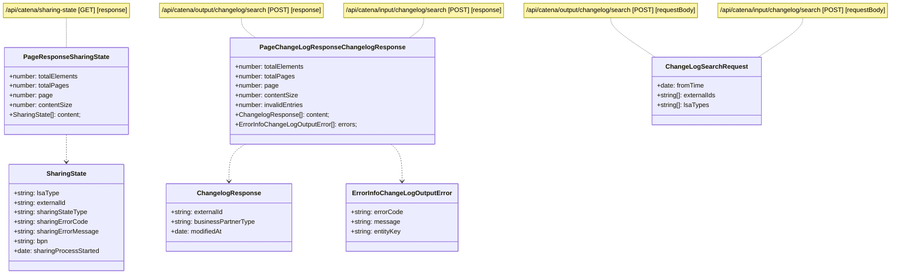

```mermaid
classDiagram

PageChangeLogResponseChangelogResponse ..> ChangelogResponse
PageChangeLogResponseChangelogResponse ..> ErrorInfoChangeLogOutputError
PageResponseSharingState ..> SharingState

    note for ChangeLogSearchRequest "/api/catena/output/changelog/search [POST] [requestBody]"
    note for ChangeLogSearchRequest "/api/catena/input/changelog/search [POST] [requestBody]"

    note for PageResponseSharingState "/api/catena/sharing-state [GET] [response]"

    note for PageChangeLogResponseChangelogResponse  "/api/catena/output/changelog/search [POST] [response]"
    note for PageChangeLogResponseChangelogResponse "/api/catena/input/changelog/search [POST] [response]"

class ChangeLogSearchRequest{
+date: fromTime
+string[]: externalIds
+string[]: lsaTypes
}
class ChangelogResponse{
+string: externalId
+string: businessPartnerType
+date: modifiedAt
}
class ErrorInfoChangeLogOutputError{
+string: errorCode
+string: message
+string: entityKey
}
class PageChangeLogResponseChangelogResponse{
+number: totalElements
+number: totalPages
+number: page
+number: contentSize
+number: invalidEntries
+ChangelogResponse[]: content;
+ErrorInfoChangeLogOutputError[]: errors;
}
class SharingState{
+string: lsaType
+string: externalId
+string: sharingStateType
+string: sharingErrorCode
+string: sharingErrorMessage
+string: bpn
+date: sharingProcessStarted
}
class PageResponseSharingState{
+number: totalElements
+number: totalPages
+number: page
+number: contentSize
+SharingState[]: content;
}
```