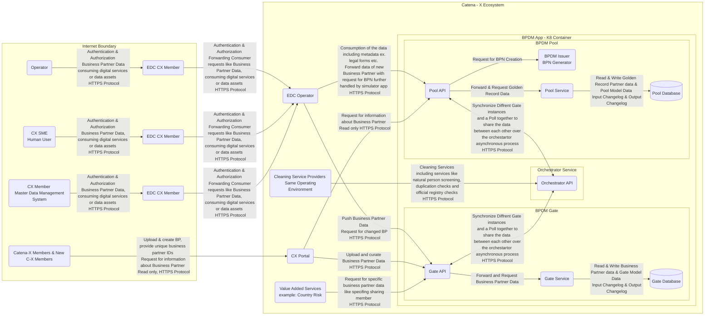

# Security Assessment BPDM Golden Record (incl. Frontend, Backend Services, IAM and other infrastructure)

| Contact                  | Details                                                                           |
| ------------------------- | ---------------------------------------------------------------------------------------------- |
| Contact for product       | [@nicoprow](https://github.com/nicoprow) |
| Security responsible      | [@SSIRKC](https://github.com/SSIRKC)   [@szymonkowalczykzf](https://github.com/szymonkowalczykzf) |
| Version number of product | 24.03                                                                                         |
| Dates of assessment       | 2024-01-25: Re-Assessment                                                                      |
| Status of assessment      | RE-ASSESSMENT DONE                                                                            |

## Product Description
The Business Partner Data Management (BPDM) is a distributed service-based system, composed of a set of dedicated services, that simultaneously serve multiple stakeholders. 
It is based on a central data pool of business partners, which is consistent with the overall design principles of Catena-X. 
The main target is to create business partner data records (such as customer/supplier) with a high quality and currentness, to provide other processes with these data. 
This results in less rework and adjustment due to better master data quality which ultimately leads to an overall cost reduction for participating companies. 
Additionally, Value Added Services shall be offered to enrich those business partner data sets even further and give additional information or warnings about the business partners. 
Getting a 360° view on your business partners also helps with reducing costs and achieving process excellence because better decisions can be made. 

BPN:
The aim of BPDM with its BPN is to define a set of rules for a unique ID for cross-company communication and identification of Business Partners. 
The ID should be used as an international, cross-industry standard. A special requirement within the process of Business Partner identification is the mapping of changes in the company structures (Split Offs, Mergers, Joint Ventures) considering local and legal requirements to differentiate between Business Partner legal entities, sites and addresses as well as the question who assigns the BPN. 
The concept of the BPN is trying to consider the various requirements of different functional areas, such as accounting, logistics, purchasing, legal and sales.

POOL: 
The Business Partner Pool collects business partner data records which are cleansed and enriched, so-called Golden Records, and makes them available. 
It is a main component of the architecture framework at Catena-X, as it enables the Catena-X members to leverage accurate, complete, and consistent business partner data for Catena-X applications and shared services.  
The Business Partner Pool can be accessed via the standardized API described in this standard. 

GATE: 
The Business Partner Gate allows any Catena-X member to share own business partner data as well as business partner data of its suppliers and customers with the Catena-X network so that cleansed and enriched business partner data records, so-called Golden Records, can be created and made available. 
It is a main component of the architecture framework at Catena-X, as it enables the Catena-X members to leverage accurate, complete, and consistent business partner data for Catena-X applications and shared services.

## Dataflow Diagram

## Dataflow Diagram - Mermaid 

## Security Controls

Primary controls implemented on product (or on specific aspect of product):

* Communication between Gate and Pool (Curation Service) is out of scope and must be provided by OpCo –  out of scope
* Is data stored in Pool/Gate confidential?
  * All data in the pool is publicly available
  * No personal data is stored in the pool
  * Personal data may be stored in the gate but gets anonymized and merged over all Gates by the Curation Service
  * In the Gate all business relations are stored, which are confidential
* Explain from ARC42: ‹The BPN, as the unique identifier of the Golden Record, can be stored as a verifiable credential used in an SSI solution so that a business partner can provide it for authentication and authorization.
  * BPDM doesn't have anything to do with VC, only the BPNs are used for identification, eg., in the Wallet.
* Any direct connections to SSI, namely MIW?
  * Wallet reads from the Pool API, triggered via the Portal.
* Integrity controls of Golden Records? eg., write-only/append-only data store? checksums? Processes to detect and inform about lack of integrity
  * There are no integrity checks in place for the stored data
  * Access via the API uses permissions
  * Undetected changes to the database would lead to big problems with systems relying on systems assuming the BPNs don't change
* What is logged? How?
  * There exist actuator endpoints where logging applications can be attached 
  * All requests to endpoints are logged with user id accessing the API
  * Main service methods are logged
  * creation of BPN
  * creation of business partners
  * Currently there is no documention what is logged
* Multi-tenancy in Pool necessary and implemented?
  * No tenant system
  * Each client gets its own instance of Gate and Databases
  * There is the possibility to use multiple databases and gates, etc.
  * OpCo hosts all gates and has access to data
* Input validation?
  * No input validation before entering data into the gate → part of the curation service
  * Checks for max-length, etc. are in place
* Rate-Limiting on API?
  * topic for operations
* APIs are secured on permission level → see https://github.com/eclipse-tractusx/bpdm/blob/main/INSTALL.md for permission levels
  * eg., VAS Country Risk would not receive permissions to write

## Vulnerabilities & Threats
| V001 | 	Lack of rate limiting for API |
| ------------------------- | ------------------------- |
| Element | BPDM App |
| Before Mitigation | Impact: Medium, Likelihood: Low, Risk: Low |
| After Mitigation | Impact: Low, Likelihood: Low, Risk: Low |
| Mitigation | Enable rate limiting that will allow to setup a maximum number of request that may be handled by the application at once which will allow to secure it from denial of service type of attacks generated by too large number of requests flooding the BPDM application. |

| V002 | 	Lack of documentation regarding active log collection, correlation & monitoring |
| ------------------------- | ------------------------- |
| Element | BPDM App |
| Before Mitigation | Impact: Low, Likelihood: Low, Risk: Low |
| After Mitigation | Impact: Low, Likelihood: Low, Risk: Low |
| Mitigation | Please crate a documentation allowing to investigate the current state of logging and monitoring. Documentation should include information about actual parts of information that is being logged, & saved to potential reviews. Logging behaviour has added all required standard events and also additional event types which fulfills the logging requirement to the extend of sensitive data manipulation. |

| V003 | Lack of Integrity controls |
| ------------------------- | ------------------------- |
| Element | Pool Database |
| Before Mitigation | Impact: High, Likelihood: Low, Risk: Medium |
| After Mitigation | Impact: Low, Likelihood: Low, Risk: Low |
| Mitigation | Implementation of integrity controls. Implemented solution should be allowing the application to confirm the integrity (authenticity and confirmation that information was not changed by unauthorized party) of the stored data, especially golden records, that are further used and consumed by other entities. Rollback of manipulated data must be possible. |
